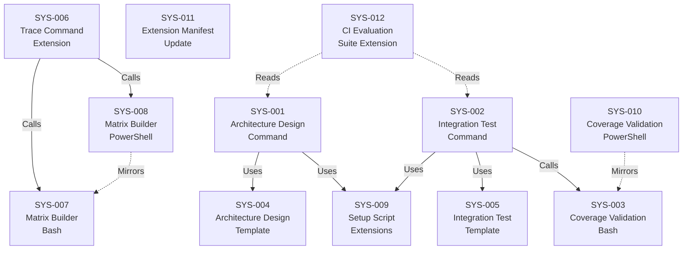

# System Design: Architecture Design ↔ Integration Testing

**Feature Branch**: `003-architecture-integration`
**Created**: 2026-02-21
**Status**: Approved
**Source**: `specs/003-architecture-integration/v-model/requirements.md`

## Overview

This system design decomposes the 61 requirements for v0.3.0 of the V-Model Extension Pack into 12 system components organized across the extension's artifact types: Markdown agent prompts (commands), Markdown output structure definitions (templates), deterministic Bash/PowerShell helpers (scripts), Python-based CI test infrastructure (validators/evals), and the extension manifest. The decomposition follows the natural boundary of each deliverable artifact — commands that orchestrate AI generation, templates that constrain output structure, scripts that perform deterministic validation and matrix building, and the manifest that registers capabilities. Two new commands (architecture-design, integration-test) form the core of this V-level, supported by a new validation script, template pair, trace command extension, matrix builder extensions, setup script extensions, a manifest update, and CI evaluation suite extensions. Safety-critical sections are conditionally included within the existing command and template components based on domain configuration.

## ID Schema

- **System Component**: `SYS-NNN` — sequential identifier for each component
- **Parent Requirements**: Comma-separated `REQ-NNN` list per component (many-to-many)
- Example: `SYS-003` with Parent Requirements `REQ-024, REQ-025, REQ-026` — component satisfies all three requirements

## Decomposition View (IEEE 1016 §5.1)

| SYS ID | Name | Description | Parent Requirements | Type |
|--------|------|-------------|---------------------|------|
| SYS-001 | Architecture Design Command | Markdown agent prompt executed by GitHub Copilot that reads `system-design.md` as input and produces `architecture-design.md` as output. Assigns unique `ARCH-NNN` identifiers, generates four mandatory 42010/4+1 views (Logical, Process, Interface, Data Flow), enforces many-to-many SYS↔ARCH traceability with explicit "Parent System Components" fields, supports `[CROSS-CUTTING]` tagging for infrastructure modules, detects and flags derived modules, rejects black-box descriptions with anti-pattern warnings, conditionally includes safety-critical sections (ASIL Decomposition, Defensive Programming, Temporal Constraints) when domain is configured, follows the strict translator constraint, handles 50+ SYS identifiers without truncation, and fails gracefully when system-design.md is empty or contains zero SYS identifiers. Reads input exclusively from `{FEATURE_DIR}/v-model/system-design.md` and writes output exclusively to `{FEATURE_DIR}/v-model/architecture-design.md`. | REQ-001, REQ-002, REQ-003, REQ-004, REQ-005, REQ-006, REQ-007, REQ-008, REQ-009, REQ-010, REQ-012, REQ-013, REQ-021, REQ-041, REQ-045, REQ-NF-002, REQ-IF-001, REQ-CN-001 | Module |
| SYS-002 | Integration Test Command | Markdown agent prompt executed by GitHub Copilot that reads `architecture-design.md` as input and produces `integration-test.md` as output. Assigns test case identifiers (`ITP-NNN-X`) and test scenario identifiers (`ITS-NNN-X#`), applies four mandatory ISO 29119-4 techniques (Interface Contract Testing, Data Flow Testing, Interface Fault Injection, Concurrency & Race Condition Testing), anchors each test case to a specific architecture view and technique, uses Given/When/Then BDD structure with module-boundary-oriented language, restricts scope to boundary/handshake tests only, ensures cross-cutting modules have at least one test case, conditionally includes safety-critical sections (SIL/HIL Compatibility, Resource Contention) when domain is configured, invokes `validate-architecture-coverage.sh` as a post-generation coverage gate, follows the strict translator constraint, and handles 50+ SYS identifiers without truncation. Reads input exclusively from `{FEATURE_DIR}/v-model/architecture-design.md` and writes output exclusively to `{FEATURE_DIR}/v-model/integration-test.md`. | REQ-014, REQ-015, REQ-016, REQ-017, REQ-018, REQ-019, REQ-020, REQ-011, REQ-022, REQ-023, REQ-042, REQ-049, REQ-NF-002, REQ-IF-002, REQ-CN-001 | Module |
| SYS-003 | Architecture Coverage Validation Script (Bash) | Deterministic Bash script (`validate-architecture-coverage.sh`) that validates bidirectional coverage across architecture-level artifacts. Performs forward coverage validation (every `SYS-NNN` in `system-design.md` has at least one `ARCH-NNN` in `architecture-design.md`), backward coverage validation (every `ARCH-NNN` has at least one `ITP-NNN-X` in `integration-test.md`), orphan detection (ARCH without parent SYS or `[CROSS-CUTTING]` tag, ITP without parent ARCH), circular dependency detection in the Process View without hanging, and ID lineage validation (regex-extractable ITP→ARCH ancestry, file-lookup-based SYS resolution for many-to-many). Accepts three file paths as positional arguments, supports `--json` output mode, supports partial execution (forward-only when integration-test.md absent), accepts gaps in ARCH numbering without false positives, outputs human-readable gap reports with specific IDs, and exits with code 0 on pass / code 1 on failure. Uses regex-based parsing consistent with v0.2.0's `validate-system-coverage.sh`, requiring no external tooling beyond standard Bash utilities. Cross-cutting `[CROSS-CUTTING]` modules are included in coverage validation. | REQ-024, REQ-025, REQ-026, REQ-027, REQ-028, REQ-029, REQ-030, REQ-011, REQ-046, REQ-048, REQ-NF-001, REQ-NF-003, REQ-IF-003, REQ-IF-004 | Utility |
| SYS-004 | Architecture Design Template | Markdown template file (`architecture-design-template.md`) in the `templates/` directory defining the required structure for ISO/IEC/IEEE 42010-compliant architecture design output. Includes section structure and field definitions for the four mandatory views: Logical View (component breakdown with ARCH-NNN, name, description, Parent System Components field, and `[CROSS-CUTTING]` tag distinction with rationale), Process View (Mermaid sequence diagrams for runtime interactions), Interface View (strict API contracts — inputs, outputs, exceptions per ARCH module), and Data Flow View (data transformation chains with intermediate formats). Includes conditional safety-critical section placeholders (ASIL Decomposition, Defensive Programming, Temporal & Execution Constraints). | REQ-039, REQ-003, REQ-004, REQ-005, REQ-006, REQ-009, REQ-010, REQ-021 | Module |
| SYS-005 | Integration Test Template | Markdown template file (`integration-test-template.md`) in the `templates/` directory defining the required structure for ISO/IEC/IEEE 29119-4-compliant integration test output. Includes the three-tier ITP/ITS hierarchy (ARCH→ITP-NNN-X→ITS-NNN-X#), technique naming and view anchoring per test case, Given/When/Then BDD scenario format with module-boundary language, and a "Test Harness & Mocking Strategy" section where each test case defines stubs/mocks for external interfaces, hardware dependencies, or unresolved module dependencies. Includes conditional safety-critical section placeholders (SIL/HIL Compatibility, Resource Contention). | REQ-040, REQ-049, REQ-015, REQ-016, REQ-017, REQ-018, REQ-019, REQ-022 | Module |
| SYS-006 | Trace Command Extension | Extension to the existing `/speckit.v-model.trace` Markdown agent prompt to produce Matrix C (Integration Verification) — `SYS → ARCH → ITP → ITS` — when `architecture-design.md` and `integration-test.md` exist. Each `SYS-NNN` cell includes parent `REQ-NNN` references in parentheses for end-to-end traceability. Cross-cutting ARCH modules appear as pseudo-rows with `N/A (Cross-Cutting)` in the SYS column. Produces Matrix A, B, and C as separate tables with independent coverage percentages. Builds matrices progressively (A alone, A+B, A+B+C). Remains backward compatible: when architecture-level artifacts are absent, produces v0.2.0 output (Matrix A + B only, no warning). Supports partial Matrix C (ARCH column populated, ITP/ITS empty with note) when integration-test.md is absent. | REQ-031, REQ-032, REQ-033, REQ-034, REQ-035, REQ-036, REQ-047, REQ-NF-004 | Module |
| SYS-007 | Matrix Builder Script Extension (Bash) | Extension to the existing `build-matrix.sh` deterministic Bash script to parse `architecture-design.md` and `integration-test.md` and generate Matrix C data. Outputs structured matrix data with independently calculated coverage percentages matching the validation script output. | REQ-037, REQ-036 | Utility |
| SYS-008 | Matrix Builder Script Extension (PowerShell) | Extension to the existing `build-matrix.ps1` deterministic PowerShell script with identical Matrix C generation logic as the Bash version (SYS-007). Ensures cross-platform parity for enterprise Windows teams. | REQ-038 | Utility |
| SYS-009 | Setup Script Extensions | Extensions to `setup-v-model.sh` and `setup-v-model.ps1` to support the new architecture-level commands. Adds `--require-system-design` flag to verify `system-design.md` exists before the architecture design command proceeds. Extends `AVAILABLE_DOCS` detection to include `architecture-design.md` and `integration-test.md`. Preserves backward compatibility — existing v0.2.0 invocations produce unchanged behavior. | REQ-043, REQ-044, REQ-NF-004 | Utility |
| SYS-010 | Architecture Coverage Validation Script (PowerShell) | PowerShell script (`validate-architecture-coverage.ps1`) with identical behavior, output format, and exit codes as the Bash validation script (SYS-003). Accepts the same three file path arguments, supports `--json` output mode, and passes the same test fixture suite. Ensures cross-platform parity for enterprise Windows teams. | REQ-CN-003, REQ-IF-003, REQ-IF-004 | Utility |
| SYS-011 | Extension Manifest Update | Updates to `extension.yml` and `catalog-entry.json` to bump the extension version to `0.3.0` and register exactly 7 commands (5 existing + 2 new: `architecture-design`, `integration-test`) and 1 hook. | REQ-CN-002 | Module |
| SYS-012 | CI Evaluation Suite Extension | Extension to the Python-based CI evaluation infrastructure to validate that `/speckit.v-model.architecture-design` and `/speckit.v-model.integration-test` command outputs meet or exceed v0.2.0 quality thresholds. Includes syntactic validation of generated Mermaid diagrams in the Process View — broken Mermaid syntax is treated as a structural failure. | REQ-NF-005 | Module |

## Dependency View (IEEE 1016 §5.2)

| Source | Target | Relationship | Failure Impact |
|--------|--------|-------------|----------------|
| SYS-001 | SYS-004 | Uses | Architecture design command cannot produce compliant output structure without the template; output would lack mandatory 42010/4+1 view sections. |
| SYS-001 | SYS-009 | Uses | Architecture design command cannot verify that `system-design.md` exists (via `--require-system-design` flag) or detect available documents; command may proceed without prerequisite input. |
| SYS-002 | SYS-005 | Uses | Integration test command cannot produce compliant output structure without the template; output would lack mandatory ISO 29119-4 sections and test harness strategy. |
| SYS-002 | SYS-003 | Calls | Integration test command cannot run the post-generation coverage gate; coverage gaps would go unreported and the output would lack the validation result summary. |
| SYS-002 | SYS-009 | Uses | Integration test command cannot detect available documents; command may proceed without verifying prerequisite artifacts. |
| SYS-006 | SYS-007 | Calls | Trace command extension on Linux/macOS cannot generate Matrix C data; Matrix C would be missing from the traceability matrix output. |
| SYS-006 | SYS-008 | Calls | Trace command extension on Windows cannot generate Matrix C data; Matrix C would be missing from the traceability matrix output on Windows. |
| SYS-010 | SYS-003 | Mirrors | PowerShell validation script must replicate all Bash script logic; behavioral divergence between SYS-003 and SYS-010 produces inconsistent coverage results across platforms. |
| SYS-008 | SYS-007 | Mirrors | PowerShell matrix builder must replicate all Bash matrix builder logic; behavioral divergence produces inconsistent Matrix C data across platforms. |
| SYS-012 | SYS-001 | Reads | CI evaluation suite validates architecture design command output; if SYS-001 output format changes, evaluation fixtures and assertions must be updated. |
| SYS-012 | SYS-002 | Reads | CI evaluation suite validates integration test command output; if SYS-002 output format changes, evaluation fixtures and assertions must be updated. |

### Dependency Diagram

## Interface View (IEEE 1016 §5.3)

### External Interfaces

| Component | Interface Name | Protocol | Input | Output | Error Handling |
|-----------|---------------|----------|-------|--------|----------------|
| SYS-001 | Architecture Design Generation | File I/O (Markdown) | `{FEATURE_DIR}/v-model/system-design.md` — Markdown file containing `SYS-NNN` component decomposition table with IEEE 1016 views | `{FEATURE_DIR}/v-model/architecture-design.md` — Markdown file containing `ARCH-NNN` module decomposition with four 42010/4+1 views (Logical, Process, Interface, Data Flow) | Fails gracefully with message "No system components found in system-design.md — cannot generate architecture design" when input is empty or contains zero SYS identifiers. Flags derived modules as `[DERIVED MODULE: description]` instead of silently creating components. Emits anti-pattern warnings for modules with incomplete interface contracts. |
| SYS-002 | Integration Test Generation | File I/O (Markdown) | `{FEATURE_DIR}/v-model/architecture-design.md` — Markdown file containing `ARCH-NNN` module decomposition with four architecture views | `{FEATURE_DIR}/v-model/integration-test.md` — Markdown file containing `ITP-NNN-X` test cases and `ITS-NNN-X#` test scenarios with ISO 29119-4 techniques, plus embedded coverage validation result | Reports coverage gate result (pass/fail with summary) from `validate-architecture-coverage.sh` invocation. Passes through validation script exit code semantics. |
| SYS-003 | Architecture Coverage Validation (Bash) | CLI (stdout + exit code) | Three positional file path arguments: (1) `system-design.md`, (2) `architecture-design.md`, (3) `integration-test.md`. Optional `--json` flag for machine-readable output. | Human-readable gap report listing each gap/orphan by ID (e.g., "SYS-003: no architecture module mapping found"), or JSON-structured equivalent when `--json` is specified. Coverage summary with forward/backward percentages and pass/fail verdict. | Exit code 0 when all coverage checks pass; exit code 1 when any gap or orphan is detected. Supports partial execution: validates forward coverage only when `integration-test.md` is absent, exiting with code 0 if forward coverage is complete. Detects circular dependencies without hanging. |
| SYS-010 | Architecture Coverage Validation (PowerShell) | CLI (stdout + exit code) | Three positional file path arguments: (1) `system-design.md`, (2) `architecture-design.md`, (3) `integration-test.md`. Optional `-Json` flag for machine-readable output. | Identical output format to SYS-003: human-readable gap report or JSON equivalent, coverage summary with pass/fail verdict. | Identical exit code behavior to SYS-003: exit code 0 on pass, exit code 1 on failure. Same partial execution and circular dependency detection semantics. |
| SYS-006 | Traceability Matrix Generation | File I/O (Markdown) | V-model artifact files in `{FEATURE_DIR}/v-model/`: `requirements.md`, `acceptance-plan.md`, `system-design.md`, `system-test.md`, `architecture-design.md` (optional), `integration-test.md` (optional) | `traceability-matrix.md` — Markdown file containing Matrix A (REQ→ATP→SCN), Matrix B (REQ→SYS→STP→STS), and Matrix C (SYS→ARCH→ITP→ITS) as separate tables with independent coverage percentages. Progressive: A only, A+B, or A+B+C depending on available artifacts. | When architecture-level artifacts are absent, produces v0.2.0 output (Matrix A + B only) with no warning. When `architecture-design.md` exists but `integration-test.md` does not, includes ARCH column in Matrix C with ITP/ITS columns empty and note "Integration test plan not yet generated." |

### Internal Interfaces

| Source | Target | Interface Name | Protocol | Data Format | Error Handling |
|--------|--------|---------------|----------|-------------|----------------|
| SYS-001 | SYS-004 | Template Loading | File read | Markdown template with section headers, HTML comments (field definitions), and placeholder tables defining the four 42010/4+1 view structures | Template file not found: command cannot proceed — reports error to user. |
| SYS-001 | SYS-009 | Setup Invocation | Shell exec + JSON stdout | JSON object with keys: `VMODEL_DIR`, `FEATURE_DIR`, `BRANCH`, `AVAILABLE_DOCS`, plus `system-design.md` path verified via `--require-system-design` flag | Setup script returns non-zero exit code with error message if `system-design.md` is missing. |
| SYS-002 | SYS-005 | Template Loading | File read | Markdown template with section headers, HTML comments, and placeholder tables defining the three-tier ITP/ITS hierarchy and test harness strategy section | Template file not found: command cannot proceed — reports error to user. |
| SYS-002 | SYS-003 | Coverage Gate Invocation | Shell exec + stdout/exit code | SYS-002 passes three file paths to SYS-003 CLI. Parses stdout for coverage summary (or JSON with `--json`). Checks exit code: 0 = pass, 1 = gaps found. | Exit code 1: SYS-002 includes the gap report in its output and flags incomplete coverage. SYS-002 does not abort — it reports the validation result as part of the integration test output. |
| SYS-002 | SYS-009 | Setup Invocation | Shell exec + JSON stdout | JSON object with keys: `VMODEL_DIR`, `FEATURE_DIR`, `BRANCH`, `AVAILABLE_DOCS` including detection of `architecture-design.md` | Setup script returns non-zero exit code with error message if prerequisites are missing. |
| SYS-006 | SYS-007 | Matrix C Data Generation (Bash) | Shell exec + stdout | Structured text output containing parsed SYS→ARCH→ITP→ITS mappings with coverage percentages, piped to trace command for Markdown table generation | Script returns non-zero exit code if input files are malformed or missing; trace command reports Matrix C generation failure. |
| SYS-006 | SYS-008 | Matrix C Data Generation (PowerShell) | Shell exec + stdout | Identical structured text output to SYS-007, ensuring cross-platform parity | Script returns non-zero exit code if input files are malformed or missing; trace command reports Matrix C generation failure on Windows. |

## Data Design View (IEEE 1016 §5.4)

| Entity | Component | Storage | Protection at Rest | Protection in Transit | Retention |
|--------|-----------|---------|-------------------|-----------------------|-----------|
| architecture-design.md | SYS-001 | File (Markdown in `{FEATURE_DIR}/v-model/`) | Repository access controls (Git permissions); no encryption required — specification artifact, not secret data | N/A — local file system; protected by repository transport (HTTPS/SSH for Git push/pull) | Persists for the lifetime of the feature branch; archived when branch is merged or deleted. Never modified by downstream commands (REQ-NF-004). |
| integration-test.md | SYS-002 | File (Markdown in `{FEATURE_DIR}/v-model/`) | Repository access controls (Git permissions); no encryption required — specification artifact, not secret data | N/A — local file system; protected by repository transport (HTTPS/SSH for Git push/pull) | Persists for the lifetime of the feature branch; archived when branch is merged or deleted. Never modified by downstream commands (REQ-NF-004). |
| Coverage Validation Results | SYS-003, SYS-010 | In-memory (stdout stream) | N/A — ephemeral output not persisted to disk | N/A — local process stdout; no network transit | Ephemeral — exists only during script execution. Captured by calling command (SYS-002) for inclusion in integration-test.md output, or displayed in CI logs. |
| Coverage Validation Results (JSON) | SYS-003, SYS-010 | In-memory (stdout stream) | N/A — ephemeral output not persisted to disk | N/A — local process stdout; no network transit | Ephemeral — exists only during script execution. Consumed programmatically by SYS-002 when `--json` flag is used. |
| Matrix C Data | SYS-007, SYS-008 | In-memory (stdout stream) | N/A — ephemeral output not persisted to disk | N/A — local process stdout; no network transit | Ephemeral — exists only during script execution. Consumed by SYS-006 for Markdown table generation. |
| traceability-matrix.md (Matrix C addition) | SYS-006 | File (Markdown in `{FEATURE_DIR}/v-model/`) | Repository access controls (Git permissions); no encryption required | N/A — local file system; protected by repository transport | Persists for the lifetime of the feature branch. Updated when trace command is re-run with new artifacts. |
| architecture-design-template.md | SYS-004 | File (Markdown in `templates/`) | Repository access controls; read-only at runtime by SYS-001 | N/A — local file system | Permanent — part of the extension distribution. Versioned with the extension. |
| integration-test-template.md | SYS-005 | File (Markdown in `templates/`) | Repository access controls; read-only at runtime by SYS-002 | N/A — local file system | Permanent — part of the extension distribution. Versioned with the extension. |
| extension.yml | SYS-011 | File (YAML in repository root) | Repository access controls | N/A — local file system | Permanent — part of the extension distribution. Updated per release (v0.3.0). |
| CI Evaluation Fixtures | SYS-012 | File (Python + fixture Markdown in test infrastructure) | Repository access controls | N/A — local file system | Permanent — part of the extension test suite. Updated when command output formats change. |

---

## Coverage Summary

| Metric | Count |
|--------|-------|
| Total System Components (SYS) | 12 |
| Total Parent Requirements Covered | 61 / 61 (100%) |
| Components per Type | Subsystem: 0 \| Module: 7 \| Service: 0 \| Library: 0 \| Utility: 5 |
| **Forward Coverage (REQ→SYS)** | **100%** |

## Derived Requirements

None — all components trace to existing requirements.

## Glossary

| Term | Definition |
|------|-----------|
| ARCH-NNN | Architecture module identifier (e.g., ARCH-001). Maps many-to-many with SYS-NNN, or tagged `[CROSS-CUTTING]` for infrastructure modules. |
| ITP-NNN-X | Integration test case identifier (e.g., ITP-001-A). Parent: ARCH-NNN. Each names one of four ISO 29119-4 techniques. |
| ITS-NNN-X# | Integration test scenario identifier (e.g., ITS-001-A1). Parent: ITP-NNN-X. BDD format with module-boundary language. |
| ISO/IEC/IEEE 42010 | Systems and Software Engineering — Architecture Description. Framework for documenting architecture viewpoints and views. |
| Kruchten's 4+1 View Model | Four mandatory architecture views (Logical, Process, Interface, Data Flow) plus scenarios. |
| ISO/IEC/IEEE 29119-4 | Software Testing — Test Techniques. Defines integration test techniques. |
| IEEE 1016 | Software Design Description. Defines the four mandatory design views used in this system design (Decomposition, Dependency, Interface, Data Design). |
| Matrix C | Traceability matrix: SYS → ARCH → ITP → ITS. Proves module boundaries work correctly. SYS cells include parent REQ references. |
| Strict Translator Constraint | Rule prohibiting the AI from inventing capabilities not present in the source artifact; only documented requirements may produce system components. |
| Coverage Gate | A deterministic script invocation that validates artifact coverage and reports pass/fail, used as a quality gate before completing a command's output. |
| CROSS-CUTTING | Tag applied to infrastructure/utility ARCH modules that serve the system as a whole rather than tracing to a specific SYS component. |
| Derived Module | A technical module identified during architecture design that is neither traceable to a SYS component nor qualifies as CROSS-CUTTING. Must be flagged, not silently added. |
