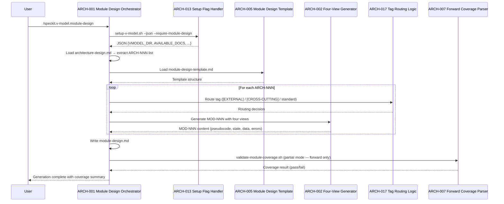
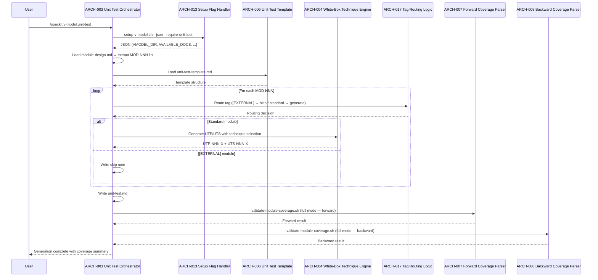
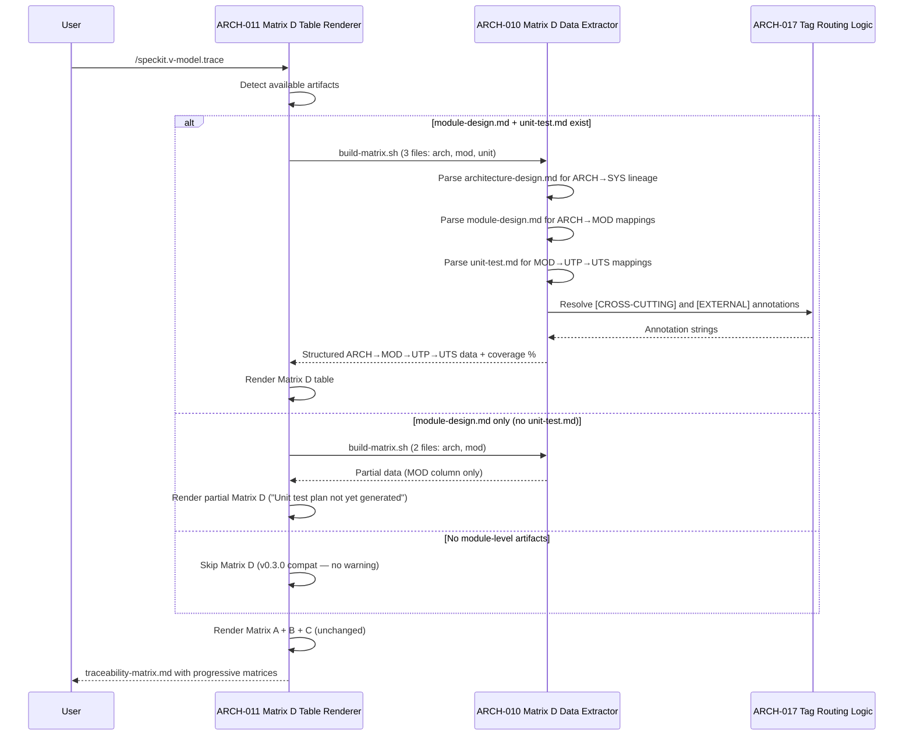

# Architecture Design: Module Design ↔ Unit Testing

**Feature Branch**: `004-module-unit-testing`
**Created**: 2026-02-21
**Status**: Approved
**Source**: `specs/004-module-unit/v-model/system-design.md`

## Overview

This document decomposes the 12 system components of the V-Model Extension Pack v0.4.0 into 17 architecture modules following the IEEE 42010/Kruchten 4+1 framework. The decomposition follows natural code/file boundaries within the extension: Markdown agent prompts are split into orchestrators (step execution) and generators (content production); validation scripts are split into forward and backward coverage parsers; the CI evaluation suite is split into structural and semantic engines. One cross-cutting module captures the shared tag-routing logic (`[EXTERNAL]`, `[CROSS-CUTTING]`, `[DERIVED MODULE]`) used across commands and validators. Each architecture module maps many-to-many to parent system components, and every SYS-NNN from the system design appears as a parent in at least one ARCH-NNN. No safety-critical sections are generated (no `v-model-config.yml` domain configuration detected).

## ID Schema

- **Architecture Module**: `ARCH-NNN` — sequential identifier for each module
- **Parent System Components**: Comma-separated `SYS-NNN` list per module (many-to-many)
- **Cross-Cutting Tag**: `[CROSS-CUTTING]` for infrastructure/utility modules not traceable to a specific SYS
- Example: `ARCH-003` with Parent System Components `SYS-001, SYS-004` — module serves both components
- Example: `ARCH-017 [CROSS-CUTTING]` — shared tag-routing logic used across commands and validators

## Logical View — Component Breakdown (IEEE 42010 / Kruchten 4+1)

| ARCH ID | Name | Description | Parent System Components | Type |
|---------|------|-------------|--------------------------|------|
| ARCH-001 | Module Design Prompt Orchestrator | Executes the `/speckit.v-model.module-design` command step-by-step: invokes setup script with `--require-module-design` prerequisite flag, loads `architecture-design.md`, loads the template (ARCH-005), delegates per-module generation to ARCH-002, delegates tag-based routing to ARCH-017, invokes `validate-module-coverage.sh` (ARCH-007/ARCH-008) as a post-generation coverage gate (forward-only partial validation since unit-test.md does not yet exist at this stage), and writes `module-design.md` to the feature's `v-model/` directory. Enforces the strict translator constraint by rejecting any `MOD-NNN` not traceable to an `ARCH-NNN` in the input, and flags untraceable modules as `[DERIVED MODULE: description]`. Fails gracefully with a clear error message when `architecture-design.md` is empty or contains zero `ARCH-NNN` identifiers. | SYS-001 | Component |
| ARCH-002 | Module Four-View Generator | Generates the four mandatory module design views for each `MOD-NNN`: (1) Algorithmic/Logic View with fenced ` ```pseudocode ``` ` blocks containing explicit branches, loops, and decisions; (2) State Machine View using Mermaid `stateDiagram-v2` for stateful modules or a broad-regex-matchable stateless bypass string (`(?i)N/?A.*Stateless`) for pure functions; (3) Internal Data Structures with explicit local variable types, sizes, and constraints; (4) Error Handling & Return Codes mapped to Architecture Interface View contracts. Populates the "Target Source File(s)" property (comma-separated for header/implementation pairs) and the "Parent Architecture Modules" field for many-to-many ARCH↔MOD traceability. Conditionally includes safety-critical sections (Complexity Constraints, Memory Management, Single Entry/Exit) when domain configuration is present. | SYS-001, SYS-004 | Component |
| ARCH-003 | Unit Test Prompt Orchestrator | Executes the `/speckit.v-model.unit-test` command step-by-step: invokes setup script with `--require-unit-test` prerequisite flag, loads `module-design.md`, loads the template (ARCH-006), delegates per-module test generation to ARCH-004, delegates tag routing to ARCH-017 (skipping `[EXTERNAL]` modules), invokes `validate-module-coverage.sh` (ARCH-007/ARCH-008) as a post-generation coverage gate (full validation mode since both `module-design.md` and `unit-test.md` now exist), and writes `unit-test.md` to the feature's `v-model/` directory. Enforces the strict translator constraint: test cases target only internal module logic documented in `module-design.md`. | SYS-002 | Component |
| ARCH-004 | White-Box Technique Engine | Selects and applies ISO 29119-4 white-box testing techniques for each `MOD-NNN`: Statement & Branch Coverage (driven by Algorithmic/Logic View), Boundary Value Analysis for scalar types or Equivalence Partitioning for discrete non-scalar types (driven by Internal Data Structures), Strict Isolation via Dependency & Mock Registry (driven by Architecture Interface View — includes hardware interfaces such as GPIO and memory-mapped registers), State Transition Testing covering every transition including invalid ones (driven by State Machine View). Generates `UTP-NNN-X` test cases with explicit technique naming and view anchoring, and `UTS-NNN-X#` scenarios in Arrange/Act/Assert format with white-box implementation-oriented language. Populates the Dependency & Mock Registry table per test case, using "None — module is self-contained" for dependency-free modules. Conditionally includes MC/DC truth tables and variable-level fault injection for safety-critical domains. ID lineage is regex-parseable to `MOD-NNN`; ARCH resolution requires file lookup due to many-to-many. | SYS-002, SYS-005 | Component |
| ARCH-005 | Module Design Template | Markdown template file (`module-design-template.md`) defining the required output structure for `module-design.md`. Contains section headers and HTML comment guidance for each of the four mandatory views, the Target Source File(s) property field, Parent Architecture Modules field, `[CROSS-CUTTING]` and `[EXTERNAL]` handling sections, and conditional safety-critical placeholders (Complexity Constraints, Memory Management, Single Entry/Exit). Read by ARCH-001 during generation. | SYS-004 | Library |
| ARCH-006 | Unit Test Template | Markdown template file (`unit-test-template.md`) defining the required output structure for `unit-test.md`. Contains section headers and HTML comment guidance for the three-tier MOD→UTP-NNN-X→UTS-NNN-X# hierarchy, technique naming, view anchoring, Arrange/Act/Assert format, Dependency & Mock Registry table (with hardware interface guidance), `[EXTERNAL]` skip notation, and conditional safety-critical placeholders (MC/DC truth tables, Variable-Level Fault Injection). Read by ARCH-003 during generation. | SYS-005 | Library |
| ARCH-007 | Forward Coverage Parser | Component within `validate-module-coverage.sh` that validates forward coverage: every `ARCH-NNN` (including `[CROSS-CUTTING]`) in `architecture-design.md` has at least one `MOD-NNN` in `module-design.md`. Resolves ARCH ancestry from the "Parent Architecture Modules" field in `module-design.md` (not from the MOD ID string) due to many-to-many ARCH↔MOD relationships. Accepts gaps in MOD numbering without false positives. Uses regex-based parsing consistent with v0.3.0's `validate-architecture-coverage.sh`. | SYS-003 | Utility |
| ARCH-008 | Backward Coverage Parser | Component within `validate-module-coverage.sh` that validates backward coverage: every `MOD-NNN` (except `[EXTERNAL]`) has at least one `UTP-NNN-X` in `unit-test.md`. Implements partial validation: when `unit-test.md` is absent, the parser is entirely skipped and the script exits based on forward coverage alone. Detects orphaned UTP identifiers (UTP whose parent MOD does not exist). The `[EXTERNAL]` tag is the sole recognized bypass — `[COTS]` and other variants are ignored. Outputs human-readable gap reports with specific IDs and supports `--json` mode. Exit code: 0 on pass, 1 on failure. | SYS-003 | Utility |
| ARCH-009 | Module Coverage Validator (PowerShell) | PowerShell script (`validate-module-coverage.ps1`) implementing identical forward coverage parsing (ARCH-007), backward coverage parsing (ARCH-008), partial validation, `[EXTERNAL]` bypass, orphan detection, exit codes, and output formatting as the Bash version. Accepts the same three positional file path arguments and `-Json` flag. Passes the same test fixture suite. | SYS-010 | Utility |
| ARCH-010 | Matrix D Data Extractor (Bash) | Extension to `build-matrix.sh` that parses three files — `architecture-design.md` (for ARCH→SYS lineage resolution), `module-design.md` (for ARCH→MOD mappings via "Parent Architecture Modules" field), and `unit-test.md` (for MOD→UTP→UTS mappings) — to extract structured ARCH→MOD→UTP→UTS data. Annotates each ARCH-NNN with its parent SYS-NNN references in parentheses; outputs `([CROSS-CUTTING])` for cross-cutting ARCH modules and `[EXTERNAL]` annotations with "N/A — External" for UTP/UTS on external modules. Computes independent coverage percentages matching `validate-module-coverage.sh` output. | SYS-007 | Utility |
| ARCH-011 | Matrix D Table Renderer | Extension to the `/speckit.v-model.trace` command prompt that consumes structured data from ARCH-010 (Bash) or ARCH-012 (PowerShell) and renders Matrix D as a Markdown table. Produces Matrix A, B, C, and D as separate tables with independent coverage percentages. Builds progressively: A alone → A+B → A+B+C → A+B+C+D depending on available artifacts. Backward compatible: when `module-design.md` and `unit-test.md` are absent, produces v0.3.0 output (Matrix A+B+C only, no Matrix D, no warning). Supports partial Matrix D: MOD column populated, UTP/UTS columns display "Unit test plan not yet generated" when `unit-test.md` is absent. | SYS-006 | Component |
| ARCH-012 | Matrix D Data Extractor (PowerShell) | Extension to `build-matrix.ps1` with identical three-file parsing logic, ARCH→SYS annotation, `[CROSS-CUTTING]`/`[EXTERNAL]` handling, and coverage percentage computation as the Bash version (ARCH-010). Ensures cross-platform parity for enterprise Windows teams. | SYS-008 | Utility |
| ARCH-013 | Setup Module-Level Flag Handler | Extension to `setup-v-model.sh` and `setup-v-model.ps1` adding `--require-module-design` and `--require-unit-test` flags that verify the respective files exist before returning JSON. Extends `AVAILABLE_DOCS` array detection to include `module-design.md` and `unit-test.md`. Preserves backward compatibility: existing v0.3.0 invocations (without the new flags) produce unchanged JSON output and unchanged exit behavior. | SYS-009 | Utility |
| ARCH-014 | Extension Manifest v0.4.0 Registrar | Updates to `extension.yml` bumping the version to `0.4.0`, registering exactly 9 commands (7 existing + `module-design` + `unit-test`) and 1 hook, and adding `MOD`, `UTP`, `UTS` to the recognized `id_prefixes` list. | SYS-011 | Component |
| ARCH-015 | Structural Evaluation Engine | Python-based structural validation for module-design and unit-test command outputs. Assertions include: fenced ` ```pseudocode ``` ` block presence for every non-`[EXTERNAL]` MOD, technique naming for every UTP, Dependency & Mock Registry table presence for every UTP, `[EXTERNAL]` bypass correctness (no UTP generated for external modules), State Machine View validity (Mermaid for stateful, broad regex `(?i)N/?A.*Stateless` for stateless), Target Source File(s) field presence, and Parent Architecture Modules field presence. Integrated into CI via `evals.yml` workflow. | SYS-012 | Component |
| ARCH-016 | Semantic Quality Evaluator | LLM-as-judge evaluation component that assesses the semantic quality and concreteness of pseudocode in `module-design.md`. Evaluates whether pseudocode contains explicit branches, loops, decisions, and implementation-level detail (not vague prose like "process appropriately"). Reports pass/fail with specific module identifiers for failures. Integrated into CI alongside structural evaluations (ARCH-015). | SYS-012 | Component |
| ARCH-017 | Tag Routing Logic | Shared logic for routing `[EXTERNAL]`, `[CROSS-CUTTING]`, and `[DERIVED MODULE]` tags across commands and validators. In the module design command (ARCH-001): `[CROSS-CUTTING]` ARCH modules are fully decomposed with inherited tag; `[EXTERNAL]` ARCH modules produce wrapper-only documentation; unroutable modules are flagged as `[DERIVED MODULE: description]`. In validation scripts (ARCH-007/ARCH-008): `[EXTERNAL]` is the sole bypass tag; `[CROSS-CUTTING]` modules require full forward coverage; `[COTS]` is not recognized. In Matrix D rendering (ARCH-011): `[CROSS-CUTTING]` displays `([CROSS-CUTTING])` instead of SYS annotation; `[EXTERNAL]` shows "N/A — External" in UTP/UTS columns. Ensures a single canonical tag vocabulary across all 12 system components. | [CROSS-CUTTING] — Infrastructure routing logic shared by commands (ARCH-001, ARCH-003), validators (ARCH-007, ARCH-008, ARCH-009), matrix builders (ARCH-010, ARCH-012), and trace rendering (ARCH-011). Cannot be attributed to a single SYS. | Utility |

## Process View — Dynamic Behavior (Kruchten 4+1)

### Interaction: Module Design Generation Pipeline



**Concurrency Model**: Sequential — single-threaded LLM agent prompt execution. No parallelism within the generation pipeline; modules are processed one at a time in ARCH-NNN order.
**Synchronization Points**: Coverage gate (ARCH-007) must complete before the orchestrator reports final status.

### Interaction: Unit Test Generation Pipeline



**Concurrency Model**: Sequential — single-threaded LLM agent prompt execution. Technique selection (ARCH-004) processes modules serially.
**Synchronization Points**: Both forward (ARCH-007) and backward (ARCH-008) validators must complete before final status.

### Interaction: Matrix D Trace Generation



**Concurrency Model**: Sequential — deterministic script execution. Matrix D data extraction is a single-pass regex parse over three files.
**Synchronization Points**: Matrix D data extraction must complete before table rendering. All four matrices rendered sequentially (A → B → C → D).

## Interface View — API Contracts (Kruchten 4+1)

### ARCH-001: Module Design Prompt Orchestrator

| Direction | Name | Type | Format | Constraints |
|-----------|------|------|--------|-------------|
| Input | architecture-design.md | File (Markdown) | `{FEATURE_DIR}/v-model/architecture-design.md` | MUST exist — verified by setup script. MUST contain ≥1 `ARCH-NNN` identifier. |
| Input | v-model-config.yml | File (YAML, optional) | Repository root | If absent: safety-critical sections omitted. If present with `domain`: enables MISRA C/complexity sections. |
| Output | module-design.md | File (Markdown) | `{FEATURE_DIR}/v-model/module-design.md` | Contains `MOD-NNN` with four mandatory views, Target Source File(s), Parent Architecture Modules. |
| Exception | Empty input | Error message | stdout | "No architecture modules found in architecture-design.md — cannot generate module design" — no file produced. |
| Exception | Derived module | Warning flag | Inline in output | `[DERIVED MODULE: description]` — halts and flags; does not assign ARCH-NNN. |

### ARCH-002: Module Four-View Generator

| Direction | Name | Type | Format | Constraints |
|-----------|------|------|--------|-------------|
| Input | ARCH-NNN module data | In-memory object | Parsed from architecture-design.md | Four architecture views (Logical, Process, Interface, Data Flow) for the parent module. |
| Input | Template structure | In-memory object | Parsed from ARCH-005 template | Section headers and field definitions for view structure. |
| Output | MOD-NNN content | Markdown text | Four sections per module | Algorithmic/Logic (fenced pseudocode), State Machine (Mermaid or stateless bypass), Internal Data Structures (typed), Error Handling (mapped to contracts). |
| Output | Target Source File(s) | String | Comma-separated file paths | e.g., `src/sensor/parser.py` or `src/parser.h, src/parser.cpp` for C/C++ pairs. |
| Exception | Vague prose | Structural failure | Rejection | Absence of fenced ` ```pseudocode ``` ` block is a structural failure — rejects the MOD. |

### ARCH-003: Unit Test Prompt Orchestrator

| Direction | Name | Type | Format | Constraints |
|-----------|------|------|--------|-------------|
| Input | module-design.md | File (Markdown) | `{FEATURE_DIR}/v-model/module-design.md` | MUST exist — verified by setup script. Contains `MOD-NNN` modules. |
| Input | v-model-config.yml | File (YAML, optional) | Repository root | If present with `domain`: enables MC/DC and fault injection sections. |
| Output | unit-test.md | File (Markdown) | `{FEATURE_DIR}/v-model/unit-test.md` | Contains `UTP-NNN-X` + `UTS-NNN-X#` with white-box techniques, mock registries, AAA format. |
| Exception | Coverage gate failure | Warning | Inline in output | Gap report from `validate-module-coverage.sh` included in output; command does NOT abort. |

### ARCH-004: White-Box Technique Engine

| Direction | Name | Type | Format | Constraints |
|-----------|------|------|--------|-------------|
| Input | MOD-NNN four views | In-memory object | Parsed from module-design.md | Algorithmic/Logic, State Machine, Internal Data Structures, Error Handling views. |
| Input | Template structure | In-memory object | Parsed from ARCH-006 template | UTP/UTS hierarchy, mock registry format, AAA structure. |
| Output | UTP-NNN-X test cases | Markdown text | Per-technique sections | Technique name, view anchor, description, Dependency & Mock Registry table. |
| Output | UTS-NNN-X# scenarios | Markdown text | Arrange/Act/Assert | White-box implementation-oriented language (not BDD Given/When/Then). |
| Exception | Boolean/Enum input | Technique switch | EP instead of BVA | For non-scalar types: applies Equivalence Partitioning, not Boundary Value Analysis. |

### ARCH-005: Module Design Template

| Direction | Name | Type | Format | Constraints |
|-----------|------|------|--------|-------------|
| Input | Read request | File read | `templates/module-design-template.md` | Read-only. Template must exist or command fails with "template not found" error. |
| Output | Template content | Markdown text | Section headers + HTML comments + placeholder tables | Four-view structure, Target Source File(s), Parent Architecture Modules, safety-critical placeholders (conditional). |

### ARCH-006: Unit Test Template

| Direction | Name | Type | Format | Constraints |
|-----------|------|------|--------|-------------|
| Input | Read request | File read | `templates/unit-test-template.md` | Read-only. Template must exist or command fails with "template not found" error. |
| Output | Template content | Markdown text | Section headers + HTML comments + placeholder tables | Three-tier hierarchy, technique naming, mock registry, AAA format, safety-critical placeholders (conditional). |

### ARCH-007: Forward Coverage Parser

| Direction | Name | Type | Format | Constraints |
|-----------|------|------|--------|-------------|
| Input | architecture-design.md path | CLI argument (positional 1) | File path string | File MUST exist. |
| Input | module-design.md path | CLI argument (positional 2) | File path string | File MUST exist. |
| Output | Forward coverage result | stdout | Human-readable gap report or JSON (with `--json`) | Lists each ARCH-NNN without MOD mapping. `[CROSS-CUTTING]` ARCH modules MUST have MOD coverage. |
| Exception | Forward gap | Exit code 1 | stderr + stdout | Human-readable message: "ARCH-003: no module design mapping found". |

### ARCH-008: Backward Coverage Parser

| Direction | Name | Type | Format | Constraints |
|-----------|------|------|--------|-------------|
| Input | module-design.md path | CLI argument (positional 2) | File path string | File MUST exist. |
| Input | unit-test.md path | CLI argument (positional 3, optional) | File path string | If absent: partial validation mode — backward checks skipped entirely. |
| Output | Backward coverage result | stdout | Human-readable gap report or JSON (with `--json`) | `[EXTERNAL]` modules counted as "covered by integration tests" — NOT flagged as gaps. |
| Output | Orphan report | stdout | Human-readable list | UTP-NNN-X whose parent MOD-NNN does not exist in module-design.md. |
| Exception | Backward gap | Exit code 1 | stderr + stdout | Human-readable message: "MOD-005: no unit test case found". |

### ARCH-009: Module Coverage Validator (PowerShell)

| Direction | Name | Type | Format | Constraints |
|-----------|------|------|--------|-------------|
| Input | Three file paths | CLI arguments (positional) | File path strings | Same positional convention as Bash version. Third argument optional for partial mode. |
| Input | -Json flag | CLI switch (optional) | N/A | Enables JSON output mode. |
| Output | Coverage result | stdout | Identical format to ARCH-007 + ARCH-008 combined | Human-readable or JSON. Same exit codes: 0 pass, 1 fail. |

### ARCH-010: Matrix D Data Extractor (Bash)

| Direction | Name | Type | Format | Constraints |
|-----------|------|------|--------|-------------|
| Input | architecture-design.md path | CLI argument | File path string | Required for ARCH→SYS lineage resolution. |
| Input | module-design.md path | CLI argument | File path string | Required for ARCH→MOD mappings. |
| Input | unit-test.md path | CLI argument | File path string | Required for MOD→UTP→UTS mappings. Optional for partial Matrix D. |
| Output | Structured matrix data | stdout | Text with ARCH→MOD→UTP→UTS mappings | Includes SYS-NNN parenthetical annotations, `([CROSS-CUTTING])`, `[EXTERNAL]` + "N/A — External". |
| Output | Coverage percentages | stdout | Numeric | Must match `validate-module-coverage.sh` independently computed percentages. |
| Exception | Missing file | Non-zero exit code | stderr | Reports which required file is missing. |

### ARCH-011: Matrix D Table Renderer

| Direction | Name | Type | Format | Constraints |
|-----------|------|------|--------|-------------|
| Input | Matrix D structured data | stdout from ARCH-010 or ARCH-012 | Parsed text | Consumed by the trace command prompt for Markdown rendering. |
| Input | Available artifacts | File existence check | `AVAILABLE_DOCS` from setup | Determines which matrices to produce (progressive: A, A+B, A+B+C, A+B+C+D). |
| Output | traceability-matrix.md | File (Markdown) | `{FEATURE_DIR}/v-model/traceability-matrix.md` | Matrix D as separate table with independent coverage percentages. |
| Exception | No module artifacts | Graceful skip | No Matrix D in output | v0.3.0 backward-compatible output (Matrix A+B+C only). No warning emitted. |

### ARCH-012: Matrix D Data Extractor (PowerShell)

| Direction | Name | Type | Format | Constraints |
|-----------|------|------|--------|-------------|
| Input | Three file paths | CLI arguments | File path strings | Same as ARCH-010. |
| Output | Structured matrix data | stdout | Text identical to ARCH-010 output | Cross-platform parity with Bash version. |

### ARCH-013: Setup Module-Level Flag Handler

| Direction | Name | Type | Format | Constraints |
|-----------|------|------|--------|-------------|
| Input | --require-module-design flag | CLI flag (optional) | N/A | When present: verifies `module-design.md` exists; exits non-zero if absent. |
| Input | --require-unit-test flag | CLI flag (optional) | N/A | When present: verifies `unit-test.md` exists; exits non-zero if absent. |
| Output | JSON with AVAILABLE_DOCS | stdout | JSON object | `AVAILABLE_DOCS` array includes `module-design.md` and `unit-test.md` when detected. |
| Exception | Prerequisite missing | Non-zero exit code | stderr | "module-design.md is required but not found in {path}". |

### ARCH-014: Extension Manifest v0.4.0 Registrar

| Direction | Name | Type | Format | Constraints |
|-----------|------|------|--------|-------------|
| Input | Manual edit | YAML file | `extension.yml` at repository root | Version field, commands list, id_prefixes list. |
| Output | Updated extension.yml | YAML file | `extension.yml` at repository root | Version: `0.4.0`. Exactly 9 commands + 1 hook. id_prefixes includes `MOD`, `UTP`, `UTS`. |

### ARCH-015: Structural Evaluation Engine

| Direction | Name | Type | Format | Constraints |
|-----------|------|------|--------|-------------|
| Input | module-design.md fixture | File (Markdown) | Test fixture in CI infrastructure | Generated by module-design command. |
| Input | unit-test.md fixture | File (Markdown) | Test fixture in CI infrastructure | Generated by unit-test command. |
| Output | Evaluation results | stdout / CI report | Pass/fail per assertion | Structural failures listed with specific MOD/UTP identifiers. |
| Exception | Missing pseudocode block | Structural failure | Assertion failure | Reports "MOD-NNN: missing fenced pseudocode block". |

### ARCH-016: Semantic Quality Evaluator

| Direction | Name | Type | Format | Constraints |
|-----------|------|------|--------|-------------|
| Input | module-design.md fixture | File (Markdown) | Test fixture in CI infrastructure | Pseudocode content for quality assessment. |
| Output | Quality assessment | stdout / CI report | Pass/fail with quality score | Reports specific modules failing quality threshold. |
| Exception | Vague pseudocode | Quality failure | Below threshold | Reports "MOD-NNN: pseudocode lacks implementation-level specificity". |

### ARCH-017: Tag Routing Logic

| Direction | Name | Type | Format | Constraints |
|-----------|------|------|--------|-------------|
| Input | Module tag | String | `[EXTERNAL]`, `[CROSS-CUTTING]`, `[DERIVED MODULE: ...]`, or none | Single canonical tag vocabulary. `[COTS]` NOT recognized. |
| Output | Routing decision | Enum/String | `decompose_full`, `wrapper_only`, `skip_utp`, `flag_derived`, `bypass_validation` | Context-dependent: commands, validators, and matrix builders consume different subsets. |

## Data Flow View — Data Transformation Chains (Kruchten 4+1)

### Data Flow: Module Design Generation

| Stage | Module | Input Format | Transformation | Output Format |
|-------|--------|-------------|----------------|---------------|
| 1 | ARCH-013 | CLI flags + file system | Verify prerequisites, detect available docs | JSON `{VMODEL_DIR, AVAILABLE_DOCS, ...}` |
| 2 | ARCH-001 | JSON + `architecture-design.md` (Markdown) | Parse ARCH-NNN identifiers from Logical View table | In-memory ARCH module list with four views per module |
| 3 | ARCH-017 | ARCH-NNN tag string | Classify tag: `[EXTERNAL]` → wrapper_only, `[CROSS-CUTTING]` → decompose_full, none → decompose_full | Routing decision per module |
| 4 | ARCH-002 | ARCH module data + template structure | Generate four views per MOD: pseudocode, state machine, data structures, error handling | Markdown text per MOD-NNN section |
| 5 | ARCH-001 | MOD-NNN sections + template | Assemble into complete document | `module-design.md` (Markdown file) |
| 6 | ARCH-007 | `architecture-design.md` + `module-design.md` | Regex-parse ARCH-NNN and MOD-NNN IDs, cross-reference via "Parent Architecture Modules" field | Coverage report (stdout text or JSON) |

### Data Flow: Unit Test Generation

| Stage | Module | Input Format | Transformation | Output Format |
|-------|--------|-------------|----------------|---------------|
| 1 | ARCH-013 | CLI flags + file system | Verify prerequisites, detect available docs | JSON `{VMODEL_DIR, AVAILABLE_DOCS, ...}` |
| 2 | ARCH-003 | JSON + `module-design.md` (Markdown) | Parse MOD-NNN identifiers and four views per module | In-memory MOD module list with views and data types |
| 3 | ARCH-017 | MOD-NNN tag string | Classify: `[EXTERNAL]` → skip_utp, else → generate | Routing decision per module |
| 4 | ARCH-004 | MOD views + Internal Data Structures types | Select technique: scalar → BVA, non-scalar → EP, stateful → State Transition, all → Statement/Branch | UTP-NNN-X + UTS-NNN-X# Markdown text with mock registry |
| 5 | ARCH-003 | UTP/UTS sections + template | Assemble into complete document | `unit-test.md` (Markdown file) |
| 6 | ARCH-007 + ARCH-008 | `architecture-design.md` + `module-design.md` + `unit-test.md` | Regex-parse all IDs, cross-reference forward + backward + orphans | Full coverage report (stdout text or JSON) |

### Data Flow: Matrix D Trace Generation

| Stage | Module | Input Format | Transformation | Output Format |
|-------|--------|-------------|----------------|---------------|
| 1 | ARCH-011 | File existence check via AVAILABLE_DOCS | Determine which matrices to produce (progressive) | Matrix generation plan (A, A+B, A+B+C, or A+B+C+D) |
| 2 | ARCH-010 | Three Markdown files (architecture-design, module-design, unit-test) | Regex-parse ARCH→SYS from Logical View, MOD→ARCH from "Parent Architecture Modules", UTP/UTS from unit-test | Structured ARCH→MOD→UTP→UTS text with annotations |
| 3 | ARCH-017 | ARCH-NNN and MOD-NNN tags | Annotate: `[CROSS-CUTTING]` → `([CROSS-CUTTING])`, `[EXTERNAL]` → "N/A — External" | Annotated matrix data |
| 4 | ARCH-011 | Annotated matrix data + coverage percentages | Render Markdown table with column headers and row data | Matrix D section in `traceability-matrix.md` |

---

## Coverage Summary

| Metric | Count |
|--------|-------|
| Total Architecture Modules (ARCH) | 17 |
| Cross-Cutting Modules | 1 |
| Total Parent System Components Covered | 12 / 12 (100%) |
| Modules per Type | Component: 8 \| Service: 0 \| Library: 2 \| Utility: 7 \| Adapter: 0 |
| **Forward Coverage (SYS→ARCH)** | **100%** |

## Derived Modules

None — all modules trace to existing system components or are tagged `[CROSS-CUTTING]` with rationale.

## Glossary

| Term | Definition |
|------|-----------|
| IEEE 42010 | Systems and Software Engineering — Architecture Description. Framework for documenting architecture viewpoints and views. |
| Kruchten's 4+1 View Model | Four mandatory architecture views (Logical, Process, Interface, Data Flow) plus scenarios. |
| ARCH-NNN | Architecture module identifier (e.g., ARCH-001). Maps many-to-many with SYS-NNN, or tagged `[CROSS-CUTTING]` for infrastructure modules. |
| `[CROSS-CUTTING]` | Tag applied to infrastructure/utility ARCH modules that serve the system as a whole rather than tracing to a specific SYS component. |
| `[EXTERNAL]` | Single canonical tag for third-party library wrappers. MOD documents wrapper only; UTP coverage bypassed in validation. `[COTS]` not recognized. |
| `[DERIVED MODULE]` | Flag for modules not traceable to any parent system component. Must be flagged, not silently added. |
| Strict Translator Constraint | Rule prohibiting the AI from inventing capabilities not present in the source artifact. |
| Partial Validation | Mode where `validate-module-coverage.sh` validates forward coverage (ARCH→MOD) only when `unit-test.md` is absent. |
