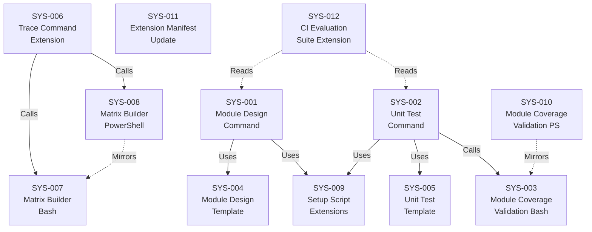

# System Design: Module Design ↔ Unit Testing

**Feature Branch**: `004-module-unit-testing`
**Created**: 2026-02-21
**Status**: Approved
**Source**: `specs/004-module-unit/v-model/requirements.md`

## Overview

This system design decomposes the 71 requirements for v0.4.0 of the V-Model Extension Pack into 12 system components organized across the extension's artifact types: Markdown agent prompts (commands), Markdown output structure definitions (templates), deterministic Bash/PowerShell helpers (scripts), Python-based CI test infrastructure (validators/evals), and the extension manifest. The decomposition follows the natural boundary of each deliverable artifact — commands that orchestrate AI generation, templates that constrain output structure, scripts that perform deterministic validation and matrix building, and the manifest that registers capabilities. Two new commands (module-design, unit-test) form the core of this V-level, supported by a new validation script pair, new template pair, trace command extension (Matrix D), matrix builder extensions, setup script extensions, a manifest update, and CI evaluation suite extensions. Safety-critical sections (MISRA C complexity constraints, MC/DC truth tables, variable-level fault injection) are conditionally included within the existing command and template components based on domain configuration. The `[EXTERNAL]` tag is the single canonical identifier for third-party library wrappers across all components.

## ID Schema

- **System Component**: `SYS-NNN` — sequential identifier for each component
- **Parent Requirements**: Comma-separated `REQ-NNN` list per component (many-to-many)
- Example: `SYS-003` with Parent Requirements `REQ-033, REQ-034, REQ-035` — component satisfies all three requirements

## Decomposition View (IEEE 1016 §5.1)

| SYS ID | Name | Description | Parent Requirements | Type |
|--------|------|-------------|---------------------|------|
| SYS-001 | Module Design Command | Markdown agent prompt executed by GitHub Copilot that reads `architecture-design.md` as input and produces `module-design.md` as output. Assigns unique `MOD-NNN` identifiers (3-digit zero-padded, sequential, never renumbered), generates four mandatory views (Algorithmic/Logic with fenced ` ```pseudocode ``` ` blocks, State Machine with Mermaid stateDiagram-v2 or broad-regex stateless bypass, Internal Data Structures with explicit types/sizes/constraints, Error Handling mapped to Architecture Interface View contracts), includes a "Target Source File(s)" property per module supporting comma-separated paths for header/implementation pairs, traces each MOD to parent ARCH-NNN identifiers via an explicit "Parent Architecture Modules" field supporting many-to-many ARCH↔MOD relationships, fully decomposes `[CROSS-CUTTING]` modules with inherited tag and complete pseudocode, tags third-party library wrappers as `[EXTERNAL]` documenting only wrapper/configuration interface while preserving wrapper logic pseudocode when meaningful (retry, circuit breaker), flags untraceable modules as `[DERIVED MODULE: description]`, rejects vague prose (absence of fenced pseudocode block is a structural failure), conditionally includes safety-critical sections (Complexity Constraints with cyclomatic complexity ≤ 10, Memory Management prohibiting dynamic allocation post-init, Single Entry/Exit enforcing one return point) when domain is configured, follows the strict translator constraint, handles 50+ ARCH identifiers without truncation, and fails gracefully with a clear error message when `architecture-design.md` is empty or contains zero ARCH-NNN identifiers. Reads input exclusively from `{FEATURE_DIR}/v-model/architecture-design.md` and writes output exclusively to `{FEATURE_DIR}/v-model/module-design.md`. | REQ-001, REQ-002, REQ-003, REQ-004, REQ-005, REQ-006, REQ-007, REQ-008, REQ-009, REQ-010, REQ-011, REQ-012, REQ-013, REQ-014, REQ-015, REQ-016, REQ-041, REQ-043, REQ-NF-002, REQ-IF-001, REQ-CN-001, REQ-CN-004 | Module |
| SYS-002 | Unit Test Command | Markdown agent prompt executed by GitHub Copilot that reads `module-design.md` as input and produces `unit-test.md` as output. Assigns test case identifiers (`UTP-NNN-X` where NNN matches parent MOD and X is sequential uppercase letter) and test scenario identifiers (`UTS-NNN-X#` where NNN-X matches parent UTP and # is sequential number), applies mandatory ISO 29119-4 white-box techniques (Statement & Branch Coverage driven by Algorithmic/Logic View, Boundary Value Analysis at the variable level for scalar types or Equivalence Partitioning for discrete non-scalar types driven by Internal Data Structures, Strict Isolation with Dependency & Mock Registry driven by Architecture Interface View, State Transition Testing covering every transition including invalid ones driven by State Machine View), includes a Dependency & Mock Registry table per test case explicitly listing all external dependencies including hardware interfaces (GPIO, memory-mapped registers, I2C/SPI) with mock/stub strategies or "None — module is self-contained" for dependency-free modules, uses Arrange/Act/Assert structure with white-box implementation-oriented language distinct from BDD Given/When/Then, skips `[EXTERNAL]` modules with a note ("Module MOD-NNN is [EXTERNAL] — wrapper behavior tested at integration level"), restricts scope to internal module logic only (no user journeys or integration boundaries), conditionally includes MC/DC truth tables and variable-level fault injection for safety-critical configurations, invokes `validate-module-coverage.sh` as a post-generation coverage gate, follows the strict translator constraint, handles 50+ ARCH identifiers without truncation, and ensures ID lineage is regex-parseable to MOD-NNN (ARCH resolution requires file lookup due to many-to-many). Reads input exclusively from `{FEATURE_DIR}/v-model/module-design.md` and writes output exclusively to `{FEATURE_DIR}/v-model/unit-test.md`. | REQ-017, REQ-018, REQ-019, REQ-020, REQ-021, REQ-022, REQ-023, REQ-024, REQ-025, REQ-026, REQ-027, REQ-028, REQ-029, REQ-030, REQ-031, REQ-032, REQ-042, REQ-NF-002, REQ-IF-002, REQ-CN-001, REQ-CN-004 | Module |
| SYS-003 | Module Coverage Validation Script (Bash) | Deterministic Bash script (`validate-module-coverage.sh`) that validates bidirectional coverage across module-level artifacts. Performs forward coverage validation (every `ARCH-NNN` including `[CROSS-CUTTING]` in `architecture-design.md` has at least one `MOD-NNN` in `module-design.md`), backward coverage validation (every `MOD-NNN` except `[EXTERNAL]` in `module-design.md` has at least one `UTP-NNN-X` in `unit-test.md`), orphan detection (MOD without parent ARCH, UTP without parent MOD), and `[EXTERNAL]` bypass (counting external modules as "covered by integration tests" rather than flagging as gaps). Supports partial validation: when `unit-test.md` is absent, validates only ARCH→MOD forward coverage and gracefully skips MOD→UTP backward checks, exiting with code 0 if forward coverage is complete. Accepts three file paths as positional arguments (architecture-design.md, module-design.md, unit-test.md), supports `--json` output mode, accepts gaps in MOD numbering without false positives, outputs human-readable gap reports with specific IDs suitable for CI log inspection, exits with code 0 on pass / code 1 on failure, uses the broad case-insensitive regex `(?i)N/?A.*Stateless` for stateless bypass detection, and resolves ARCH ancestry from the "Parent Architecture Modules" field (not from ID string) due to many-to-many ARCH↔MOD. Uses regex-based parsing consistent with v0.3.0's `validate-architecture-coverage.sh`, requiring no external tooling beyond standard Bash utilities. The `[EXTERNAL]` tag is the only recognized bypass tag — `[COTS]` and other alternatives are not processed. | REQ-033, REQ-034, REQ-035, REQ-036, REQ-037, REQ-038, REQ-039, REQ-040, REQ-006, REQ-031, REQ-032, REQ-NF-001, REQ-NF-003, REQ-IF-003, REQ-IF-004, REQ-CN-004 | Utility |
| SYS-004 | Module Design Template | Markdown template file (`module-design-template.md`) in the `templates/` directory defining the required structure for DO-178C/ISO 26262-compliant module design output. Includes section structure and field definitions for the four mandatory views: Algorithmic/Logic View (fenced ` ```pseudocode ``` ` blocks for each MOD, explicit branches/loops/decisions), State Machine View (Mermaid `stateDiagram-v2` syntax for stateful modules, stateless bypass string for pure functions), Internal Data Structures (local variables, constants, buffers with explicit types/sizes/constraints), and Error Handling & Return Codes (exception paths mapped to Architecture Interface View contracts). Includes Target Source File(s) property field (comma-separated for multi-file modules), Parent Architecture Modules field, `[CROSS-CUTTING]` tag handling, `[EXTERNAL]` wrapper-only documentation section, and conditional safety-critical placeholders (Complexity Constraints, Memory Management, Single Entry/Exit). | REQ-056, REQ-003, REQ-004, REQ-005, REQ-006, REQ-007, REQ-008, REQ-014 | Module |
| SYS-005 | Unit Test Template | Markdown template file (`unit-test-template.md`) in the `templates/` directory defining the required structure for ISO 29119-4-compliant white-box unit test output. Includes the three-tier MOD→UTP-NNN-X→UTS-NNN-X# hierarchy, technique naming and view anchoring per test case, Arrange/Act/Assert scenario format with white-box implementation-oriented language, Dependency & Mock Registry table per test case (with explicit hardware interface guidance), self-contained module handling ("None — module is self-contained"), `[EXTERNAL]` module skip notation, and conditional safety-critical placeholders (MC/DC truth tables, Variable-Level Fault Injection). | REQ-057, REQ-018, REQ-019, REQ-020, REQ-021, REQ-022, REQ-023, REQ-024, REQ-025, REQ-027 | Module |
| SYS-006 | Trace Command Extension | Extension to the existing `/speckit.v-model.trace` Markdown agent prompt to produce Matrix D (Implementation Verification) — `ARCH → MOD → UTP → UTS` — when `module-design.md` and `unit-test.md` exist. Each `ARCH-NNN` cell includes parent `SYS-NNN` references in parentheses for end-to-end traceability (resolved from `architecture-design.md`); `[CROSS-CUTTING]` ARCH modules display `([CROSS-CUTTING])` instead of SYS annotation; `[EXTERNAL]` modules appear with annotation and "N/A — External" in UTP/UTS columns. Produces Matrix A, B, C, and D as separate tables with independent coverage percentages. Builds matrices progressively (A alone, A+B, A+B+C, A+B+C+D). Remains backward compatible: when module-level artifacts are absent, produces v0.3.0 output (Matrix A + B + C only, no Matrix D, no warning). Supports partial Matrix D (MOD column populated, UTP/UTS empty with note "Unit test plan not yet generated") when `unit-test.md` is absent. Coverage percentages match corresponding validation script outputs. | REQ-046, REQ-047, REQ-048, REQ-049, REQ-050, REQ-051, REQ-052, REQ-053, REQ-055, REQ-NF-004 | Module |
| SYS-007 | Matrix Builder Script Extension (Bash) | Extension to the existing `build-matrix.sh` deterministic Bash script to parse `module-design.md`, `unit-test.md`, AND `architecture-design.md` for Matrix D data generation. The three-file requirement exists because `module-design.md` only contains ARCH-NNN references, not SYS-NNN — the `architecture-design.md` is needed to resolve ARCH→SYS lineage for the parenthetical annotations required by REQ-047. Outputs structured matrix data with independently calculated coverage percentages matching the validation script output. | REQ-054, REQ-053 | Utility |
| SYS-008 | Matrix Builder Script Extension (PowerShell) | Extension to the existing `build-matrix.ps1` deterministic PowerShell script with identical Matrix D generation logic as the Bash version (SYS-007), including the three-file parsing requirement. Ensures cross-platform parity for enterprise Windows teams. | REQ-CN-005 | Utility |
| SYS-009 | Setup Script Extensions | Extensions to `setup-v-model.sh` and `setup-v-model.ps1` to support the new module-level commands. Adds `--require-module-design` and `--require-unit-test` flags to verify the respective files exist before proceeding. Extends `AVAILABLE_DOCS` detection to include `module-design.md` and `unit-test.md`. Preserves backward compatibility — existing v0.3.0 invocations produce unchanged behavior. | REQ-044, REQ-045, REQ-NF-004 | Utility |
| SYS-010 | Module Coverage Validation Script (PowerShell) | PowerShell script (`validate-module-coverage.ps1`) with identical behavior, output format, exit codes, `[EXTERNAL]` bypass logic, and partial validation support as the Bash validation script (SYS-003). Accepts the same three file path arguments, supports `-Json` output mode, and passes the same test fixture suite. Ensures cross-platform parity for enterprise Windows teams. | REQ-CN-003, REQ-IF-003, REQ-IF-004 | Utility |
| SYS-011 | Extension Manifest Update | Updates to `extension.yml` to bump the extension version to `0.4.0` and register exactly 9 commands (7 existing + 2 new: `module-design`, `unit-test`) and 1 hook. Adds `MOD`, `UTP`, `UTS` to the recognized `id_prefixes`. | REQ-CN-002 | Module |
| SYS-012 | CI Evaluation Suite Extension | Extension to the Python-based CI evaluation infrastructure to validate that `/speckit.v-model.module-design` and `/speckit.v-model.unit-test` command outputs meet quality thresholds. Structural evaluations include: fenced ` ```pseudocode ``` ` block presence for every non-EXTERNAL MOD, technique naming for every UTP, Dependency & Mock Registry presence for every UTP, `[EXTERNAL]` bypass correctness, State Machine View validity (Mermaid for stateful, broad stateless regex detection for stateless), Target Source File(s) presence, and Parent Architecture Modules field presence. LLM-as-judge evaluations assess pseudocode concreteness and semantic quality. | REQ-NF-005 | Module |

## Dependency View (IEEE 1016 §5.2)

| Source | Target | Relationship | Failure Impact |
|--------|--------|-------------|----------------|
| SYS-001 | SYS-004 | Uses | Module design command cannot produce compliant output structure without the template; output would lack mandatory DO-178C view sections, Target Source File(s) field, and `[EXTERNAL]` handling. |
| SYS-001 | SYS-009 | Uses | Module design command cannot verify that `architecture-design.md` exists (via `--require-module-design` prerequisite) or detect available documents; command may proceed without prerequisite input. |
| SYS-002 | SYS-005 | Uses | Unit test command cannot produce compliant output structure without the template; output would lack mandatory ISO 29119-4 sections, Dependency & Mock Registry, and Arrange/Act/Assert format. |
| SYS-002 | SYS-003 | Calls | Unit test command cannot run the post-generation coverage gate; coverage gaps would go unreported and the output would lack the validation result summary. |
| SYS-002 | SYS-009 | Uses | Unit test command cannot detect available documents; command may proceed without verifying prerequisite artifacts. |
| SYS-006 | SYS-007 | Calls | Trace command extension on Linux/macOS cannot generate Matrix D data; Matrix D would be missing from the traceability matrix output. |
| SYS-006 | SYS-008 | Calls | Trace command extension on Windows cannot generate Matrix D data; Matrix D would be missing from the traceability matrix output on Windows. |
| SYS-010 | SYS-003 | Mirrors | PowerShell validation script must replicate all Bash script logic; behavioral divergence between SYS-003 and SYS-010 produces inconsistent coverage results across platforms. |
| SYS-008 | SYS-007 | Mirrors | PowerShell matrix builder must replicate all Bash matrix builder logic; behavioral divergence produces inconsistent Matrix D data across platforms. |
| SYS-012 | SYS-001 | Reads | CI evaluation suite validates module design command output; if SYS-001 output format changes, evaluation fixtures and assertions must be updated. |
| SYS-012 | SYS-002 | Reads | CI evaluation suite validates unit test command output; if SYS-002 output format changes, evaluation fixtures and assertions must be updated. |

### Dependency Diagram



## Interface View (IEEE 1016 §5.3)

### External Interfaces

| Component | Interface Name | Protocol | Input | Output | Error Handling |
|-----------|---------------|----------|-------|--------|----------------|
| SYS-001 | Module Design Generation | File I/O (Markdown) | `{FEATURE_DIR}/v-model/architecture-design.md` — Markdown file containing `ARCH-NNN` module decomposition with four 42010/4+1 views, including `[CROSS-CUTTING]` and `[EXTERNAL]` tags | `{FEATURE_DIR}/v-model/module-design.md` — Markdown file containing `MOD-NNN` module designs with four mandatory views (Algorithmic/Logic, State Machine, Internal Data Structures, Error Handling), Target Source File(s), and Parent Architecture Modules field | Fails gracefully with message "No architecture modules found in architecture-design.md — cannot generate module design" when input is empty or contains zero ARCH identifiers. Flags derived modules as `[DERIVED MODULE: description]` instead of silently creating components. Rejects vague prose with structural failure when fenced pseudocode block is absent. |
| SYS-002 | Unit Test Generation | File I/O (Markdown) | `{FEATURE_DIR}/v-model/module-design.md` — Markdown file containing `MOD-NNN` module designs with four mandatory views | `{FEATURE_DIR}/v-model/unit-test.md` — Markdown file containing `UTP-NNN-X` test cases and `UTS-NNN-X#` test scenarios with ISO 29119-4 white-box techniques, Dependency & Mock Registry, and embedded coverage validation result | Reports coverage gate result (pass/fail with summary) from `validate-module-coverage.sh` invocation. Skips `[EXTERNAL]` modules with a note. Passes through validation script exit code semantics. |
| SYS-003 | Module Coverage Validation (Bash) | CLI (stdout + exit code) | Three positional file path arguments: (1) `architecture-design.md`, (2) `module-design.md`, (3) `unit-test.md`. Optional `--json` flag for machine-readable output. Third argument optional for partial validation mode. | Human-readable gap report listing each gap/orphan by ID (e.g., "ARCH-003: no module design mapping found"), or JSON-structured equivalent when `--json` is specified. Coverage summary with forward/backward percentages and pass/fail verdict. `[EXTERNAL]` modules counted as "covered by integration tests." | Exit code 0 when all applicable coverage checks pass; exit code 1 when any gap or orphan is detected. Supports partial validation: validates forward coverage only when `unit-test.md` is absent, exiting with code 0 if forward coverage is complete. |
| SYS-010 | Module Coverage Validation (PowerShell) | CLI (stdout + exit code) | Three positional file path arguments: (1) `architecture-design.md`, (2) `module-design.md`, (3) `unit-test.md`. Optional `-Json` flag for machine-readable output. Third argument optional for partial validation mode. | Identical output format to SYS-003: human-readable gap report or JSON equivalent, coverage summary with pass/fail verdict. | Identical exit code behavior to SYS-003: exit code 0 on pass, exit code 1 on failure. Same partial validation and `[EXTERNAL]` bypass semantics. |
| SYS-006 | Traceability Matrix Generation | File I/O (Markdown) | V-model artifact files in `{FEATURE_DIR}/v-model/`: `requirements.md`, `acceptance-plan.md`, `system-design.md`, `system-test.md`, `architecture-design.md`, `integration-test.md`, `module-design.md` (optional), `unit-test.md` (optional) | `traceability-matrix.md` — Markdown file containing Matrix A (REQ→ATP→SCN), Matrix B (REQ→SYS→STP→STS), Matrix C (SYS→ARCH→ITP→ITS), and Matrix D (ARCH→MOD→UTP→UTS) as separate tables with independent coverage percentages. Progressive: A only, A+B, A+B+C, or A+B+C+D depending on available artifacts. | When module-level artifacts are absent, produces v0.3.0 output (Matrix A + B + C only) with no warning. When `module-design.md` exists but `unit-test.md` does not, includes MOD column in Matrix D with UTP/UTS columns showing "Unit test plan not yet generated." |

### Internal Interfaces

| Source | Target | Interface Name | Protocol | Data Format | Error Handling |
|--------|--------|---------------|----------|-------------|----------------|
| SYS-001 | SYS-004 | Template Loading | File read | Markdown template with section headers, HTML comments (field definitions), and placeholder tables defining the four mandatory view structures, Target Source File(s) field, `[EXTERNAL]` section, and safety-critical placeholders | Template file not found: command cannot proceed — reports error to user. |
| SYS-001 | SYS-009 | Setup Invocation | Shell exec + JSON stdout | JSON object with keys: `VMODEL_DIR`, `FEATURE_DIR`, `BRANCH`, `AVAILABLE_DOCS`, plus `architecture-design.md` path verified via appropriate flags | Setup script returns non-zero exit code with error message if prerequisite files are missing. |
| SYS-002 | SYS-005 | Template Loading | File read | Markdown template with section headers, HTML comments, and placeholder tables defining the three-tier UTP/UTS hierarchy, Dependency & Mock Registry, and Arrange/Act/Assert format | Template file not found: command cannot proceed — reports error to user. |
| SYS-002 | SYS-003 | Coverage Gate Invocation | Shell exec + stdout/exit code | SYS-002 passes three file paths to SYS-003 CLI. Parses stdout for coverage summary (or JSON with `--json`). Checks exit code: 0 = pass, 1 = gaps found. | Exit code 1: SYS-002 includes the gap report in its output and flags incomplete coverage. SYS-002 does not abort — it reports the validation result as part of the unit test output. |
| SYS-002 | SYS-009 | Setup Invocation | Shell exec + JSON stdout | JSON object with keys: `VMODEL_DIR`, `FEATURE_DIR`, `BRANCH`, `AVAILABLE_DOCS` including detection of `module-design.md` and `unit-test.md` | Setup script returns non-zero exit code with error message if prerequisites are missing. |
| SYS-006 | SYS-007 | Matrix D Data Generation (Bash) | Shell exec + stdout | Structured text output containing parsed ARCH→MOD→UTP→UTS mappings with SYS lineage annotations and coverage percentages, piped to trace command for Markdown table generation. Requires three input files: `architecture-design.md` (for ARCH→SYS resolution), `module-design.md`, and `unit-test.md`. | Script returns non-zero exit code if input files are malformed or missing; trace command reports Matrix D generation failure. |
| SYS-006 | SYS-008 | Matrix D Data Generation (PowerShell) | Shell exec + stdout | Identical structured text output to SYS-007, ensuring cross-platform parity for Matrix D generation | Script returns non-zero exit code if input files are malformed or missing; trace command reports Matrix D generation failure on Windows. |

## Data Design View (IEEE 1016 §5.4)

| Entity | Component | Storage | Protection at Rest | Protection in Transit | Retention |
|--------|-----------|---------|-------------------|-----------------------|-----------|
| module-design.md | SYS-001 | File (Markdown in `{FEATURE_DIR}/v-model/`) | Repository access controls (Git permissions); no encryption required — specification artifact, not secret data | N/A — local file system; protected by repository transport (HTTPS/SSH for Git push/pull) | Persists for the lifetime of the feature branch; archived when branch is merged or deleted. Never modified by downstream commands (REQ-NF-004). |
| unit-test.md | SYS-002 | File (Markdown in `{FEATURE_DIR}/v-model/`) | Repository access controls (Git permissions); no encryption required — specification artifact, not secret data | N/A — local file system; protected by repository transport (HTTPS/SSH for Git push/pull) | Persists for the lifetime of the feature branch; archived when branch is merged or deleted. Never modified by downstream commands (REQ-NF-004). |
| Coverage Validation Results | SYS-003, SYS-010 | In-memory (stdout stream) | N/A — ephemeral output not persisted to disk | N/A — local process stdout; no network transit | Ephemeral — exists only during script execution. Captured by calling command (SYS-002) for inclusion in unit-test.md output, or displayed in CI logs. |
| Coverage Validation Results (JSON) | SYS-003, SYS-010 | In-memory (stdout stream) | N/A — ephemeral output not persisted to disk | N/A — local process stdout; no network transit | Ephemeral — exists only during script execution. Consumed programmatically by SYS-002 when `--json` flag is used. |
| Matrix D Data | SYS-007, SYS-008 | In-memory (stdout stream) | N/A — ephemeral output not persisted to disk | N/A — local process stdout; no network transit | Ephemeral — exists only during script execution. Consumed by SYS-006 for Markdown table generation. |
| traceability-matrix.md (Matrix D addition) | SYS-006 | File (Markdown in `{FEATURE_DIR}/v-model/`) | Repository access controls (Git permissions); no encryption required | N/A — local file system; protected by repository transport | Persists for the lifetime of the feature branch. Updated when trace command is re-run with new artifacts. |
| module-design-template.md | SYS-004 | File (Markdown in `templates/`) | Repository access controls; read-only at runtime by SYS-001 | N/A — local file system | Permanent — part of the extension distribution. Versioned with the extension. |
| unit-test-template.md | SYS-005 | File (Markdown in `templates/`) | Repository access controls; read-only at runtime by SYS-002 | N/A — local file system | Permanent — part of the extension distribution. Versioned with the extension. |
| extension.yml | SYS-011 | File (YAML in repository root) | Repository access controls | N/A — local file system | Permanent — part of the extension distribution. Updated per release (v0.4.0). |
| CI Evaluation Fixtures | SYS-012 | File (Python + fixture Markdown in test infrastructure) | Repository access controls | N/A — local file system | Permanent — part of the extension test suite. Updated when command output formats change. |

---

## Coverage Summary

| Metric | Count |
|--------|-------|
| Total System Components (SYS) | 12 |
| Total Parent Requirements Covered | 71 / 71 (100%) |
| Components per Type | Subsystem: 0 \| Module: 7 \| Service: 0 \| Library: 0 \| Utility: 5 |
| **Forward Coverage (REQ→SYS)** | **100%** |

## Derived Requirements

None — all components trace to existing requirements.

## Glossary

| Term | Definition |
|------|-----------|
| MOD-NNN | Module design identifier (e.g., MOD-001). 3-digit zero-padded. Maps many-to-many with ARCH-NNN. Each includes Target Source File(s) for codebase mapping. |
| UTP-NNN-X | Unit test case identifier (e.g., UTP-001-A). Parent: MOD-NNN. Each names one of the mandatory ISO 29119-4 white-box techniques and includes a Dependency & Mock Registry. |
| UTS-NNN-X# | Unit test scenario identifier (e.g., UTS-001-A1). Parent: UTP-NNN-X. Arrange/Act/Assert format with white-box, implementation-oriented language. |
| DO-178C | Software Considerations in Airborne Systems. Defines Low-Level Requirements (LLR) that must be detailed enough for mechanical code translation. Requires MC/DC for Level A. |
| ISO 26262 Part 6 | Automotive functional safety — Product development at the software level. Mandates MISRA C, restricted complexity, variable-level fault injection. |
| ISO/IEC/IEEE 29119-4 | Software Testing — Test Techniques. Defines White-Box techniques (Statement/Branch Coverage, BVA, EP, State Transition Testing) used at the unit level. |
| MISRA C:2012 | Motor Industry Software Reliability Association — safe coding standard. Cyclomatic complexity ≤ 10 per function, no dynamic allocation post-init. |
| MC/DC | Modified Condition/Decision Coverage. Most rigorous structural coverage metric — proves each boolean condition independently affects the decision. |
| IEEE 1016 | Software Design Description. Defines the four mandatory design views (Decomposition, Dependency, Interface, Data Design). |
| Matrix D | Traceability matrix: ARCH → MOD → UTP → UTS. Proves individual modules are correctly implemented and tested. Requires three input files. |
| Strict Translator Constraint | Rule prohibiting the AI from inventing capabilities not present in the source artifact. |
| Coverage Gate | Deterministic script invocation that validates coverage and reports pass/fail. |
| `[CROSS-CUTTING]` | Tag inherited from v0.3.0 for infrastructure modules. Requires full MOD decomposition and UTP coverage. |
| `[EXTERNAL]` | Single canonical tag for third-party library wrappers. MOD documents wrapper only; UTP coverage bypassed. `[COTS]` not recognized. |
| `[DERIVED MODULE]` | Flag for modules not traceable to any parent architecture module. Must be flagged, not silently added. |
| Dependency & Mock Registry | Table per UTP listing all external dependencies including hardware interfaces and their mock/stub strategy. |
| Target Source File(s) | Property mapping MOD-NNN to physical repository file paths. Comma-separated for header/implementation pairs. |
| Boundary Value Analysis (BVA) | White-box technique for scalar ordered types: min, min-1, mid, max, max+1. |
| Equivalence Partitioning (EP) | White-box technique for non-scalar types (Booleans, Enums) where BVA boundaries do not exist. |
| Variable-Level Fault Injection | Safety-critical technique forcing local variables into corrupted states to test error handling. |
