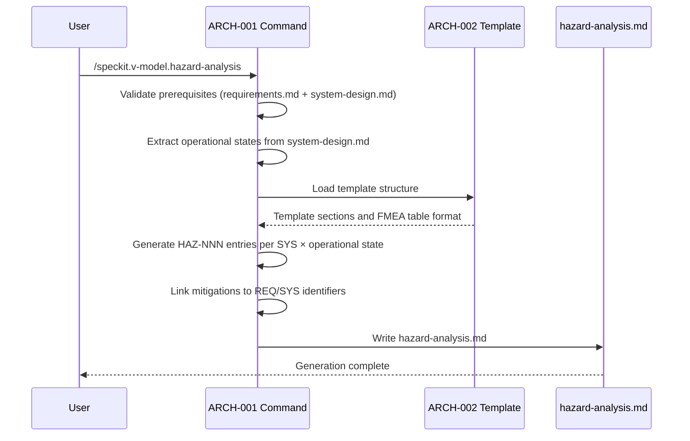
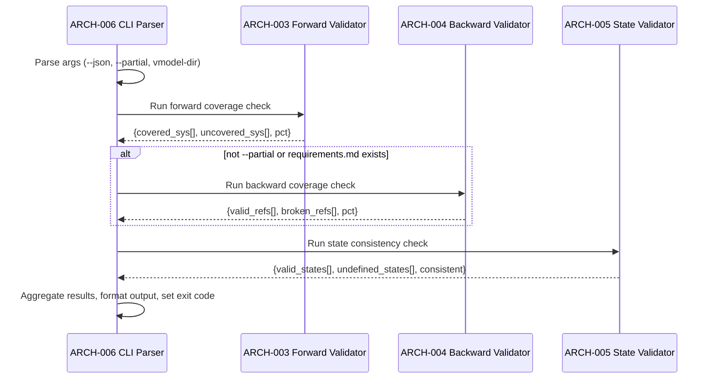
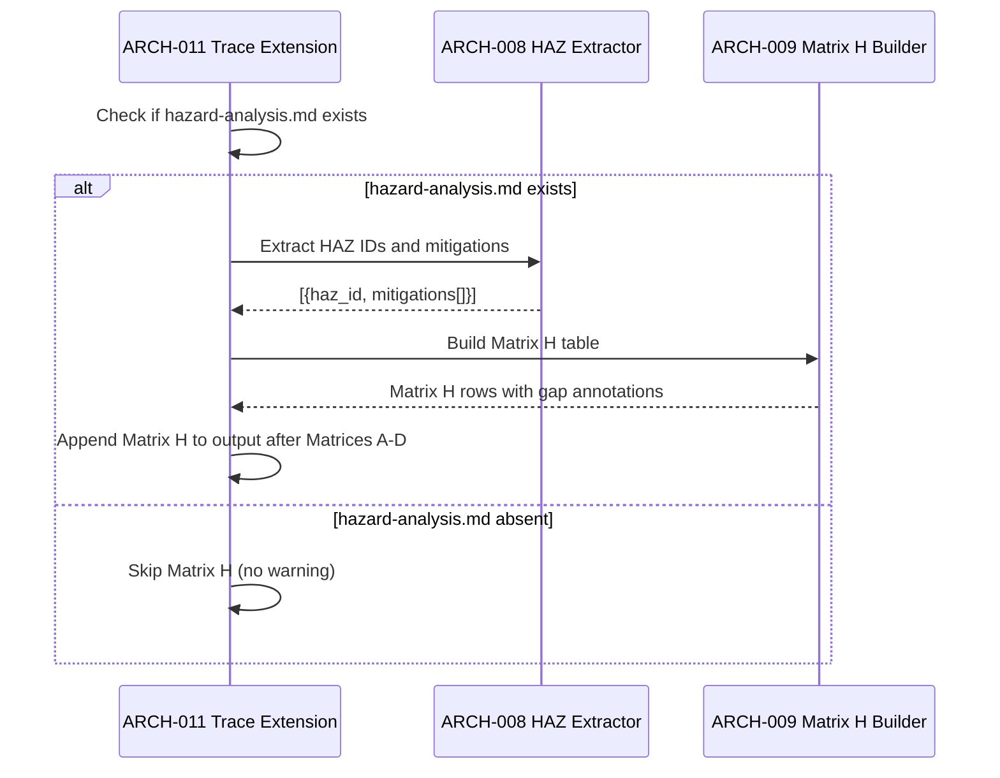

# Architecture Design: Hazard Analysis (FMEA)

**Feature Branch**: `005a-hazard-analysis`
**Created**: 2026-04-01
**Status**: Approved
**Source**: `specs/005a-hazard-analysis/v-model/system-design.md`

## Overview

This architecture decomposes the 9 system components into 13 architecture modules organized by implementation boundary. The Hazard Analysis Command (SYS-001) maps to a single prompt file (ARCH-001). The template (SYS-002) maps to a single template file (ARCH-002). The Bash validation script (SYS-003) is decomposed into four functional modules — three independent coverage validators (forward, backward, state consistency) and a CLI/output formatter — reflecting the script's internal function structure. PowerShell parity scripts (SYS-004, SYS-006) each map to a single module mirroring their Bash counterparts. The matrix builder extension (SYS-005) decomposes into a HAZ ID extractor and a Matrix H table builder. The trace command extension (SYS-007), ID validator (SYS-008), and manifest (SYS-009) each map to a single module. All modules have explicit interface contracts. No cross-cutting or derived modules are required.

## ID Schema

- **Architecture Module**: `ARCH-NNN` — sequential identifier for each module
- **Parent System Components**: Comma-separated `SYS-NNN` list per module (many-to-many)
- Example: `ARCH-006` with Parent System Components `SYS-003` — module implements one function within the validation script

## Logical View — Component Breakdown (IEEE 42010 / Kruchten 4+1)

| ARCH ID | Name | Description | Parent System Components | Type |
|---------|------|-------------|--------------------------|------|
| ARCH-001 | Hazard Analysis Command Definition | Markdown agent prompt file (`commands/hazard-analysis.md`) executed by GitHub Copilot. Orchestrates FMEA generation: validates prerequisite inputs (`requirements.md` + `system-design.md`), extracts operational states, generates hazard entries with 8 mandatory fields per `HAZ-NNN`, handles progressive deepening (append-only when `architecture-design.md` exists), applies domain-specific severity scales from `v-model-config.yml`, enforces the strict translator constraint, and writes output using the template structure. Produces `hazard-analysis.md` with sequential `HAZ-NNN` identifiers matching `HAZ-[0-9]{3}`. | SYS-001 | Component |
| ARCH-002 | Hazard Analysis Template | Markdown template file (`templates/hazard-analysis-template.md`) defining the output structure: Summary, Risk Matrix Definition (severity × likelihood grid), Operational States Reference table, and Hazard Register FMEA table with 10 columns (HAZ ID, Component, Failure Mode, Operational State, Effect, Severity, Likelihood, Risk Level, Mitigation, Residual Risk). Includes conditional safety-critical placeholders for domain-specific severity scales. | SYS-002 | Component |
| ARCH-003 | Forward Coverage Validator | Bash function within `validate-hazard-coverage.sh` that validates every `SYS-NNN` in `system-design.md` has at least one `HAZ-NNN` entry in `hazard-analysis.md`. Uses regex `SYS-[0-9]{3}` to extract system component IDs and `HAZ-[0-9]{3}` to extract hazard IDs, then cross-references the Component column of the FMEA table. Returns a list of uncovered `SYS-NNN` IDs and a forward coverage percentage. | SYS-003 | Utility |
| ARCH-004 | Backward Coverage Validator | Bash function within `validate-hazard-coverage.sh` that validates every `HAZ-NNN` mitigation references at least one `REQ-NNN` or `SYS-NNN` identifier that exists in `requirements.md` or `system-design.md`. Extracts mitigation references from the Mitigation column using regex, then checks existence in source documents. Returns a list of broken references and a backward coverage percentage. | SYS-003 | Utility |
| ARCH-005 | State Consistency Validator | Bash function within `validate-hazard-coverage.sh` that validates every operational state referenced in a hazard entry exists in the set of states defined in `system-design.md`. If `system-design.md` defines no explicit states, accepts only the implicit "NORMAL" state. Returns a list of undefined states and a boolean consistency result. | SYS-003 | Utility |
| ARCH-006 | Validation CLI and Output Formatter | Bash function within `validate-hazard-coverage.sh` that handles argument parsing (positional V-Model directory path, `--json` flag, `--partial` flag), orchestrates the three validators (ARCH-003, ARCH-004, ARCH-005), formats output as human-readable gap reports or JSON conforming to the schema `{has_gaps, forward_coverage, backward_coverage, state_consistency, forward_gaps, backward_gaps, state_warnings}`, and sets the exit code (0 = pass, 1 = gaps). In `--partial` mode, skips backward coverage checks when `requirements.md` is absent. | SYS-003 | Utility |
| ARCH-007 | PowerShell Coverage Validation | PowerShell script (`Validate-HazardCoverage.ps1`) mirroring the combined behavior of ARCH-003 through ARCH-006. Implements identical forward coverage, backward coverage, and state consistency validation using PowerShell regex patterns. Produces identical JSON output structure, field values, and exit codes. Accepts parameters `-Json` and `-Partial` corresponding to Bash flags. | SYS-004 | Utility |
| ARCH-008 | HAZ ID Extractor | Bash function within `build-matrix.sh` that parses `hazard-analysis.md` using regex `HAZ-[0-9]{3}` to extract all hazard IDs and their associated mitigation references (`REQ-NNN` / `SYS-NNN`) from the FMEA table. Returns structured data: array of `{haz_id, mitigations[]}` tuples. | SYS-005 | Utility |
| ARCH-009 | Matrix H Table Builder | Bash function within `build-matrix.sh` that constructs Matrix H (Hazard Traceability) from HAZ ID extractor output. For each `HAZ-NNN`, resolves the mitigation chain: HAZ → Mitigation (`REQ-NNN` / `SYS-NNN`) → Verification (`ATP-NNN` / `STP-NNN`). Inserts `⚠️ No test coverage` in the Verification column when no test case covers the mitigation. Maintains backward compatibility: produces no Matrix H output when `hazard-analysis.md` is absent. | SYS-005 | Utility |
| ARCH-010 | PowerShell Matrix H Builder | PowerShell function within `build-matrix.ps1` mirroring the combined behavior of ARCH-008 and ARCH-009. Produces identical Matrix H output including gap highlighting. | SYS-006 | Utility |
| ARCH-011 | Trace Command Matrix H Integration | Extension to the existing `commands/trace.md` prompt to include Matrix H in the traceability matrix output when `hazard-analysis.md` exists. Follows the progressive matrix pattern: Matrix H is included alongside A–D whenever hazard artifacts are present, omitted silently when absent. No warning when `hazard-analysis.md` is missing — consistent with v0.4.0 backward compatibility. | SYS-007 | Component |
| ARCH-012 | HAZ ID Pattern Registration | Extension to `evals/validators/id_validator.py` adding `HAZ` to the recognized prefix list and `HAZ-[0-9]{3}` to the validation regex patterns. Ensures the validator accepts `HAZ-001` through `HAZ-999` as valid identifiers. | SYS-008 | Utility |
| ARCH-013 | Extension Manifest Entries | Updates to `extension.yml`: (1) register `speckit.v-model.hazard-analysis` command with file path `commands/hazard-analysis.md` and description, (2) add `hazards: "HAZ"` to `defaults.id_prefixes`, (3) update trace command description to mention Matrix H alongside existing matrices A–D. | SYS-009 | Component |

## Process View — Dynamic Behavior (Kruchten 4+1)

### Interaction: Hazard Analysis Generation

**Concurrency Model**: Sequential — single-threaded execution within the Copilot agent context
**Synchronization Points**: None — file I/O is sequential

### Interaction: Coverage Validation Pipeline

**Concurrency Model**: Sequential — validators execute in order within a single Bash process
**Synchronization Points**: Each validator completes before the next starts

### Interaction: Matrix H Generation in Trace

**Concurrency Model**: Sequential — script execution within the Copilot agent context
**Synchronization Points**: None — file reads are sequential

## Interface View — API Contracts (Kruchten 4+1)

### ARCH-001: Hazard Analysis Command Definition

| Direction | Name | Type | Format | Constraints |
|-----------|------|------|--------|-------------|
| Input | requirements.md | File | Markdown with `REQ-NNN` table rows | Must exist; validated by setup script |
| Input | system-design.md | File | Markdown with `SYS-NNN` Decomposition View + operational states | Must exist; command fails with error if absent |
| Input | architecture-design.md | File | Markdown with `ARCH-NNN` Logical View | Optional; triggers progressive deepening when present |
| Input | v-model-config.yml | File | YAML with `domain` key | Optional; activates domain-specific severity scales |
| Input | existing hazard-analysis.md | File | Markdown with existing `HAZ-NNN` entries | Optional; triggers append-only mode when present |
| Output | hazard-analysis.md | File | Markdown conforming to template structure | Written to `{VMODEL_DIR}/hazard-analysis.md` |
| Exception | Missing prerequisite | Error message | Plain text | "hazard-analysis requires both requirements.md and system-design.md" |

### ARCH-002: Hazard Analysis Template

| Direction | Name | Type | Format | Constraints |
|-----------|------|------|--------|-------------|
| Input | Template load request | File read | Markdown | Template must exist in `templates/` directory |
| Output | Template structure | Markdown sections | HTML comment markers + table headers | Defines Summary, Risk Matrix, Operational States, Hazard Register sections |

### ARCH-003: Forward Coverage Validator

| Direction | Name | Type | Format | Constraints |
|-----------|------|------|--------|-------------|
| Input | system-design.md | File | Markdown with `SYS-NNN` IDs | Parsed via regex `SYS-[0-9]{3}` |
| Input | hazard-analysis.md | File | Markdown with `HAZ-NNN` FMEA table | Component column parsed for SYS references |
| Output | coverage_result | Data structure | `{covered: string[], uncovered: string[], pct: int}` | Percentage is integer 0–100 |
| Exception | File not found | Error | File path string | Returns error if either input file is missing |

### ARCH-004: Backward Coverage Validator

| Direction | Name | Type | Format | Constraints |
|-----------|------|------|--------|-------------|
| Input | hazard-analysis.md | File | Markdown with `HAZ-NNN` FMEA table | Mitigation column parsed for REQ/SYS references |
| Input | requirements.md | File | Markdown with `REQ-NNN` table rows | Parsed via regex for all REQ ID variants |
| Input | system-design.md | File | Markdown with `SYS-NNN` IDs | Parsed via regex `SYS-[0-9]{3}` |
| Output | coverage_result | Data structure | `{valid: string[], broken: string[], pct: int}` | broken[] lists "HAZ-NNN references X which does not exist" |
| Exception | File not found | Error | File path string | Returns error if requirements.md missing (unless --partial) |

### ARCH-005: State Consistency Validator

| Direction | Name | Type | Format | Constraints |
|-----------|------|------|--------|-------------|
| Input | hazard-analysis.md | File | Markdown with Operational State column | State names extracted from FMEA table |
| Input | system-design.md | File | Markdown with operational state definitions | State names extracted from design; "NORMAL" used if none defined |
| Output | consistency_result | Data structure | `{defined_states: string[], undefined_states: string[], consistent: bool}` | consistent = true when undefined_states is empty |

### ARCH-006: Validation CLI and Output Formatter

| Direction | Name | Type | Format | Constraints |
|-----------|------|------|--------|-------------|
| Input | CLI arguments | Positional + flags | `<vmodel-dir> [--json] [--partial]` | vmodel-dir is required first positional arg |
| Output | Human-readable report | Stdout | Multi-line text with gap IDs | Default output mode |
| Output | JSON report | Stdout | `{has_gaps, forward_coverage, backward_coverage, state_consistency, forward_gaps, backward_gaps, state_warnings}` | Only when `--json` flag is set |
| Output | Exit code | Process exit | Integer | 0 = all checks pass, 1 = any gap detected |

### ARCH-007: PowerShell Coverage Validation

| Direction | Name | Type | Format | Constraints |
|-----------|------|------|--------|-------------|
| Input | PowerShell parameters | Named params | `<VModelDir> [-Json] [-Partial]` | VModelDir is required positional parameter |
| Output | JSON/text report | Stdout | Identical structure to ARCH-006 | Must produce byte-identical JSON for same inputs |
| Output | Exit code | Process exit | Integer | Identical exit codes to ARCH-006 |

### ARCH-008: HAZ ID Extractor

| Direction | Name | Type | Format | Constraints |
|-----------|------|------|--------|-------------|
| Input | hazard-analysis.md | File | Markdown FMEA table | Parsed via regex `HAZ-[0-9]{3}` |
| Output | haz_entries | Data structure | Array of `{haz_id: string, mitigations: string[]}` | mitigations contains REQ-NNN and/or SYS-NNN references |
| Exception | No HAZ entries found | Warning | Empty array | Returns empty array if file has no valid HAZ IDs |

### ARCH-009: Matrix H Table Builder

| Direction | Name | Type | Format | Constraints |
|-----------|------|------|--------|-------------|
| Input | haz_entries | Data structure | Array from ARCH-008 | Must contain at least one entry |
| Input | acceptance-plan.md | File | Markdown with `ATP-NNN` entries | Optional; used to resolve REQ→ATP verification |
| Input | system-test.md | File | Markdown with `STP-NNN` entries | Optional; used to resolve SYS→STP verification |
| Output | Matrix H rows | Stdout | Markdown table rows | `HAZ-NNN \| Mitigation \| Verification` format |
| Output | Gap annotations | Embedded in rows | `⚠️ No test coverage` | Inserted when mitigation has no associated test |

### ARCH-010: PowerShell Matrix H Builder

| Direction | Name | Type | Format | Constraints |
|-----------|------|------|--------|-------------|
| Input | hazard-analysis.md | File | Same as ARCH-008 input | Identical parsing logic |
| Output | Matrix H rows | Stdout | Identical to ARCH-009 output | Must produce identical rows for same inputs |

### ARCH-011: Trace Command Matrix H Integration

| Direction | Name | Type | Format | Constraints |
|-----------|------|------|--------|-------------|
| Input | AVAILABLE_DOCS | Array | JSON from setup script | Checks for "hazard-analysis.md" presence |
| Input | Matrix H data | Stdout | From ARCH-009 or ARCH-010 | Piped from build-matrix script |
| Output | Traceability matrix | File | Markdown with Matrix A–D + optional Matrix H | Matrix H appended only when hazard artifacts exist |

### ARCH-012: HAZ ID Pattern Registration

| Direction | Name | Type | Format | Constraints |
|-----------|------|------|--------|-------------|
| Input | ID string | String | Any V-Model ID pattern | Tested against all registered prefix regexes |
| Output | Validation result | Boolean | True if pattern matches `HAZ-[0-9]{3}` | Added to existing prefix list, not replacing |

### ARCH-013: Extension Manifest Entries

| Direction | Name | Type | Format | Constraints |
|-----------|------|------|--------|-------------|
| Input | Manifest load | File | YAML | Parsed by spec-kit extension loader |
| Output | Command registration | YAML entry | `{name, description, file_path}` | Must point to `commands/hazard-analysis.md` |
| Output | ID prefix registration | YAML entry | `hazards: "HAZ"` | Added to `defaults.id_prefixes` section |
| Output | Trace description update | YAML field | Updated description string | Must mention Matrix H |

## Data Flow View — Data Transformation Chains (Kruchten 4+1)

### Data Flow: Hazard Analysis Generation

| Stage | Module | Input Format | Transformation | Output Format |
|-------|--------|-------------|----------------|---------------|
| 1 | ARCH-001 | `requirements.md` (REQ-NNN table) + `system-design.md` (SYS-NNN Decomposition + operational states) | Extract all SYS components and their operational states; identify failure modes per SYS × state combination | Internal list of `{sys_id, state, failure_mode, severity, likelihood}` tuples |
| 2 | ARCH-001 | Internal failure mode list + `requirements.md` | For each failure mode, identify mitigation (REQ/SYS that controls the risk); compute risk level as severity × likelihood | Internal list of complete hazard entries with all 8 fields |
| 3 | ARCH-002 | Template structure | Apply FMEA table format with 10 columns | Markdown table headers and section markers |
| 4 | ARCH-001 | Complete hazard entries + template format | Render hazard entries into FMEA table format with sequential HAZ-NNN IDs | `hazard-analysis.md` file |

### Data Flow: Coverage Validation

| Stage | Module | Input Format | Transformation | Output Format |
|-------|--------|-------------|----------------|---------------|
| 1 | ARCH-006 | CLI arguments (`vmodel-dir`, `--json`, `--partial`) | Parse flags, resolve file paths, determine which checks to run | Configuration object `{dir, json_mode, partial_mode}` |
| 2 | ARCH-003 | `system-design.md` + `hazard-analysis.md` | Extract SYS IDs from design, extract Component column from FMEA table, compute set difference | `{covered[], uncovered[], pct}` |
| 3 | ARCH-004 | `hazard-analysis.md` + `requirements.md` + `system-design.md` | Extract mitigation references from FMEA table, check each against source documents | `{valid[], broken[], pct}` |
| 4 | ARCH-005 | `hazard-analysis.md` + `system-design.md` | Extract state names from FMEA table, extract defined states from design, compute set difference | `{defined[], undefined[], consistent}` |
| 5 | ARCH-006 | Three validator results | Aggregate into composite result, format as text or JSON | Stdout output + exit code |

### Data Flow: Matrix H Construction

| Stage | Module | Input Format | Transformation | Output Format |
|-------|--------|-------------|----------------|---------------|
| 1 | ARCH-008 | `hazard-analysis.md` (FMEA table) | Regex extraction of HAZ-NNN IDs and Mitigation column references | Array of `{haz_id, mitigations[]}` |
| 2 | ARCH-009 | HAZ entries + `acceptance-plan.md` + `system-test.md` | For each mitigation REQ/SYS, find corresponding ATP/STP test coverage | Array of `{haz_id, mitigation, verification}` triples |
| 3 | ARCH-009 | Resolved triples | Format as Matrix H table rows; insert `⚠️ No test coverage` for unverified mitigations | Markdown table rows |

---

## Coverage Summary

| Metric | Count |
|--------|-------|
| Total Architecture Modules (ARCH) | 13 |
| Cross-Cutting Modules | 0 |
| Total Parent System Components Covered | 9 / 9 (100%) |
| Modules per Type | Component: 4 \| Service: 0 \| Library: 0 \| Utility: 9 \| Adapter: 0 |
| **Forward Coverage (SYS→ARCH)** | **100%** |

## Derived Modules

None — all modules trace to existing system components.
