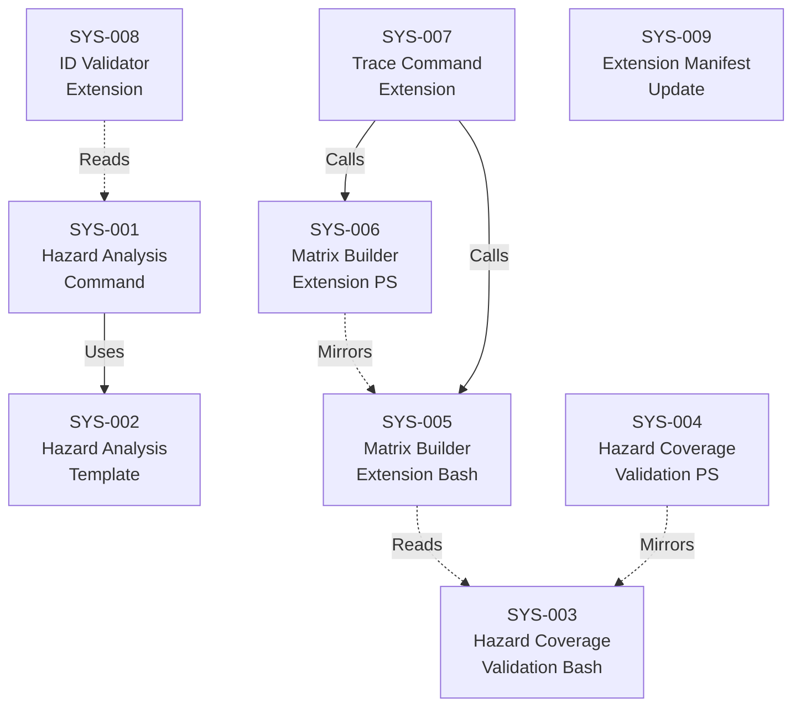

# System Design: Hazard Analysis (FMEA)

**Feature Branch**: `005a-hazard-analysis`
**Created**: 2026-04-01
**Status**: Approved
**Source**: `specs/005a-hazard-analysis/v-model/requirements.md`

## Overview

This system design decomposes the 47 requirements for the Hazard Analysis (FMEA) command into 9 system components organized across the extension's artifact types: one AI command prompt, one output template, two deterministic validation scripts (Bash + PowerShell), two matrix builder extensions (Bash + PowerShell), a trace command extension, a Python ID validator extension, and an extension manifest update. The decomposition follows the natural artifact boundaries established in v0.3.0 and v0.4.0 — commands orchestrate AI generation, templates constrain output structure, scripts perform deterministic validation and matrix building, and the manifest registers capabilities. The core command (SYS-001) is responsible for all FMEA generation logic including operational state analysis, progressive deepening, and domain-specific severity scales. Hazard coverage validation (SYS-003/SYS-004) performs three independent checks: forward (SYS→HAZ), backward (HAZ mitigation→REQ/SYS), and operational state consistency. Matrix H (SYS-005/SYS-006) extends the existing build-matrix infrastructure with hazard-to-mitigation-to-verification traceability.

## ID Schema

- **System Component**: `SYS-NNN` — sequential identifier for each component
- **Parent Requirements**: Comma-separated `REQ-NNN` list per component (many-to-many)
- Example: `SYS-003` with Parent Requirements `REQ-019, REQ-020, REQ-021` — component satisfies all three validation requirements

## Decomposition View (IEEE 1016 §5.1)

| SYS ID | Name | Description | Parent Requirements | Type |
|--------|------|-------------|---------------------|------|
| SYS-001 | Hazard Analysis Command | Markdown agent prompt executed by GitHub Copilot that reads `requirements.md` and `system-design.md` as mandatory inputs (failing with a clear error when `system-design.md` is absent) and optionally reads `architecture-design.md` for progressive deepening. Assigns unique `HAZ-NNN` identifiers (3-digit zero-padded, sequential, never renumbered, matching regex `HAZ-[0-9]{3}`). Each hazard entry includes 8 mandatory fields: Failure Mode, Operational State, Effect, Severity, Likelihood, Risk Level (severity × likelihood), Mitigation (with REQ/SYS ID references), and Residual Risk. Reads operational states from `system-design.md` and analyzes each failure mode across every relevant operational state, creating separate `HAZ-NNN` entries when the same failure mode has different severity depending on the state. Uses implicit "NORMAL" state with a validation warning when no explicit states are defined. Ensures every `SYS-NNN` has at least one associated `HAZ-NNN` entry (generating "No identified failure mode" entries flagged for human review when no realistic failure mode exists). Supports progressive deepening: when `architecture-design.md` exists, appends architecture-level failure modes (interface mismatches, protocol failures, data format incompatibilities) while preserving all existing `HAZ-NNN` entries; appends nothing with a note when no new architecture-level hazards are found. Conditionally activates domain-specific severity scales (ASIL, SIL, DO-178C failure conditions) from `v-model-config.yml` or produces general-purpose FMEA when no domain is configured. Handles 50+ hazards without batching. Follows the strict translator constraint. Reads the template from `templates/hazard-analysis-template.md` for output structure. | REQ-001, REQ-002, REQ-003, REQ-004, REQ-005, REQ-006, REQ-007, REQ-008, REQ-009, REQ-010, REQ-011, REQ-012, REQ-013, REQ-014, REQ-015, REQ-016, REQ-032, REQ-034, REQ-NF-002, REQ-IF-003, REQ-CN-001 | Module |
| SYS-002 | Hazard Analysis Template | Markdown template file (`hazard-analysis-template.md`) in the `templates/` directory defining the output structure for ISO 14971/ISO 26262-compliant hazard analysis. Includes section structure for: Summary, Risk Matrix Definition (severity × likelihood), Operational States Reference (table of states from system-design.md), and Hazard Register (FMEA table with columns: HAZ ID, Component SYS-NNN, Failure Mode, Operational State, Effect, Severity, Likelihood, Risk Level, Mitigation with REQ/SYS references, Residual Risk). Includes conditional safety-critical placeholders for domain-specific severity scales. | REQ-017, REQ-018 | Module |
| SYS-003 | Hazard Coverage Validation Script (Bash) | Deterministic Bash script (`validate-hazard-coverage.sh`) that validates three independent coverage dimensions. Forward coverage: every `SYS-NNN` in `system-design.md` has at least one `HAZ-NNN` entry in `hazard-analysis.md`. Backward coverage: every `HAZ-NNN` mitigation references at least one `REQ-NNN` or `SYS-NNN` identifier that exists in the corresponding source document. Operational state consistency: every operational state referenced in a hazard entry exists in the set of states defined in `system-design.md` (or the implicit "NORMAL" state). Supports `--json` flag for machine-readable output with schema: `{has_gaps, forward_coverage, backward_coverage, state_consistency, forward_gaps, backward_gaps, state_warnings}`. Supports `--partial` flag for validation when not all artifacts exist. Outputs human-readable gap reports with specific IDs. Exits with code 0 on pass, code 1 on failure. Uses regex-based parsing consistent with existing validators, requiring no external tooling beyond standard Bash utilities. Completes validation within 5 seconds for up to 100 hazard entries. Accepts V-Model directory path as first positional argument. | REQ-019, REQ-020, REQ-021, REQ-022, REQ-023, REQ-024, REQ-025, REQ-NF-001, REQ-NF-002, REQ-NF-003, REQ-IF-001, REQ-IF-002, REQ-CN-004 | Utility |
| SYS-004 | Hazard Coverage Validation Script (PowerShell) | PowerShell script (`Validate-HazardCoverage.ps1`) with identical behavior, JSON output structure, field values, and exit codes as the Bash validation script (SYS-003). Implements the same three coverage dimensions (forward, backward, operational state consistency), same `--json` and `--partial` flags, and same human-readable gap report format. Ensures cross-platform parity for Windows teams. | REQ-026, REQ-CN-004 | Utility |
| SYS-005 | Matrix Builder Script Extension (Bash) | Extension to the existing `build-matrix.sh` deterministic Bash script to parse `hazard-analysis.md` for `HAZ-NNN` identifiers and their mitigation references (`REQ-NNN` / `SYS-NNN`). Produces Matrix H (Hazard Traceability) showing: `HAZ-NNN` → Mitigation (`REQ-NNN` / `SYS-NNN`) → Verification (`ATP-NNN` / `STP-NNN`). Highlights gaps where a mitigation has no associated test coverage with `⚠️ No test coverage` in the Verification column. Matrix H is a separate matrix using the letter "H", not merged into existing matrices A–D. Maintains backward compatibility: projects without `hazard-analysis.md` produce the same v0.4.0 output (Matrices A–D only). | REQ-027, REQ-028, REQ-029, REQ-CN-002, REQ-CN-003 | Utility |
| SYS-006 | Matrix Builder Script Extension (PowerShell) | Extension to the existing `build-matrix.ps1` deterministic PowerShell script with identical Matrix H generation logic as the Bash version (SYS-005). Ensures cross-platform parity for Matrix H output. | REQ-030 | Utility |
| SYS-007 | Trace Command Extension | Extension to the existing `/speckit.v-model.trace` Markdown agent prompt to include Matrix H in its output when `hazard-analysis.md` exists in the project directory. Follows the progressive matrix building pattern: A alone after acceptance, A+B after system-test, A+B+C after integration-test, A+B+C+D after unit-test, plus H whenever hazard-analysis.md exists. Maintains backward compatibility: when `hazard-analysis.md` is absent, produces the same v0.4.0 output with no warning. | REQ-031, REQ-CN-002, REQ-CN-003 | Module |
| SYS-008 | ID Validator Extension | Extension to the existing `id_validator.py` Python script to recognize `HAZ-NNN` as a valid ID prefix alongside existing prefixes (REQ, ATP, SCN, SYS, STP, STS, ARCH, ITP, ITS, MOD, UTP, UTS). Validates the `HAZ-[0-9]{3}` regex pattern. | REQ-032, REQ-033 | Utility |
| SYS-009 | Extension Manifest Update | Updates to `extension.yml` to register the new `speckit.v-model.hazard-analysis` command with its file path and description. Adds `hazards: "HAZ"` to the `defaults.id_prefixes` section. Updates the `trace` command description to mention Matrix H alongside existing matrices A–D. | REQ-035, REQ-036, REQ-037 | Module |

## Dependency View (IEEE 1016 §5.2)

| Source | Target | Relationship | Failure Impact |
|--------|--------|-------------|----------------|
| SYS-001 | SYS-002 | Uses | Hazard analysis command cannot produce compliant output structure without the template; output would lack mandatory FMEA sections, risk matrix definition, and operational states reference. |
| SYS-005 | SYS-003 | Reads | Matrix builder extension relies on the same hazard-analysis.md format validated by the coverage script; if SYS-003 parsing assumptions change, SYS-005 regex patterns must also update. |
| SYS-006 | SYS-005 | Mirrors | PowerShell matrix builder must replicate all Bash matrix builder logic; behavioral divergence produces inconsistent Matrix H data across platforms. |
| SYS-004 | SYS-003 | Mirrors | PowerShell validation script must replicate all Bash script logic; behavioral divergence between SYS-003 and SYS-004 produces inconsistent coverage results across platforms. |
| SYS-007 | SYS-005 | Calls | Trace command extension on Linux/macOS calls the Bash matrix builder to generate Matrix H data; Matrix H would be missing from the traceability matrix output if SYS-005 fails. |
| SYS-007 | SYS-006 | Calls | Trace command extension on Windows calls the PowerShell matrix builder to generate Matrix H data; Matrix H would be missing from the traceability matrix output on Windows if SYS-006 fails. |
| SYS-008 | SYS-001 | Reads | ID validator processes output generated by the hazard analysis command; if SYS-001 changes the HAZ-NNN pattern, SYS-008 regex must also update. |

### Dependency Diagram

## Interface View (IEEE 1016 §5.3)

### External Interfaces

| Component | Interface Name | Protocol | Input | Output | Error Handling |
|-----------|---------------|----------|-------|--------|----------------|
| SYS-001 | Copilot Chat Command | Markdown agent prompt | User invocation via `/speckit.v-model.hazard-analysis` | `hazard-analysis.md` written to `{VMODEL_DIR}/` | Fails with message "hazard-analysis requires both requirements.md and system-design.md" when prerequisites missing |
| SYS-003 | CLI Invocation (Bash) | Bash positional args | `validate-hazard-coverage.sh [--json] [--partial] <vmodel-dir>` | Human-readable report (stdout) or JSON (stdout with `--json`) | Exit code 0 = pass, 1 = gaps detected |
| SYS-004 | CLI Invocation (PowerShell) | PowerShell params | `Validate-HazardCoverage.ps1 [-Json] [-Partial] <VModelDir>` | Identical output structure to SYS-003 | Identical exit codes to SYS-003 |

### Internal Interfaces

| Source | Target | Interface Name | Protocol | Data Format | Error Handling |
|--------|--------|---------------|----------|-------------|----------------|
| SYS-001 | SYS-002 | Template Loading | File I/O | Markdown with HTML comments (section markers) | Command fails if template not found in `templates/` directory |
| SYS-007 | SYS-005 | Matrix H Data Generation | Shell exec | Bash script stdout (structured matrix rows) | Trace command omits Matrix H if script fails |
| SYS-007 | SYS-006 | Matrix H Data Generation | Shell exec | PowerShell script stdout (structured matrix rows) | Trace command omits Matrix H if script fails |
| SYS-005 | SYS-003 | Shared Parsing Convention | File format | `hazard-analysis.md` Markdown with `HAZ-NNN` IDs in FMEA table | Both scripts must agree on table column positions and ID regex patterns |

## Data Design View (IEEE 1016 §5.4)

| Entity | Component | Storage | Protection at Rest | Protection in Transit | Retention |
|--------|-----------|---------|-------------------|-----------------------|-----------|
| Hazard Register | SYS-001 | File (`hazard-analysis.md`) | Git repository access controls | N/A (local file) | Permanent — tracked in Git, never deleted |
| FMEA Table Data | SYS-001 | Embedded in `hazard-analysis.md` Markdown table | Git repository access controls | N/A (local file) | Permanent — append-only for progressive deepening |
| Risk Matrix Definition | SYS-001 | Embedded in `hazard-analysis.md` header section | Git repository access controls | N/A (local file) | Permanent — defined once per hazard register |
| Operational States Reference | SYS-001 | Extracted from `system-design.md`, embedded in `hazard-analysis.md` | Git repository access controls | N/A (local file) | Derived — regenerated from source on each run |
| Coverage Validation Results | SYS-003, SYS-004 | Stdout (transient) | N/A (ephemeral) | N/A (local process) | Transient — regenerated each validation run |
| Matrix H Data | SYS-005, SYS-006 | Embedded in `traceability-matrix.md` | Git repository access controls | N/A (local file) | Permanent — regenerated by trace command |

---

## Coverage Summary

| Metric | Count |
|--------|-------|
| Total System Components (SYS) | 9 |
| Total Parent Requirements Covered | 47 / 47 (100%) |
| Components per Type | Subsystem: 0 \| Module: 4 \| Service: 0 \| Library: 0 \| Utility: 5 |
| **Forward Coverage (REQ→SYS)** | **100%** |

## Derived Requirements

None — all components trace to existing requirements.

## Glossary

| Term | Definition |
|------|-----------|
| FMEA | Failure Mode and Effects Analysis — systematic technique for identifying potential failure modes, their causes, effects, and mitigations |
| Forward Coverage | Validation that every source ID (SYS-NNN) maps to at least one target ID (HAZ-NNN) |
| Backward Coverage | Validation that every target ID's references (REQ/SYS in mitigation) exist in the source documents |
| Matrix H | Hazard Traceability Matrix — proves the chain from each hazard through its mitigation to the test that verifies implementation |
| Operational State | A defined mode of system operation (e.g., IDLE, ACTIVE, ERROR) that affects the severity of failure consequences |
| Progressive Deepening | The process of re-running hazard analysis after additional design artifacts exist, appending new failure modes without modifying existing entries |
| Risk Level | Product of Severity × Likelihood, determining the overall risk classification of a hazard |
