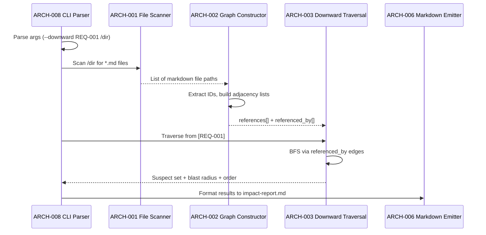
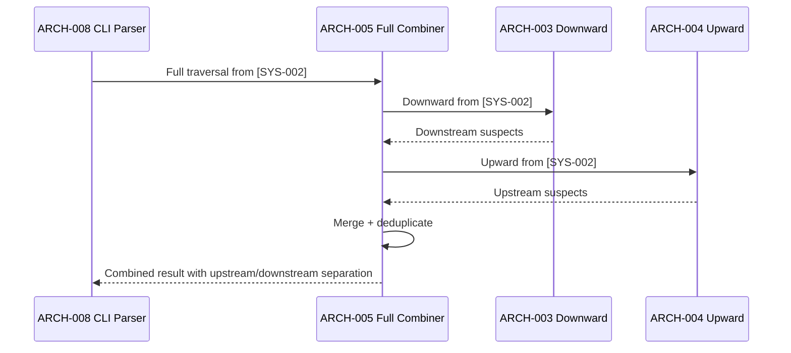
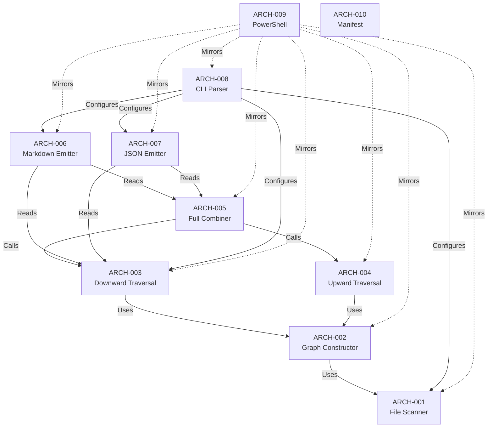

# Architecture Design: Impact Analysis

**Feature Branch**: `005b-impact-analysis`
**Created**: 2026-04-14
**Status**: Approved
**Source**: `specs/005b-impact-analysis/v-model/system-design.md`

## Overview

This architecture decomposes the 6 system components into 10 architecture modules organized by implementation boundary. The ID Dependency Graph Builder (SYS-001) decomposes into a file scanner and a graph constructor. The Graph Traversal Engine (SYS-002) decomposes into three traversal functions (downward, upward, full) sharing a common visited-set mechanism. The Impact Report Formatter (SYS-003) decomposes into a markdown emitter and a JSON emitter. The CLI Argument Parser (SYS-004) maps to a single module. PowerShell parity (SYS-005) maps to a single module mirroring all Bash components. The Extension Manifest Update (SYS-006) maps to a single module. All modules reside within `impact-analysis.sh` as Bash functions (except ARCH-009 in PowerShell and ARCH-010 in the manifest file).

## ID Schema

- **Architecture Module**: `ARCH-NNN` — sequential identifier for each module
- **Parent System Components**: Comma-separated `SYS-NNN` list per module (many-to-many)
- Example: `ARCH-003` with Parent System Components `SYS-002` — module implements one traversal mode

## Logical View — Component Breakdown (IEEE 42010 / Kruchten 4+1)

| ARCH ID | Name | Description | Parent System Components | Type |
|---------|------|-------------|--------------------------|------|
| ARCH-001 | File Scanner | Bash function within `impact-analysis.sh` that recursively discovers all markdown files (*.md) in the V-Model directory and its subdirectories using `find`. Returns a list of file paths to be scanned by the graph constructor. Skips hidden directories and non-markdown files. | SYS-001 | Utility |
| ARCH-002 | Graph Constructor | Bash function within `impact-analysis.sh` that reads each markdown file from the file scanner, extracts V-Model IDs using regex patterns for all 13 known prefixes (REQ, ATP, SCN, SYS, STP, STS, ARCH, ITP, ITS, MOD, UTP, UTS, HAZ), and builds two Bash associative arrays: `references[ID]` (IDs this artifact mentions) and `referenced_by[ID]` (IDs that mention this artifact). Uses awk to process each file line by line, tracking the current section context to associate referenced IDs with their parent ID. Produces a deterministic, reproducible graph from the same inputs. | SYS-001 | Utility |
| ARCH-003 | Downward Traversal | Bash function within `impact-analysis.sh` that implements breadth-first traversal from a set of changed IDs following the "referenced-by" edges (which IDs reference the changed ID). Uses a visited-set (Bash associative array) to prevent re-traversal and detect cycles. Organizes discovered suspects by V-Model level. Returns the suspect set, blast radius counts, and a bottom-up re-validation order. Emits a warning to stderr for changed IDs not found in the graph. | SYS-002 | Utility |
| ARCH-004 | Upward Traversal | Bash function within `impact-analysis.sh` that implements breadth-first traversal from a set of changed IDs following the "references" edges (which IDs the changed ID references). Uses the same visited-set mechanism as ARCH-003. Organizes discovered suspects by V-Model level. Returns the suspect set, blast radius counts, and a top-down re-validation order. | SYS-002 | Utility |
| ARCH-005 | Full Traversal Combiner | Bash function within `impact-analysis.sh` that invokes both ARCH-003 (downward) and ARCH-004 (upward) from the same set of changed IDs. Merges results into a single structure with clear upstream/downstream separation. Deduplicates any IDs that appear in both directions. | SYS-002 | Utility |
| ARCH-006 | Markdown Report Emitter | Bash function within `impact-analysis.sh` that formats traversal results into a markdown report. Produces sections: Changed IDs (with artifact type), Suspect Artifacts (organized by V-Model level with ID lists), Blast Radius (statistics table), and Re-validation Order (ordered list). For `--full` mode, creates separate "Upstream Suspects" and "Downstream Suspects" subsections. Writes to `impact-report.md` in the V-Model directory or to a custom `--output` path. | SYS-003 | Utility |
| ARCH-007 | JSON Report Emitter | Bash function within `impact-analysis.sh` that formats traversal results into JSON conforming to the defined schema: `changed_ids` (array), `direction` (string), `suspect_artifacts` (object keyed by V-Model level), `blast_radius` (object with `total` and `by_level`), `revalidation_order` (array). Writes to stdout. Uses printf-based JSON construction (no external JSON tools). | SYS-003 | Utility |
| ARCH-008 | CLI Argument Parser | Bash function within `impact-analysis.sh` that parses command-line arguments: direction flags (`--downward`, `--upward`, `--full` — mutually exclusive, defaulting to `--downward`), `--json`, `--output FILE`, positional IDs, and the last positional argument as the V-Model directory. Validates that at least one ID is provided and the directory contains markdown files. Exits with code 1 on validation errors. | SYS-004 | Utility |
| ARCH-009 | PowerShell Impact Analysis | PowerShell script (`impact-analysis.ps1`) mirroring the combined behavior of ARCH-001 through ARCH-008. Implements file scanning with `Get-ChildItem`, graph construction with PowerShell hashtables, traversal with queue-based BFS, and report formatting. Accepts parameters `-Downward`, `-Upward`, `-Full`, `-Json`, `-Output`, `-Ids`, `-VModelDir`. Produces identical output to the Bash implementation. | SYS-005 | Component |
| ARCH-010 | Extension Manifest Entries | Updates to `extension.yml`: register `speckit.v-model.impact-analysis` command with file path and description indicating deterministic script-based analysis. No new ID prefixes added. | SYS-006 | Component |

## Process View — Dynamic Behavior (Kruchten 4+1)

### Interaction: Downward Impact Analysis

### Interaction: Full Impact Analysis

## Development View — Code Organization (Kruchten 4+1)

| Module | File | Language | Lines (est.) |
|--------|------|----------|-------------|
| ARCH-001 | `scripts/bash/impact-analysis.sh` | Bash | ~30 |
| ARCH-002 | `scripts/bash/impact-analysis.sh` | Bash | ~80 |
| ARCH-003 | `scripts/bash/impact-analysis.sh` | Bash | ~60 |
| ARCH-004 | `scripts/bash/impact-analysis.sh` | Bash | ~50 |
| ARCH-005 | `scripts/bash/impact-analysis.sh` | Bash | ~30 |
| ARCH-006 | `scripts/bash/impact-analysis.sh` | Bash | ~80 |
| ARCH-007 | `scripts/bash/impact-analysis.sh` | Bash | ~60 |
| ARCH-008 | `scripts/bash/impact-analysis.sh` | Bash | ~60 |
| ARCH-009 | `scripts/powershell/impact-analysis.ps1` | PowerShell | ~400 |
| ARCH-010 | `extension.yml` | YAML | ~5 |

## Dependency View (IEEE 42010)

| Source | Target | Relationship | Failure Impact |
|--------|--------|-------------|----------------|
| ARCH-002 | ARCH-001 | Uses | Graph constructor needs file list; cannot build graph without scanning files first. |
| ARCH-003 | ARCH-002 | Uses | Downward traversal operates on the adjacency lists built by the graph constructor. |
| ARCH-004 | ARCH-002 | Uses | Upward traversal operates on the adjacency lists built by the graph constructor. |
| ARCH-005 | ARCH-003 | Calls | Full combiner invokes downward traversal. |
| ARCH-005 | ARCH-004 | Calls | Full combiner invokes upward traversal. |
| ARCH-006 | ARCH-003 | Reads | Markdown emitter reads results from downward traversal (or full combiner). |
| ARCH-006 | ARCH-005 | Reads | Markdown emitter reads results from full traversal. |
| ARCH-007 | ARCH-003 | Reads | JSON emitter reads results from downward traversal (or full combiner). |
| ARCH-007 | ARCH-005 | Reads | JSON emitter reads results from full traversal. |
| ARCH-008 | ARCH-001 | Configures | CLI parser provides directory path to file scanner. |
| ARCH-008 | ARCH-003 | Configures | CLI parser provides direction and IDs to traversal. |
| ARCH-008 | ARCH-006 | Configures | CLI parser selects markdown output and provides output path. |
| ARCH-008 | ARCH-007 | Configures | CLI parser selects JSON output mode. |
| ARCH-009 | ARCH-001 | Mirrors | PowerShell mirrors file scanning logic. |
| ARCH-009 | ARCH-002 | Mirrors | PowerShell mirrors graph construction logic. |
| ARCH-009 | ARCH-003 | Mirrors | PowerShell mirrors downward traversal logic. |
| ARCH-009 | ARCH-004 | Mirrors | PowerShell mirrors upward traversal logic. |
| ARCH-009 | ARCH-005 | Mirrors | PowerShell mirrors full combiner logic. |
| ARCH-009 | ARCH-006 | Mirrors | PowerShell mirrors markdown emitter logic. |
| ARCH-009 | ARCH-007 | Mirrors | PowerShell mirrors JSON emitter logic. |
| ARCH-009 | ARCH-008 | Mirrors | PowerShell mirrors CLI parser with idiomatic parameter names. |

### Dependency Diagram

## Interface View (IEEE 42010)

### Internal Interfaces

| Source | Target | Interface Name | Data Format |
|--------|--------|---------------|-------------|
| ARCH-001 | ARCH-002 | File Path List | Newline-separated file paths (string) |
| ARCH-002 | ARCH-003 | Adjacency Lists | Bash associative arrays: `references[ID]`, `referenced_by[ID]` |
| ARCH-002 | ARCH-004 | Adjacency Lists | Same as above |
| ARCH-003 | ARCH-005 | Downstream Results | `suspects_down[LEVEL]`, `blast_down[LEVEL]`, `order_down[]` |
| ARCH-004 | ARCH-005 | Upstream Results | `suspects_up[LEVEL]`, `blast_up[LEVEL]`, `order_up[]` |
| ARCH-003 | ARCH-006 | Traversal Results | Suspect arrays + blast radius + re-validation order |
| ARCH-003 | ARCH-007 | Traversal Results | Same data, formatted as JSON |

---

## Coverage Summary

| Metric | Count |
|--------|-------|
| Total Architecture Modules (ARCH) | 10 |
| Total Parent System Components Covered | 6 / 6 (100%) |
| Components per Type | Utility: 8, Component: 2 |
| **Forward Coverage (SYS→ARCH)** | **100%** |

## Derived Requirements

None — all modules trace to existing system components.

## Glossary

| Term | Definition |
|------|-----------|
| Adjacency List | In-memory graph representation using Bash associative arrays for outgoing (references) and incoming (referenced-by) edges |
| BFS | Breadth-First Search — traversal algorithm that visits all neighbors at the current depth before moving deeper |
| Visited Set | Bash associative array tracking processed nodes to prevent infinite loops in cyclic graphs |
| Printf-based JSON | JSON construction using Bash printf/echo without external tools like jq |
