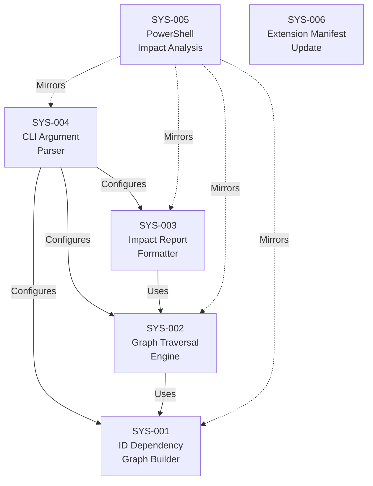

# System Design: Impact Analysis

**Feature Branch**: `005b-impact-analysis`
**Created**: 2026-04-14
**Status**: Approved
**Source**: `specs/005b-impact-analysis/v-model/requirements.md`

## Overview

This system design decomposes the 33 requirements for the Impact Analysis command into 6 system components organized across the extension's artifact types: two deterministic analysis scripts (Bash + PowerShell), one ID dependency graph builder, one graph traversal engine, one impact report formatter, one CLI argument parser, and one extension manifest update. The decomposition follows the natural artifact boundaries established in previous releases. Impact analysis is entirely script-based (no AI generation) — the script builds an ID dependency graph by scanning markdown files, then traverses the graph in the specified direction to identify all affected artifacts. The core algorithm supports three modes: `--downward` (default), `--upward`, and `--full` (bidirectional) traversal with cycle detection.

## ID Schema

- **System Component**: `SYS-NNN` — sequential identifier for each component
- **Parent Requirements**: Comma-separated `REQ-NNN` list per component (many-to-many)
- Example: `SYS-001` with Parent Requirements `REQ-001, REQ-007` — component satisfies both requirements

## Decomposition View (IEEE 1016 §5.1)

| SYS ID | Name | Description | Parent Requirements | Type |
|--------|------|-------------|---------------------|------|
| SYS-001 | ID Dependency Graph Builder | Core module within `impact-analysis.sh` that scans all V-Model markdown files in the specified directory (including nested subdirectories) and builds an in-memory directed graph of ID cross-references. For each markdown file, extracts all V-Model IDs matching the known prefix patterns (REQ, ATP, SCN, SYS, STP, STS, ARCH, ITP, ITS, MOD, UTP, UTS, HAZ) using regex. For each ID found as a section header or table row identifier, records all other IDs referenced within that section or row as edges in the dependency graph. The graph is stored as an adjacency list: for each ID, maintains both a "references" list (IDs this artifact mentions) and a "referenced-by" list (IDs that mention this artifact). Handles missing optional artifacts gracefully — if a file does not exist, that level is simply absent from the graph. Uses regex-based parsing consistent with existing scripts (awk, grep, sed), requiring no external tooling beyond standard Bash utilities. Deterministically reproducible: same inputs always produce the same graph. | REQ-001, REQ-007, REQ-015, REQ-017, REQ-019, REQ-NF-001, REQ-NF-002, REQ-NF-003, REQ-CN-003 | Module |
| SYS-002 | Graph Traversal Engine | Core module within `impact-analysis.sh` that traverses the ID dependency graph built by SYS-001 in the specified direction. Supports three modes: (a) `--downward` (default) — starting from the changed ID(s), follows "references" edges transitively to find all downstream dependents, following the V-Model hierarchy REQ → {ATP, SCN, SYS, HAZ} → {STP, STS, ARCH} → {ITP, ITS, MOD} → {UTP, UTS}; (b) `--upward` — starting from the changed ID(s), follows "referenced-by" edges transitively to find all upstream parents; (c) `--full` — performs both downward and upward traversal, merging results with clear separation between upstream and downstream. Accepts multiple changed IDs in a single invocation. Uses a visited-set to prevent re-traversal and detect circular references, emitting a warning on stderr when a cycle is detected. Produces a structured result: suspect artifact list organized by V-Model level, with blast radius statistics. Generates a suggested re-validation order: bottom-up for downward (re-validate lowest-level tests first), top-down for upward (re-validate highest-level requirements first). Emits a warning for any changed ID not found in the graph, continuing to process remaining IDs. | REQ-002, REQ-003, REQ-004, REQ-005, REQ-006, REQ-008, REQ-013, REQ-016, REQ-023, REQ-024 | Module |
| SYS-003 | Impact Report Formatter | Module within `impact-analysis.sh` that formats the traversal results from SYS-002 into either a markdown impact report (`impact-report.md`) or JSON output. Markdown output includes: changed IDs with artifact type, suspect artifact list organized by V-Model level, blast radius statistics (count per level, total), and suggested re-validation order. JSON output conforms to the defined schema with fields: `changed_ids` (array), `direction` (string: downward, upward, or full), `suspect_artifacts` (object keyed by V-Model level), `blast_radius` (object with total and by_level), and `revalidation_order` (array). Supports `--output FILE` for custom output path; defaults to `impact-report.md` in the V-Model directory. In `--full` mode, clearly separates upward and downward sections in both markdown and JSON output. | REQ-009, REQ-010, REQ-011, REQ-012, REQ-023, REQ-NF-002 | Module |
| SYS-004 | CLI Argument Parser | Module within `impact-analysis.sh` that handles argument parsing: direction flags (`--downward`, `--upward`, `--full` — mutually exclusive, defaulting to `--downward`), output format (`--json`), output file (`--output FILE`), one or more changed IDs (positional arguments before the last), and the V-Model directory path (last positional argument). Validates that at least one changed ID is provided. Validates that the V-Model directory exists and contains at least one markdown file with V-Model IDs, failing with "No V-Model artifacts found in <dir>" and exit code 1 when empty. Ensures `--downward`, `--upward`, and `--full` are mutually exclusive. Sets exit code 0 on success, 1 on error. | REQ-001, REQ-008, REQ-014, REQ-018, REQ-025, REQ-IF-001, REQ-CN-001 | Module |
| SYS-005 | PowerShell Impact Analysis Script | PowerShell script (`impact-analysis.ps1`) mirroring the combined behavior of SYS-001 through SYS-004. Implements identical ID dependency graph building, graph traversal (downward, upward, full with cycle detection), impact report formatting (markdown and JSON), and CLI argument parsing using PowerShell idioms. Accepts parameters `-Downward`, `-Upward`, `-Full`, `-Json`, `-Output`, `-Ids`, and `-VModelDir`. Produces identical JSON output structure, field values, and exit codes as the Bash script. | REQ-020, REQ-CN-002, REQ-IF-002 | Module |
| SYS-006 | Extension Manifest Update | Updates to `extension.yml` to register the new `speckit.v-model.impact-analysis` command with its file path and description. Description indicates that impact-analysis is a deterministic script command (not AI-generated). No new ID prefixes are added. | REQ-021, REQ-022, REQ-CN-001, REQ-CN-003 | Module |

## Dependency View (IEEE 1016 §5.2)

| Source | Target | Relationship | Failure Impact |
|--------|--------|-------------|----------------|
| SYS-002 | SYS-001 | Uses | Graph traversal engine requires the ID dependency graph; cannot traverse without a built graph. |
| SYS-003 | SYS-002 | Uses | Report formatter requires traversal results; cannot format without suspect artifact data. |
| SYS-004 | SYS-001 | Configures | CLI parser provides the V-Model directory path to the graph builder for scanning. |
| SYS-004 | SYS-002 | Configures | CLI parser provides the traversal direction and changed IDs to the graph traversal engine. |
| SYS-004 | SYS-003 | Configures | CLI parser provides output format (json/markdown) and output path to the formatter. |
| SYS-005 | SYS-001 | Mirrors | PowerShell script mirrors Bash graph builder logic; behavioral divergence produces inconsistent results across platforms. |
| SYS-005 | SYS-002 | Mirrors | PowerShell script mirrors Bash traversal logic; behavioral divergence produces inconsistent traversal results. |
| SYS-005 | SYS-003 | Mirrors | PowerShell script mirrors Bash report formatter logic; behavioral divergence produces inconsistent output format. |
| SYS-005 | SYS-004 | Mirrors | PowerShell script mirrors Bash CLI parser logic with idiomatic parameter names. |

### Dependency Diagram

## Interface View (IEEE 1016 §5.3)

### External Interfaces

| Component | Interface Name | Protocol | Input | Output | Error Handling |
|-----------|---------------|----------|-------|--------|----------------|
| SYS-004 | CLI Invocation (Bash) | Bash positional args + flags | `impact-analysis.sh [--downward\|--upward\|--full] [--json] [--output FILE] ID [ID...] <vmodel-dir>` | Impact report (markdown file or JSON to stdout) | Exit code 0 = success, 1 = error |
| SYS-005 | CLI Invocation (PowerShell) | PowerShell params | `Impact-Analysis.ps1 [-Downward\|-Upward\|-Full] [-Json] [-Output FILE] -Ids ID[,ID...] -VModelDir <dir>` | Identical output to Bash version | Identical exit codes |

### Internal Interfaces

| Source | Target | Interface Name | Protocol | Data Format | Error Handling |
|--------|--------|---------------|----------|-------------|----------------|
| SYS-004 | SYS-001 | Graph Build Request | Function call | V-Model directory path (string) | Returns error if no artifacts found |
| SYS-001 | SYS-002 | Dependency Graph | In-memory data | Associative arrays: `references[ID]="ID1 ID2..."` and `referenced_by[ID]="ID3 ID4..."` | Empty graph if no IDs found |
| SYS-004 | SYS-002 | Traversal Request | Function call | Direction (downward\|upward\|full) + changed IDs (string array) | Warning on stderr for unknown IDs |
| SYS-002 | SYS-003 | Traversal Results | In-memory data | Associative arrays: `suspects_by_level[LEVEL]="ID1 ID2..."`, `blast_radius[LEVEL]=N`, total count | Empty result if no suspects found |
| SYS-004 | SYS-003 | Format Request | Function call | Output format (json\|markdown) + output path (string) | Writes to stdout for JSON, to file for markdown |

## Data Design View (IEEE 1016 §5.4)

| Entity | Component | Storage | Protection at Rest | Protection in Transit | Retention |
|--------|-----------|---------|-------------------|-----------------------|-----------|
| ID Dependency Graph | SYS-001 | In-memory (Bash associative arrays) | N/A (ephemeral) | N/A (local process) | Transient — rebuilt on each invocation |
| Visited Set | SYS-002 | In-memory (Bash associative array) | N/A (ephemeral) | N/A (local process) | Transient — tracks visited nodes during traversal |
| Traversal Result Set | SYS-002 | In-memory (Bash arrays) | N/A (ephemeral) | N/A (local process) | Transient — computed on each invocation |
| Impact Report (Markdown) | SYS-003 | File (`impact-report.md`) | Git repository access controls | N/A (local file) | Persistent — tracked in Git if committed |
| Impact Report (JSON) | SYS-003 | Stdout (transient) | N/A (ephemeral) | N/A (local process) | Transient — consumed by caller |

## Operational States

The impact-analysis script is a stateless command-line tool. Each invocation is an independent, atomic operation: read artifacts → build graph → traverse → produce output. There are no background processes, daemons, or persistent state between invocations.

---

## Coverage Summary

| Metric | Count |
|--------|-------|
| Total System Components (SYS) | 6 |
| Total Parent Requirements Covered | 33 / 33 (100%) |
| Components per Type | Module: 6 |
| **Forward Coverage (REQ→SYS)** | **100%** |

## Derived Requirements

None — all components trace to existing requirements.

## Glossary

| Term | Definition |
|------|-----------|
| Adjacency List | A graph representation where each node stores lists of its outgoing edges (references) and incoming edges (referenced-by) |
| Blast Radius | The complete set of artifacts affected by a change to one or more IDs |
| Cycle Detection | Mechanism using a visited-set to detect and handle circular references in the ID dependency graph |
| ID Dependency Graph | A directed graph where nodes are V-Model IDs and edges represent cross-references between artifacts |
| Transitive Closure | The complete set of nodes reachable from a starting node through any sequence of edges |
| Visited Set | A Bash associative array tracking which nodes have been processed during graph traversal, preventing infinite loops |
