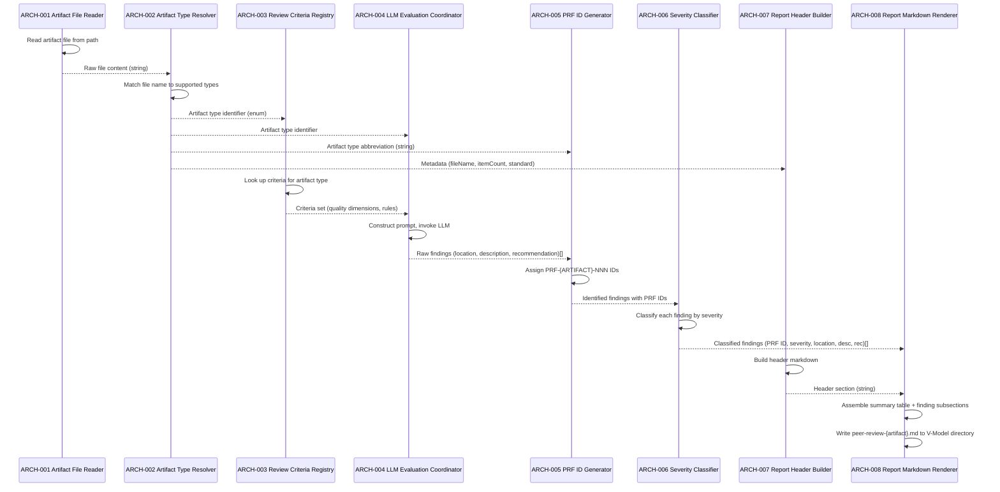
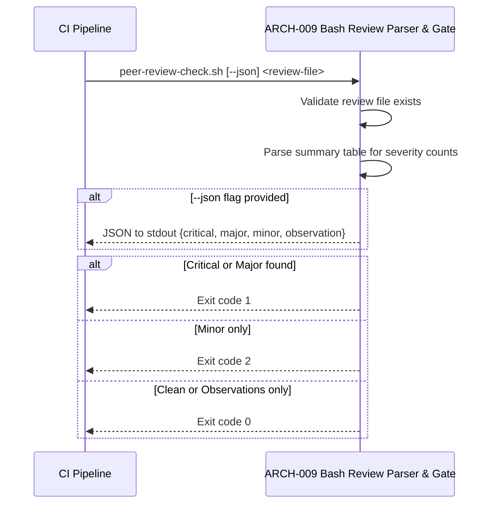
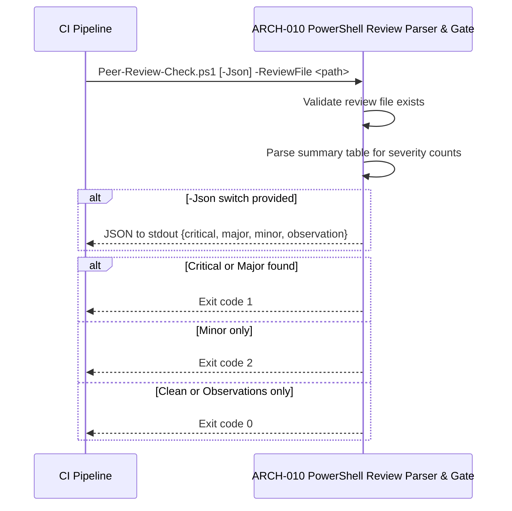
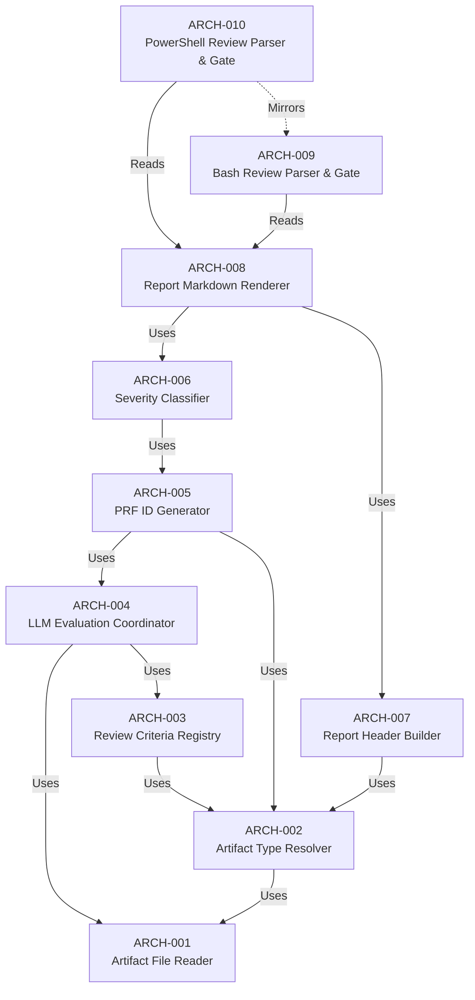

# Architecture Design: Peer Review

**Feature Branch**: `feature/005c-peer-review`
**Created**: 2025-07-18
**Status**: Approved
**Source**: `specs/005c-peer-review/v-model/system-design.md`

## Overview

This architecture decomposes the 6 system components of the Peer Review feature into 10 architecture modules organized by implementation boundary. The Artifact Reader & Type Dispatcher (SYS-001) decomposes into a file reader and a type resolver. The AI Review Criteria Engine (SYS-002) decomposes into a criteria registry holding 9 artifact-type-specific rule sets and an LLM evaluation coordinator that orchestrates the AI call. The Finding Identifier & Severity Classifier (SYS-003) decomposes into a PRF ID generator and a severity classifier. The Review Report Formatter (SYS-004) decomposes into a header builder and a markdown renderer. The Bash CI Check Script (SYS-005) and PowerShell CI Check Script (SYS-006) each map to a single module since they are self-contained deterministic scripts. The decomposition preserves the two distinct execution contexts from the system design: the AI evaluation path (ARCH-001 through ARCH-008) runs within the AI agent, while the CI gate path (ARCH-009, ARCH-010) runs in CI pipelines with no AI dependency.

## ID Schema

- **Architecture Module**: `ARCH-NNN` — sequential identifier for each module
- **Parent System Components**: Comma-separated `SYS-NNN` list per module (many-to-many)
- **Cross-Cutting Tag**: `[CROSS-CUTTING]` for infrastructure/utility modules not traceable to a specific SYS
- Example: `ARCH-004` with Parent System Components `SYS-002` — module implements the LLM evaluation coordination
- Example: `ARCH-009` with Parent System Components `SYS-005` — module implements the entire Bash CI check script

## Logical View — Component Breakdown (IEEE 42010 / Kruchten 4+1)

| ARCH ID | Name | Description | Parent System Components | Type |
|---------|------|-------------|--------------------------|------|
| ARCH-001 | Artifact File Reader | Reads the single V-Model artifact file specified by the user from the file system. Validates that the file path points to an existing, non-empty file. Returns the raw file content as a string for downstream processing. Operates in read-only mode — does not modify the source artifact. | SYS-001 | Component |
| ARCH-002 | Artifact Type Resolver | Identifies the artifact type from the file name by matching against the 9 supported V-Model artifact types (requirements.md, system-design.md, architecture-design.md, system-test.md, integration-test.md, module-design.md, unit-test.md, hazard-analysis.md, acceptance-plan.md). Derives the artifact type abbreviation (REQ, SYS, ARCH, STP, ITP, MOD, UTP, HAZ, ATP), the governing standard name (e.g., INCOSE, IEEE 1016), and the artifact item count by parsing content for known ID patterns. Rejects unsupported artifact types and multiple artifact inputs. | SYS-001 | Component |
| ARCH-003 | Review Criteria Registry | Contains the 9 artifact-type-specific evaluation rule sets as a structured lookup. Given an artifact type identifier, returns the corresponding set of quality criteria, evaluation dimensions, and governing standard references. Rule sets include: (1) requirements — INCOSE quality attributes; (2) system-design — IEEE 1016 criteria; (3) architecture-design — IEEE 42010 / Kruchten 4+1 criteria; (4) system-test — ISO 29119 criteria; (5) integration-test — ISO 29119-4 criteria; (6) module-design — DO-178C / ISO 26262 criteria; (7) unit-test — ISO 29119-4 criteria; (8) hazard-analysis — ISO 14971 / ISO 26262 criteria; (9) acceptance-plan — ISO 29119 criteria. | SYS-002 | Library |
| ARCH-004 | LLM Evaluation Coordinator | Orchestrates the AI evaluation by combining the artifact content from ARCH-001 with the type-specific criteria from ARCH-003. Constructs the evaluation prompt, sends it to the LLM, and parses the response into a list of raw findings. Each raw finding contains: location (artifact item ID reference), description (quality issue text), and recommendation (suggested remediation). Returns an empty list if no quality issues are detected. | SYS-002 | Component |
| ARCH-005 | PRF ID Generator | Generates unique `PRF-{ARTIFACT}-NNN` identifiers for each raw finding produced by ARCH-004. Takes the artifact type abbreviation from ARCH-002 and assigns sequential zero-padded numbers starting at 001 (e.g., PRF-REQ-001, PRF-REQ-002). IDs are advisory-only and do not participate in the V-Model traceability chain. | SYS-003 | Utility |
| ARCH-006 | Severity Classifier | Classifies each finding with exactly one severity level based on the finding's nature and the severity definitions: Critical (fundamental quality violation blocking release), Major (significant quality issue requiring resolution before approval), Minor (style or completeness issue not affecting correctness), or Observation (informational suggestion for improvement). Produces the classified findings list with PRF IDs and severity levels assigned. | SYS-003 | Component |
| ARCH-007 | Report Header Builder | Constructs the report header section containing: reviewer identification (AI peer reviewer), generation date, artifact file name, count of items in the reviewed artifact (from ARCH-002 metadata), and the governing standard for the artifact type. Outputs a formatted markdown string for inclusion in the report. | SYS-004 | Component |
| ARCH-008 | Report Markdown Renderer | Assembles the complete `peer-review-{artifact}.md` file from the header (ARCH-007), a summary table of finding counts by severity level, and individual finding subsections each containing PRF ID, Severity, Location, Description, and Recommendation. Writes the file to the V-Model directory, replacing any previously generated review for the same artifact. Operates statelessly — contains no persistent status fields. | SYS-004 | Component |
| ARCH-009 | Bash Review Parser & Gate | Deterministic Bash script (`peer-review-check.sh`) that reads a `peer-review-{artifact}.md` file and returns an exit code based on finding severities. Parses the summary table or individual finding headers using standard Bash utilities (grep, awk, sed). Exit codes: 0 when zero findings or only Observations; 1 when at least one Critical or Major finding; 2 when at least one Minor finding and zero Critical/Major. Supports `--json` flag for structured JSON output to stdout. CLI syntax: `peer-review-check.sh [--json] <peer-review-file>`. | SYS-005 | Utility |
| ARCH-010 | PowerShell Review Parser & Gate | PowerShell script (`peer-review-check.ps1`) mirroring the behavior of ARCH-009. Accepts equivalent PowerShell parameters: `Peer-Review-Check.ps1 [-Json] -ReviewFile <path>`. Produces identical exit code semantics (0, 1, 2) and identical JSON output structure. Requires PowerShell 5.1+ or PowerShell Core 7+. | SYS-006 | Utility |

## Process View — Dynamic Behavior (Kruchten 4+1)

### Interaction: Peer Review Report Generation

**Concurrency Model**: Sequential, single-threaded execution within the AI agent context. The evaluation pipeline is inherently serial: each stage requires the output of the previous stage. No concurrent access patterns exist in the AI path.

**Synchronization Points**: None required — the AI evaluation path is a linear pipeline with no parallel branches.

### Interaction: CI Gate Check (Bash)

**Concurrency Model**: Single-process execution. The Bash script runs as a standalone process invoked by the CI pipeline. No concurrency within the script.

**Synchronization Points**: The CI pipeline must wait for the script to complete and read the exit code before making the gate decision.

### Interaction: CI Gate Check (PowerShell)

**Concurrency Model**: Single-process execution mirroring ARCH-009 behavior in the PowerShell runtime.

**Synchronization Points**: Identical to ARCH-009 — CI pipeline waits for script completion and exit code.

## Dependency View (IEEE 42010)

| Source | Target | Relationship | Failure Impact |
|--------|--------|-------------|----------------|
| ARCH-002 | ARCH-001 | Uses | Type resolver needs raw file content; cannot identify artifact type without reading the file first. |
| ARCH-003 | ARCH-002 | Uses | Criteria registry receives artifact type from the resolver; cannot return criteria without a valid type identifier. |
| ARCH-004 | ARCH-001 | Uses | LLM evaluation coordinator needs raw artifact content to construct the evaluation prompt. |
| ARCH-004 | ARCH-003 | Uses | LLM evaluation coordinator needs the type-specific criteria set to guide the LLM evaluation. |
| ARCH-005 | ARCH-004 | Uses | PRF ID generator needs raw findings from the LLM coordinator; cannot assign IDs without findings. |
| ARCH-005 | ARCH-002 | Uses | PRF ID generator needs the artifact type abbreviation to construct PRF-{ARTIFACT}-NNN identifiers. |
| ARCH-006 | ARCH-005 | Uses | Severity classifier operates on identified findings with PRF IDs already assigned. |
| ARCH-007 | ARCH-002 | Uses | Report header builder needs artifact metadata (file name, item count, governing standard) from the type resolver. |
| ARCH-008 | ARCH-006 | Uses | Report markdown renderer needs classified findings with PRF IDs and severity levels to produce finding subsections. |
| ARCH-008 | ARCH-007 | Uses | Report markdown renderer needs the formatted header section. |
| ARCH-009 | ARCH-008 | Reads | Bash review parser reads the peer-review-{artifact}.md file produced by the renderer; cannot determine exit codes without a generated review file. |
| ARCH-010 | ARCH-008 | Reads | PowerShell review parser reads the same peer-review-{artifact}.md file. |
| ARCH-010 | ARCH-009 | Mirrors | PowerShell script mirrors Bash script behavior; behavioral divergence produces inconsistent CI gating across platforms. |

### Dependency Diagram

## Interface View — API Contracts (Kruchten 4+1)

### ARCH-001: Artifact File Reader

| Direction | Name | Type | Format | Constraints |
|-----------|------|------|--------|-------------|
| Input | artifactPath | string | File system path | Required; must point to an existing file |
| Output | fileContent | string | Raw text content | Non-empty; preserves original encoding |
| Exception | FileNotFoundError | error | Error message | Thrown when artifactPath does not exist |
| Exception | EmptyFileError | error | Error message | Thrown when file exists but contains zero bytes |

### ARCH-002: Artifact Type Resolver

| Direction | Name | Type | Format | Constraints |
|-----------|------|------|--------|-------------|
| Input | fileName | string | Base file name (e.g., `requirements.md`) | Required; must match one of 9 supported names |
| Input | fileContent | string | Raw artifact text | Required; used to count artifact items |
| Output | artifactType | enum | One of: requirements, system-design, architecture-design, system-test, integration-test, module-design, unit-test, hazard-analysis, acceptance-plan | Exactly one type resolved per invocation |
| Output | abbreviation | string | Uppercase abbreviation (REQ, SYS, ARCH, STP, ITP, MOD, UTP, HAZ, ATP) | Deterministic mapping from artifactType |
| Output | governingStandard | string | Standard name (e.g., "INCOSE", "IEEE 1016") | Derived from artifactType |
| Output | itemCount | integer | Non-negative integer | Count of primary IDs found in content |
| Exception | UnsupportedArtifactTypeError | error | Error message with file name | Thrown when fileName does not match any supported type |
| Exception | MultipleArtifactError | error | Error message | Thrown when more than one artifact is provided |

### ARCH-003: Review Criteria Registry

| Direction | Name | Type | Format | Constraints |
|-----------|------|------|--------|-------------|
| Input | artifactType | enum | Artifact type identifier | Required; must be one of 9 supported types |
| Output | criteriaSet | object | Structured criteria: quality dimensions (string[]), evaluation rules (string[]), standard references (string[]) | Non-empty; at least one quality dimension per type |
| Exception | UnknownArtifactTypeError | error | Error message | Thrown when artifactType has no registered criteria |

### ARCH-004: LLM Evaluation Coordinator

| Direction | Name | Type | Format | Constraints |
|-----------|------|------|--------|-------------|
| Input | artifactContent | string | Raw artifact text | Required; non-empty |
| Input | criteriaSet | object | Criteria from ARCH-003 | Required; must contain quality dimensions |
| Input | artifactType | enum | Artifact type identifier | Required; used for context in prompt construction |
| Output | rawFindings | array | Array of objects: `{location: string, description: string, recommendation: string}` | May be empty (no issues detected); each finding must have all three fields |
| Exception | LLMEvaluationError | error | Error message with failure details | Thrown when LLM call fails or returns unparseable response |

### ARCH-005: PRF ID Generator

| Direction | Name | Type | Format | Constraints |
|-----------|------|------|--------|-------------|
| Input | rawFindings | array | Array of `{location, description, recommendation}` | Required; may be empty |
| Input | abbreviation | string | Artifact type abbreviation from ARCH-002 | Required; must be one of: REQ, SYS, ARCH, STP, ITP, MOD, UTP, HAZ, ATP |
| Output | identifiedFindings | array | Array of `{prfId: string, location, description, recommendation}` | PRF IDs follow pattern `PRF-{ABBREV}-NNN`, sequential from 001 |
| Exception | InvalidAbbreviationError | error | Error message | Thrown when abbreviation is not in the allowed set |

### ARCH-006: Severity Classifier

| Direction | Name | Type | Format | Constraints |
|-----------|------|------|--------|-------------|
| Input | identifiedFindings | array | Array with PRF IDs from ARCH-005 | Required; each finding must have prfId, location, description, recommendation |
| Output | classifiedFindings | array | Array of `{prfId, severity, location, description, recommendation}` | severity is exactly one of: Critical, Major, Minor, Observation |
| Exception | UnclassifiableFindingError | error | Error message with finding details | Thrown when a finding cannot be mapped to any severity level |

### ARCH-007: Report Header Builder

| Direction | Name | Type | Format | Constraints |
|-----------|------|------|--------|-------------|
| Input | reviewerName | string | Reviewer identification | Required; defaults to "AI Peer Reviewer" |
| Input | artifactFileName | string | Base file name of reviewed artifact | Required |
| Input | itemCount | integer | Count of items in artifact | Required; non-negative |
| Input | governingStandard | string | Standard name from ARCH-002 | Required |
| Output | headerMarkdown | string | Formatted markdown header section | Includes reviewer, date, file name, item count, standard |
| Exception | MissingMetadataError | error | Error message listing missing fields | Thrown when any required metadata field is absent |

### ARCH-008: Report Markdown Renderer

| Direction | Name | Type | Format | Constraints |
|-----------|------|------|--------|-------------|
| Input | headerMarkdown | string | Header from ARCH-007 | Required |
| Input | classifiedFindings | array | Classified findings from ARCH-006 | Required; may be empty (clean review) |
| Input | outputPath | string | File system path for output | Required; must be writable |
| Output | filePath | string | Path to written `peer-review-{artifact}.md` | File is created or overwritten (full regeneration) |
| Exception | FileWriteError | error | Error message with path and OS error | Thrown when file cannot be written to outputPath |

### ARCH-009: Bash Review Parser & Gate

| Direction | Name | Type | Format | Constraints |
|-----------|------|------|--------|-------------|
| Input | reviewFilePath | string | Positional CLI argument: path to `peer-review-{artifact}.md` | Required |
| Input | jsonFlag | boolean | `--json` CLI flag | Optional; defaults to false |
| Output | exitCode | integer | Process exit code: 0, 1, or 2 | 0 = clean/observations; 1 = Critical or Major; 2 = Minor only |
| Output | jsonOutput | string | JSON to stdout: `{"critical": N, "major": N, "minor": N, "observation": N}` | Only produced when --json flag is set |
| Exception | FileNotFoundError | integer | Exit code 1 + stderr message | When review file does not exist |
| Exception | ParseError | integer | Exit code 1 + stderr message | When review file has unexpected format |

### ARCH-010: PowerShell Review Parser & Gate

| Direction | Name | Type | Format | Constraints |
|-----------|------|------|--------|-------------|
| Input | ReviewFile | string | `-ReviewFile <path>` parameter | Required |
| Input | Json | switch | `-Json` switch parameter | Optional; defaults to false |
| Output | exitCode | integer | Process exit code: 0, 1, or 2 | Identical semantics to ARCH-009 |
| Output | jsonOutput | string | JSON to stdout: identical structure to ARCH-009 | Only produced when -Json switch is set |
| Exception | FileNotFoundError | integer | Exit code 1 + PowerShell error output | When review file does not exist |
| Exception | ParseError | integer | Exit code 1 + PowerShell error output | When review file has unexpected format |

## Data Flow View — Data Transformation Chains (Kruchten 4+1)

### Data Flow: Artifact to Peer Review Report

| Stage | Module | Input Format | Transformation | Output Format |
|-------|--------|-------------|----------------|---------------|
| 1 | ARCH-001 | File path (string) | Read file from disk, validate existence and non-emptiness | Raw file content (string) |
| 2 | ARCH-002 | File name (string) + raw content (string) | Match file name against 9 supported types; parse content for ID patterns to count items; derive abbreviation and governing standard | Artifact metadata: type (enum), abbreviation (string), governing standard (string), item count (integer) |
| 3 | ARCH-003 | Artifact type (enum) | Look up type in criteria registry; retrieve quality dimensions, evaluation rules, and standard references | Criteria set (structured object with dimensions, rules, references) |
| 4 | ARCH-004 | Raw content (string) + criteria set (object) + artifact type (enum) | Construct evaluation prompt; invoke LLM; parse LLM response into discrete findings | Raw findings array: `[{location, description, recommendation}]` |
| 5 | ARCH-005 | Raw findings (array) + abbreviation (string) | Assign sequential PRF-{ARTIFACT}-NNN identifiers to each finding | Identified findings array: `[{prfId, location, description, recommendation}]` |
| 6 | ARCH-006 | Identified findings (array) | Classify each finding as Critical, Major, Minor, or Observation based on finding nature | Classified findings array: `[{prfId, severity, location, description, recommendation}]` |
| 7 | ARCH-007 | Metadata from ARCH-002 (fileName, itemCount, standard) | Format header section with reviewer name, date, and artifact metadata | Header markdown (string) |
| 8 | ARCH-008 | Header markdown (string) + classified findings (array) | Compute severity counts for summary table; format each finding as a subsection; assemble complete document | `peer-review-{artifact}.md` file written to V-Model directory |

### Data Flow: Review Report to CI Exit Code

| Stage | Module | Input Format | Transformation | Output Format |
|-------|--------|-------------|----------------|---------------|
| 1 | ARCH-009 / ARCH-010 | File path to `peer-review-{artifact}.md` | Read the markdown review file from disk | Raw review content (string) |
| 2 | ARCH-009 / ARCH-010 | Raw review content (string) | Parse summary table or finding headers to extract severity counts (Critical, Major, Minor, Observation) | Severity counts: `{critical: int, major: int, minor: int, observation: int}` |
| 3 | ARCH-009 / ARCH-010 | Severity counts (object) | Apply exit code rules: 0 if all zero or observations only; 1 if critical > 0 or major > 0; 2 if minor > 0 and critical = 0 and major = 0 | Exit code (integer: 0, 1, or 2) |
| 3a | ARCH-009 / ARCH-010 | Severity counts (object) | (Conditional: --json / -Json flag) Serialize severity counts as JSON | JSON string to stdout |

---

## Coverage Summary

| Metric | Count |
|--------|-------|
| Total Architecture Modules (ARCH) | 10 |
| Cross-Cutting Modules | 0 |
| Total Parent System Components Covered | 6 / 6 (100%) |
| Modules per Type | Component: 5 \| Utility: 3 \| Library: 1 \| Service: 0 \| Adapter: 0 |
| **Forward Coverage (SYS→ARCH)** | **100%** |

### Forward Coverage Detail

| SYS ID | Covered By |
|--------|-----------|
| SYS-001 | ARCH-001, ARCH-002 |
| SYS-002 | ARCH-003, ARCH-004 |
| SYS-003 | ARCH-005, ARCH-006 |
| SYS-004 | ARCH-007, ARCH-008 |
| SYS-005 | ARCH-009 |
| SYS-006 | ARCH-010 |

## Derived Modules

None — all modules trace to existing system components.

## Glossary

| Term | Definition |
|------|-----------|
| PRF ID | Peer Review Finding identifier in the format `PRF-{ARTIFACT}-NNN`; advisory-only and not part of the V-Model traceability chain |
| Criteria Set | Structured collection of quality dimensions, evaluation rules, and standard references for a specific artifact type |
| Severity Level | Classification of a finding's impact: Critical (blocks release), Major (fix before approval), Minor (does not affect correctness), or Observation (informational suggestion) |
| Governing Standard | The industry standard (e.g., INCOSE, IEEE 1016, ISO 14971) that defines the review criteria for a specific artifact type |
| Stateless Linting | A review model where findings are derived solely from the current state of the artifact on each run, with no persistent tracking of finding status across invocations |
| CI Gate | A continuous integration checkpoint that uses exit codes from the check script (0, 1, or 2) to allow or block pull request merges |
| LLM | Large Language Model — the AI model used to perform standards-based evaluation of artifact content |
| BFS | Breadth-First Search — not applicable here but referenced in related V-Model features |
