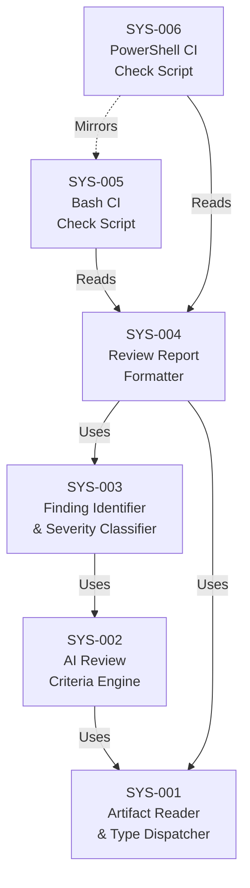

# System Design: Peer Review

**Feature Branch**: `feature/005c-peer-review`
**Created**: 2025-07-18
**Status**: Approved
**Source**: `specs/005c-peer-review/v-model/requirements.md`

## Overview

This system design decomposes the 37 requirements for the Peer Review command into 6 system components: an artifact reader and type dispatcher, an AI review criteria engine covering all 9 artifact types, a finding identifier and severity classifier, a review report formatter, and two deterministic CI check scripts (Bash + PowerShell). The command operates as an AI-powered, stateless linter: it reads a single V-Model artifact, evaluates it against standards-based review criteria specific to that artifact type using LLM analysis, and produces a structured `peer-review-{artifact}.md` report with findings classified by severity. A companion deterministic parser script reads the generated review and returns exit codes (0 = clean or observations only, 1 = Critical or Major, 2 = Minor only) for CI gating. The decomposition separates the AI evaluation path (SYS-001 through SYS-004) from the deterministic CI path (SYS-005, SYS-006), reflecting the distinct execution contexts: the command runs within an AI agent, while the check scripts run in CI pipelines with no AI dependency.

## ID Schema

- **System Component**: `SYS-NNN` — sequential identifier for each component
- **Parent Requirements**: Comma-separated `REQ-NNN` list per component (many-to-many)
- Example: `SYS-004` with Parent Requirements `REQ-001, REQ-018, REQ-019` — component satisfies all three requirements

## Decomposition View (IEEE 1016 §5.1)

| SYS ID | Name | Description | Parent Requirements | Type |
|--------|------|-------------|---------------------|------|
| SYS-001 | Artifact Reader & Type Dispatcher | Core module that reads a single V-Model artifact file specified by the user and identifies its type from the 9 supported artifact types (requirements.md, system-design.md, architecture-design.md, system-test.md, integration-test.md, module-design.md, unit-test.md, hazard-analysis.md, acceptance-plan.md). Validates that exactly one artifact is provided per invocation and that the file is one of the supported types. Dispatches the artifact content and type identifier to the AI Review Criteria Engine (SYS-002) for evaluation. Operates in read-only mode — does not modify the original artifact file. Does not require any other V-Model artifacts to be present; the single specified artifact is sufficient for review. | REQ-001, REQ-029, REQ-CN-001, REQ-CN-003 | Module |
| SYS-002 | AI Review Criteria Engine | Core AI evaluation module that applies standards-based review criteria specific to the artifact type received from SYS-001. Uses LLM evaluation to assess prose quality, structural completeness, standards compliance, and cross-reference integrity. Contains 9 artifact-type-specific evaluation rule sets: (1) requirements.md — INCOSE quality attributes: atomic, testable, unambiguous, complete, free of subjective language, priority assigned; (2) system-design.md — IEEE 1016 criteria: all 4 design views present, every SYS traces to ≥1 REQ, interface contracts complete, derived requirements flagged; (3) architecture-design.md — IEEE 42010 / Kruchten 4+1 criteria: 4+1 views populated, CROSS-CUTTING modules justified, interface definitions complete; (4) system-test.md — ISO 29119 criteria: named techniques used correctly, no user-journey language, test scenario independence; (5) integration-test.md — ISO 29119-4 criteria: CDCT technique present, fault injection scenarios, interface coverage complete; (6) module-design.md — DO-178C / ISO 26262 criteria: 4 mandatory views present, algorithm specifications complete, error handling defined; (7) unit-test.md — ISO 29119-4 criteria: 5 techniques present, mock registry complete, boundary values explicit; (8) hazard-analysis.md — ISO 14971 / ISO 26262 criteria: severity classifications present, every HAZ has mitigation, operational state coverage, residual risk assessed; (9) acceptance-plan.md — ISO 29119 criteria: BDD scenarios well-formed, validation conditions measurable, parent REQ coverage verified. Produces a list of raw findings (location, description, recommendation) for each quality issue detected. | REQ-002, REQ-003, REQ-004, REQ-005, REQ-006, REQ-007, REQ-008, REQ-009, REQ-010, REQ-011 | Module |
| SYS-003 | Finding Identifier & Severity Classifier | Module that assigns unique identifiers and severity classifications to each raw finding produced by SYS-002. Generates PRF-{ARTIFACT}-NNN identifiers where {ARTIFACT} is an uppercase abbreviation derived from the artifact type (REQ, SYS, ARCH, STP, ITP, MOD, UTP, HAZ, ATP) and NNN is a zero-padded sequential number starting at 001. Classifies each finding with exactly one severity level: Critical (fundamental quality violation blocking release, such as untestable requirement, missing mandatory view, unmitigated catastrophic hazard), Major (significant quality issue requiring resolution before approval, such as ambiguous quantifier, incomplete interface contract, missing test technique), Minor (style or completeness issue not affecting correctness, such as inconsistent formatting, missing rationale on low-risk item), or Observation (informational suggestion for improvement, not a defect, such as alternative decomposition strategy or additional test technique). PRF IDs are advisory-only and do not participate in the V-Model traceability chain; they are not referenced by trace matrices or coverage metrics. | REQ-012, REQ-013, REQ-014, REQ-015, REQ-016, REQ-017, REQ-CN-002 | Module |
| SYS-004 | Review Report Formatter | Module that generates the complete `peer-review-{artifact}.md` output file from the classified findings produced by SYS-003. The report includes: (1) header section with reviewer identification, generation date, artifact file name, count of items in the reviewed artifact, and governing standard for the artifact type; (2) summary table displaying finding counts for each severity level (Critical, Major, Minor, Observation); (3) finding subsections, each containing PRF ID, Severity, Location (referencing the specific artifact item ID), Description, and Recommendation. Regenerates the entire file on each invocation, replacing any previously generated review for the same artifact. Operates statelessly: the report contains no persistent status fields (e.g., no "Status: Open/Closed" on findings); presence of a finding indicates a current problem, absence after re-run indicates resolution. Does not maintain a database or persistent store of past findings; git history serves as the audit trail. | REQ-001, REQ-018, REQ-019, REQ-020, REQ-021, REQ-NF-001, REQ-CN-004 | Module |
| SYS-005 | Bash CI Check Script | Deterministic Bash script (`peer-review-check.sh`) that reads a `peer-review-{artifact}.md` file and returns an exit code based on the severities of findings present. Determines finding severities by parsing the summary table or individual finding headers in the peer review markdown file. Exit code semantics: 0 when the review contains zero findings or only Observation-level findings; 1 when the review contains at least one Critical or at least one Major finding; 2 when the review contains at least one Minor finding and zero Critical and zero Major findings. Supports a `--json` flag that outputs finding counts by severity level as structured JSON to stdout. CLI syntax: `peer-review-check.sh [--json] <peer-review-file>`. Deterministic: given the same input file, always produces the same exit code and the same JSON output. Uses standard Bash utilities (grep, awk, sed) for parsing — no AI dependency. | REQ-022, REQ-023, REQ-024, REQ-025, REQ-026, REQ-027, REQ-NF-002, REQ-IF-001 | Utility |
| SYS-006 | PowerShell CI Check Script | PowerShell script (`peer-review-check.ps1`) mirroring the behavior of SYS-005. Accepts equivalent PowerShell parameters: `Peer-Review-Check.ps1 [-Json] -ReviewFile <path>`. Produces identical exit code semantics (0 = clean or observations only, 1 = Critical or Major, 2 = Minor only) and identical JSON output structure as the Bash script. Deterministic: given the same input file, always produces the same exit code and JSON output. Requires PowerShell 5.1+ or PowerShell Core 7+. | REQ-028, REQ-IF-002, REQ-NF-002 | Utility |

## Dependency View (IEEE 1016 §5.2)

| Source | Target | Relationship | Failure Impact |
|--------|--------|-------------|----------------|
| SYS-002 | SYS-001 | Uses | AI Review Criteria Engine requires the artifact content and type identification from the reader; cannot evaluate without input artifact data. |
| SYS-003 | SYS-002 | Uses | Finding Identifier & Severity Classifier requires raw findings from the AI engine; cannot assign IDs or severities without evaluation results. |
| SYS-004 | SYS-003 | Uses | Review Report Formatter requires classified findings with PRF IDs and severities; cannot generate the report without structured finding data. |
| SYS-004 | SYS-001 | Uses | Review Report Formatter requires artifact metadata (file name, item count, artifact type) from the reader for the report header section. |
| SYS-005 | SYS-004 | Reads | Bash CI Check Script reads the peer-review-{artifact}.md file produced by the formatter; cannot determine exit codes without a generated review file. |
| SYS-006 | SYS-004 | Reads | PowerShell CI Check Script reads the same peer-review-{artifact}.md file; cannot determine exit codes without a generated review file. |
| SYS-006 | SYS-005 | Mirrors | PowerShell script mirrors Bash script behavior; behavioral divergence between the two produces inconsistent CI gating across platforms. |

### Dependency Diagram

## Interface View (IEEE 1016 §5.3)

### External Interfaces

| Component | Interface Name | Protocol | Input | Output | Error Handling |
|-----------|---------------|----------|-------|--------|----------------|
| SYS-001 | Peer Review Command Invocation | VS Code chat command / CLI | Single artifact file path (one of 9 supported V-Model artifact types) | Dispatches artifact content and type to SYS-002; triggers report generation via SYS-004 producing `peer-review-{artifact}.md` in the V-Model directory | Rejects unsupported artifact types; rejects multiple artifact inputs; fails if artifact file does not exist |
| SYS-005 | Bash CI Check Invocation | Bash CLI | `peer-review-check.sh [--json] <peer-review-file>` — path to a `peer-review-{artifact}.md` file, optional `--json` flag | Exit code (0, 1, or 2); with `--json`: structured JSON to stdout with finding counts by severity | Exit code 1 if review file not found or unparseable; stderr message describing the error |
| SYS-006 | PowerShell CI Check Invocation | PowerShell CLI | `Peer-Review-Check.ps1 [-Json] -ReviewFile <path>` — path to a `peer-review-{artifact}.md` file, optional `-Json` switch | Identical exit codes and JSON structure as SYS-005 | Identical error handling as SYS-005 with PowerShell idiomatic error output |

### Internal Interfaces

| Source | Target | Interface Name | Protocol | Data Format | Error Handling |
|--------|--------|---------------|----------|-------------|----------------|
| SYS-001 | SYS-002 | Artifact Dispatch | In-memory data | Artifact content (string), artifact type identifier (enum: requirements, system-design, architecture-design, system-test, integration-test, module-design, unit-test, hazard-analysis, acceptance-plan), artifact item count (integer) | Error if artifact content is empty or type is unrecognized |
| SYS-002 | SYS-003 | Raw Findings List | In-memory data | Array of raw findings, each containing: location (artifact item ID reference), description (string), recommendation (string), artifact type abbreviation (string) | Empty array if no quality issues detected |
| SYS-003 | SYS-004 | Classified Findings List | In-memory data | Array of classified findings, each containing: PRF ID (string, pattern `PRF-{ARTIFACT}-NNN`), severity (enum: Critical, Major, Minor, Observation), location (string), description (string), recommendation (string) | Empty array if no findings to classify |
| SYS-001 | SYS-004 | Artifact Metadata | In-memory data | Artifact file name (string), artifact item count (integer), artifact type (string), governing standard name (string) | Error if metadata extraction fails |
| SYS-004 | SYS-005 | Review Report File | File I/O | Markdown file `peer-review-{artifact}.md` with structured headers, summary table, and finding subsections following the defined report format | SYS-005 fails with exit code 1 if file is missing or has unexpected format |
| SYS-004 | SYS-006 | Review Report File | File I/O | Same markdown file as consumed by SYS-005 | SYS-006 fails with exit code 1 if file is missing or has unexpected format |

## Data Design View (IEEE 1016 §5.4)

| Entity | Component | Storage | Protection at Rest | Protection in Transit | Retention |
|--------|-----------|---------|-------------------|-----------------------|-----------|
| Input Artifact Content | SYS-001 | In-memory (read from file system) | Git repository access controls on source artifact | N/A (local process) | Transient — read on each invocation, not persisted separately |
| Artifact Type & Metadata | SYS-001 | In-memory | N/A (ephemeral) | N/A (local process) | Transient — derived on each invocation |
| Raw Findings List | SYS-002 | In-memory | N/A (ephemeral) | N/A (local process) | Transient — produced by AI evaluation on each invocation |
| Classified Findings List | SYS-003 | In-memory | N/A (ephemeral) | N/A (local process) | Transient — enriched with PRF IDs and severities on each invocation |
| Peer Review Report | SYS-004 | File (`peer-review-{artifact}.md`) | Git repository access controls | N/A (local file) | Regenerated on each invocation; persistent if committed to Git; git history serves as audit trail of past findings |
| CI Check JSON Output | SYS-005, SYS-006 | Stdout (transient) | N/A (ephemeral) | N/A (local process) | Transient — consumed by CI pipeline; not persisted by the script |

---

## Coverage Summary

| Metric | Count |
|--------|-------|
| Total System Components (SYS) | 6 |
| Total Parent Requirements Covered | 37 / 37 (100%) |
| Components per Type | Module: 4 \| Utility: 2 |
| **Forward Coverage (REQ→SYS)** | **100%** |

### Forward Coverage Detail

| REQ ID | Covered By |
|--------|-----------|
| REQ-001 | SYS-001, SYS-004 |
| REQ-002 | SYS-002 |
| REQ-003 | SYS-002 |
| REQ-004 | SYS-002 |
| REQ-005 | SYS-002 |
| REQ-006 | SYS-002 |
| REQ-007 | SYS-002 |
| REQ-008 | SYS-002 |
| REQ-009 | SYS-002 |
| REQ-010 | SYS-002 |
| REQ-011 | SYS-002 |
| REQ-012 | SYS-003 |
| REQ-013 | SYS-003 |
| REQ-014 | SYS-003 |
| REQ-015 | SYS-003 |
| REQ-016 | SYS-003 |
| REQ-017 | SYS-003 |
| REQ-018 | SYS-004 |
| REQ-019 | SYS-004 |
| REQ-020 | SYS-004 |
| REQ-021 | SYS-004 |
| REQ-022 | SYS-005 |
| REQ-023 | SYS-005 |
| REQ-024 | SYS-005 |
| REQ-025 | SYS-005 |
| REQ-026 | SYS-005 |
| REQ-027 | SYS-005 |
| REQ-028 | SYS-006 |
| REQ-029 | SYS-001 |
| REQ-NF-001 | SYS-004 |
| REQ-NF-002 | SYS-005, SYS-006 |
| REQ-IF-001 | SYS-005 |
| REQ-IF-002 | SYS-006 |
| REQ-CN-001 | SYS-001 |
| REQ-CN-002 | SYS-003 |
| REQ-CN-003 | SYS-001 |
| REQ-CN-004 | SYS-004 |

## Derived Requirements

None — all components trace to existing requirements.

## Glossary

| Term | Definition |
|------|-----------|
| PRF ID | Peer Review Finding identifier in the format `PRF-{ARTIFACT}-NNN`, used to label individual findings in the review report; advisory-only and not part of the V-Model traceability chain |
| Artifact Type | One of the 9 V-Model document types that can be peer-reviewed: requirements, system-design, architecture-design, system-test, integration-test, module-design, unit-test, hazard-analysis, acceptance-plan |
| Governing Standard | The industry standard (e.g., INCOSE, IEEE 1016, ISO 14971) that defines the review criteria applied during peer review of a specific artifact type |
| Severity Level | Classification of a finding's impact: Critical (blocks release), Major (fix before approval), Minor (does not affect correctness), or Observation (informational suggestion) |
| Stateless Linting | A review model where findings are derived solely from the current state of the artifact on each run, with no persistent tracking of finding status across invocations |
| CI Gate | A continuous integration checkpoint that uses exit codes from the check script (0, 1, or 2) to allow or block pull request merges |
| INCOSE | International Council on Systems Engineering — provides the quality attributes guide used for reviewing requirements |
| IEEE 1016 | IEEE Standard for Information Technology — Software Design Descriptions; governs system design review criteria |
| IEEE 42010 | ISO/IEC/IEEE 42010 — Systems and Software Engineering — Architecture Description; governs architecture design review criteria |
| ISO 29119 | International standard for software and systems engineering — software testing; governs test artifact review criteria |
| ISO 14971 | International standard for application of risk management to medical devices; governs hazard analysis review criteria |
