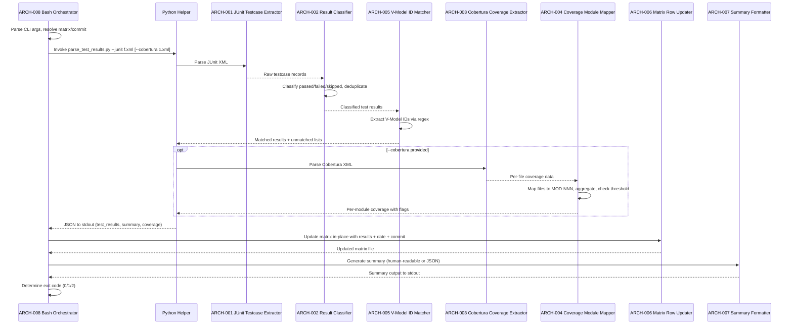
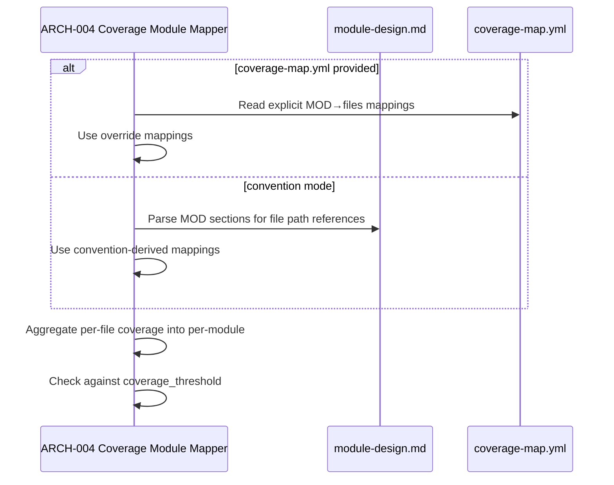

# Architecture Design: Test Results Ingestion

**Feature Branch**: `feature/005d-test-results`
**Created**: 2026-04-05
**Status**: Approved
**Source**: `specs/005d-test-results/v-model/system-design.md`

## Overview

This architecture decomposes the 7 system components of the Test Results Ingestion feature into 9 architecture modules organized by implementation boundary. The JUnit XML Parser (SYS-001) decomposes into a testcase extractor and a result classifier. The Cobertura XML Coverage Parser (SYS-002) decomposes into a coverage extractor and a module mapper. The V-Model ID Matcher (SYS-003), In-Place Matrix Updater (SYS-004), and Summary Reporter (SYS-005) each map to single architecture modules since their responsibilities are cohesive. The Bash (SYS-006) and PowerShell (SYS-007) wrappers each map to single self-contained modules. The entire feature is 100% deterministic with no AI dependency. The Python helper (`parse_test_results.py`) contains ARCH-001 through ARCH-004 and ARCH-005; the Bash/PowerShell wrappers contain ARCH-006 and ARCH-007 for matrix manipulation and ARCH-008/ARCH-009 for orchestration.

## ID Schema

- **Architecture Module**: `ARCH-NNN` — sequential identifier for each module
- **Parent System Components**: Comma-separated `SYS-NNN` list per module (many-to-many)
- Example: `ARCH-006` with Parent System Components `SYS-004` — module implements in-place matrix string manipulation

## Logical View — Component Breakdown (IEEE 42010 / Kruchten 4+1)

| ARCH ID | Name | Description | Parent System Components | Type |
|---------|------|-------------|--------------------------|------|
| ARCH-001 | JUnit Testcase Extractor | Python module that reads a JUnit XML file using `xml.etree.ElementTree` and extracts all `<testcase>` elements from all `<testsuite>` elements. Handles both single `<testsuite>` root and `<testsuites>` wrapper root. For each testcase, extracts the `name` attribute and `time` attribute. Returns a flat ordered list of raw testcase records. Uses only Python standard library. | SYS-001 | Component |
| ARCH-002 | Test Result Classifier | Python module that classifies each raw testcase record from ARCH-001 by inspecting child elements. A testcase with no `<failure>`, `<error>`, or `<skipped>` child elements is classified as "passed". A testcase with a `<failure>` or `<error>` child is classified as "failed" (extracts the `message` attribute). A testcase with a `<skipped>` child is classified as "skipped" (extracts the `message` attribute). When the same test name appears multiple times (retries), the last occurrence overwrites earlier ones. Returns a deduplicated list of classified test results. | SYS-001 | Component |
| ARCH-003 | Cobertura Coverage Extractor | Python module that reads a Cobertura XML file using `xml.etree.ElementTree` and extracts per-file coverage data. Parses `<package>` and `<class>` elements to extract `filename`, `line-rate`, and `branch-rate` attributes. Returns a dict mapping file paths to coverage tuples (stmt_pct, branch_pct). Uses only Python standard library. | SYS-002 | Component |
| ARCH-004 | Coverage Module Mapper | Python module that maps per-file coverage data from ARCH-003 to MOD-NNN module IDs. Implements two strategies: (a) convention — scans `module-design.md` for file path references per MOD-NNN section using regex; (b) override — reads `coverage-map.yml` (YAML-like structure with `mappings` containing `mod_id` and `files` entries), which takes precedence when provided. For modules mapped to multiple files, computes weighted average coverage based on line counts from Cobertura XML. Compares each module's coverage against the `coverage_threshold` from `extension.yml` and flags below-threshold modules. Outputs per-module coverage with formatted values (`{stmt}% stmt / {branch}% branch`, one decimal place). | SYS-002 | Component |
| ARCH-005 | V-Model ID Regex Matcher | Python module that extracts V-Model scenario IDs from test case names using four regex patterns: `SCN-[A-Z]*-?[0-9]{3}-[A-Z][0-9]+` (Matrix A), `STS-[A-Z]*-?[0-9]{3}-[A-Z][0-9]+` (Matrix B), `ITS-[A-Z]*-?[0-9]{3}-[A-Z][0-9]+` (Matrix C), `UTS-[A-Z]*-?[0-9]{3}-[A-Z][0-9]+` (Matrix D). For each matched ID, determines the target matrix. Reports unmatched test names and extra IDs (in JUnit but not in matrix). Outputs structured JSON with `test_results`, `unmatched_tests`, and `unmatched_ids` arrays. | SYS-003 | Component |
| ARCH-006 | Matrix Row Updater | Shell logic within the Bash/PowerShell wrappers that performs targeted string manipulation on `traceability-matrix.md`. For each matched scenario ID from ARCH-005: locates the matrix row containing that ID, replaces the Status column value (`⬜ Untested` or a previously ingested status) with the new status (`✅ Passed`, `❌ Failed`, `⏭️ Skipped`), and sets the Date and Commit column values. When coverage data is provided (from ARCH-004), adds or updates the Coverage column in Matrix D rows only. Handles header row and separator row modifications (adding new column headers). Preserves all non-table content (headers, summaries, notes). Supports re-running: overwrites previous status/date/commit values. | SYS-004 | Component |
| ARCH-007 | Ingestion Summary Formatter | Shell logic within the Bash/PowerShell wrappers that produces the summary output. In human-readable mode: prints per-matrix counts (passed, failed, skipped, matched vs. total) and overall totals. When coverage data is present, prints per-module and overall coverage percentages with threshold warnings. In JSON mode (`--json`): produces a structured JSON object with `test_results` (per-ID status), `summary` (per-matrix and overall counts), and optionally `coverage` (per-module data). | SYS-005 | Component |
| ARCH-008 | Bash Ingestion Orchestrator | Self-contained Bash script (`ingest-test-results.sh`) that orchestrates the full ingestion workflow. Parses CLI arguments (`--input`, `--coverage`, `--matrix`, `--coverage-map`, `--commit-sha`, `--json`, `--help`). Resolves matrix path via `setup-v-model.sh --json` if `--matrix` not provided. Resolves commit SHA via `git rev-parse --short HEAD` if `--commit-sha` not provided. Invokes `parse_test_results.py` with appropriate arguments and captures JSON output. Delegates to ARCH-006 for matrix update and ARCH-007 for summary output. Returns exit codes: 0 (all passed), 1 (failures), 2 (no matches). | SYS-006 | Utility |
| ARCH-009 | PowerShell Ingestion Orchestrator | Self-contained PowerShell script (`Ingest-Test-Results.ps1`) mirroring ARCH-008 behavior. Accepts equivalent parameters (`-Input`, `-Coverage`, `-Matrix`, `-CoverageMap`, `-CommitSha`, `-Json`, `-Help`). Produces identical exit codes, matrix updates, and JSON output. | SYS-007 | Utility |

## Process View — Dynamic Behavior (Kruchten 4+1)

### Interaction: Test Results Ingestion



### Interaction: Coverage-Map Override Resolution



## Development View — Source Organization (Kruchten 4+1)

```
scripts/
├── python/
│   └── parse_test_results.py       # ARCH-001, ARCH-002, ARCH-003, ARCH-004, ARCH-005
│                                     # Single Python file: JUnit parser, result classifier,
│                                     # Cobertura parser, module mapper, ID matcher
│                                     # Outputs JSON to stdout
├── bash/
│   └── ingest-test-results.sh       # ARCH-006, ARCH-007, ARCH-008
│                                     # Bash orchestrator with matrix updater and summary
└── powershell/
    └── Ingest-Test-Results.ps1      # ARCH-006, ARCH-007, ARCH-009
                                      # PowerShell orchestrator (1:1 parity)
```

## Physical View — Deployment (Kruchten 4+1)

### Execution Environment

```
┌──────────────────────────────────────────────────┐
│  CI Runner (GitHub Actions / Local Dev Machine)   │
│                                                    │
│  ┌──────────────────────────────────────────┐     │
│  │  ingest-test-results.sh (Bash)            │     │
│  │  OR Ingest-Test-Results.ps1 (PowerShell)  │     │
│  │                                            │     │
│  │  ┌──────────────────────────────────┐     │     │
│  │  │  parse_test_results.py (Python)   │     │     │
│  │  │  - xml.etree.ElementTree          │     │     │
│  │  │  - json, re, sys, argparse        │     │     │
│  │  └──────────────────────────────────┘     │     │
│  │                                            │     │
│  │  Reads:  junit.xml, cobertura.xml,        │     │
│  │          traceability-matrix.md,           │     │
│  │          module-design.md, extension.yml,  │     │
│  │          coverage-map.yml (optional)       │     │
│  │                                            │     │
│  │  Writes: traceability-matrix.md (in-place) │     │
│  └──────────────────────────────────────────┘     │
│                                                    │
│  Prerequisites: Python 3.x, Bash 4+ or PS 5.1+,  │
│                 Git (for commit SHA)               │
└──────────────────────────────────────────────────┘
```

## Dependency View (Component Dependencies)

| Source | Target | Relationship | Failure Impact |
|--------|--------|-------------|----------------|
| ARCH-002 | ARCH-001 | Uses | Result Classifier needs raw testcase records from extractor; no records means no classification. |
| ARCH-005 | ARCH-002 | Uses | ID Matcher needs classified results; without them, no ID matching occurs. |
| ARCH-004 | ARCH-003 | Uses | Module Mapper needs per-file coverage data; without it, no module-level aggregation. |
| ARCH-006 | ARCH-005 | Uses | Matrix Row Updater needs matched ID→status mapping; without it, no rows to update. |
| ARCH-006 | ARCH-004 | Uses | Matrix Row Updater uses module coverage for Coverage column; omitted when no coverage data. |
| ARCH-007 | ARCH-005 | Uses | Summary Formatter uses match results for counts; empty without match data. |
| ARCH-007 | ARCH-004 | Uses | Summary Formatter uses module coverage for display; omitted when no coverage data. |
| ARCH-008 | ARCH-001 | Invokes | Bash Orchestrator spawns Python subprocess; Python unavailable causes total failure. |
| ARCH-008 | ARCH-006 | Contains | Orchestrator contains matrix update logic as shell functions. |
| ARCH-008 | ARCH-007 | Contains | Orchestrator contains summary formatting logic as shell functions. |
| ARCH-009 | ARCH-008 | Mirrors | PowerShell mirrors Bash; divergence causes cross-platform inconsistency. |

---

## Coverage Summary

| Metric | Count |
|--------|-------|
| Total Architecture Modules (ARCH) | 9 |
| Total Parent SYS Components Covered | 7 / 7 (100%) |
| Modules per Type | Component: 6 \| Utility: 3 |
| **Forward Coverage (SYS→ARCH)** | **100%** |

### Forward Coverage Detail

| SYS ID | Covered By |
|--------|-----------|
| SYS-001 | ARCH-001, ARCH-002 |
| SYS-002 | ARCH-003, ARCH-004 |
| SYS-003 | ARCH-005 |
| SYS-004 | ARCH-006 |
| SYS-005 | ARCH-007 |
| SYS-006 | ARCH-008 |
| SYS-007 | ARCH-009 |
