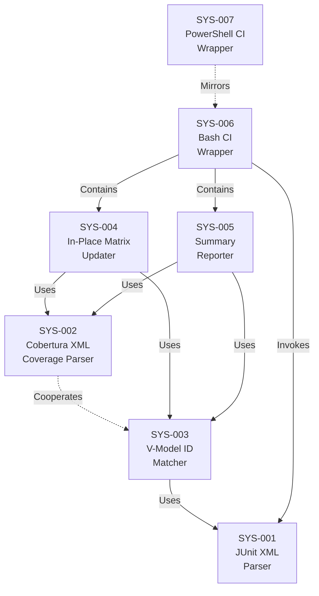

# System Design: Test Results Ingestion

**Feature Branch**: `feature/005d-test-results`
**Created**: 2026-04-05
**Status**: Approved
**Source**: `specs/005d-test-results/v-model/requirements.md`

## Overview

This system design decomposes the 27 requirements for the Test Results Ingestion command into 7 system components: a Python-based JUnit XML parser, a Python-based Cobertura XML coverage parser, a V-Model ID matcher, an in-place matrix updater, a summary reporter, and two CI wrapper scripts (Bash + PowerShell). The command is 100% deterministic with no AI dependency. The core parsing logic lives in a Python helper script (`parse_test_results.py`) that uses only standard library modules (`xml.etree.ElementTree`, `json`, `re`, `sys`, `argparse`). The Bash and PowerShell wrappers invoke the Python helper, receive structured JSON, perform the in-place matrix update, and emit exit codes for CI integration. The decomposition separates XML parsing concerns (SYS-001, SYS-002) from matching logic (SYS-003), matrix mutation (SYS-004), reporting (SYS-005), and platform-specific CI wrappers (SYS-006, SYS-007).

## ID Schema

- **System Component**: `SYS-NNN` — sequential identifier for each component
- **Parent Requirements**: Comma-separated `REQ-NNN` list per component (many-to-many)
- Example: `SYS-004` with Parent Requirements `REQ-005, REQ-006, REQ-007, REQ-CN-001` — component satisfies all four requirements

## Decomposition View (IEEE 1016 §5.1)

| SYS ID | Name | Description | Parent Requirements | Type |
|--------|------|-------------|---------------------|------|
| SYS-001 | JUnit XML Parser | Python module within `parse_test_results.py` that reads a JUnit XML file and extracts all `<testcase>` elements from all `<testsuite>` elements. For each testcase, extracts: the `name` attribute, the `time` attribute, and the presence of child elements (`<failure>`, `<error>`, `<skipped>`). Classifies each test result as Passed (no failure/error/skipped children), Failed (failure or error child present), or Skipped (skipped child present). When a test case ID appears multiple times (retries or parameterized runs), the last occurrence is used as the definitive result. Outputs a structured list of test results with name, status, duration, and failure/skip message. Uses only `xml.etree.ElementTree` from the Python standard library for XML parsing. Accepts CLI syntax: `parse_test_results.py --junit <junit.xml> [--cobertura <cobertura.xml>] [--coverage-map <map.yml>]` and outputs structured JSON to stdout. | REQ-001, REQ-003, REQ-015, REQ-NF-001, REQ-NF-002, REQ-IF-003, REQ-CN-002 | Module |
| SYS-002 | Cobertura XML Coverage Parser | Python module within `parse_test_results.py` that reads a Cobertura XML file and extracts per-file coverage data. Parses `<package>` and `<class>` elements to extract `filename`, `line-rate`, and `branch-rate` attributes. Maps source file coverage to MOD-NNN module IDs using two strategies: (a) convention — parses `module-design.md` for file path references per MOD-NNN section; (b) override — reads `coverage-map.yml` (top-level `mappings` key, array of `{mod_id, files}` objects) when provided, which takes precedence. For modules mapped to multiple files, aggregates coverage as weighted averages. Compares actual coverage against the `coverage_threshold` from `extension.yml` and flags below-threshold modules with `⚠`. Uses only `xml.etree.ElementTree` and `json` for parsing. The `coverage-map.yml` parser uses `json` after YAML-to-JSON conversion by the wrapper script, or a minimal inline YAML parser for the simple schema. | REQ-008, REQ-009, REQ-018, REQ-019, REQ-020, REQ-NF-001, REQ-NF-002 | Module |
| SYS-003 | V-Model ID Matcher | Python module within `parse_test_results.py` that extracts V-Model scenario IDs from test case names using regex patterns. Matches four ID families: `SCN-[A-Z]*-?[0-9]{3}-[A-Z][0-9]+` (Matrix A), `STS-[A-Z]*-?[0-9]{3}-[A-Z][0-9]+` (Matrix B), `ITS-[A-Z]*-?[0-9]{3}-[A-Z][0-9]+` (Matrix C), `UTS-[A-Z]*-?[0-9]{3}-[A-Z][0-9]+` (Matrix D). For each matched test case, maps the extracted ID to the appropriate matrix. Reports test cases with no ID match as unmatched in the output. Reports IDs found in test results but not in the matrix as extra IDs. Outputs the complete matching result as structured JSON for consumption by the wrapper scripts. | REQ-002, REQ-013, REQ-016, REQ-017, REQ-NF-001 | Module |
| SYS-004 | In-Place Matrix Updater | Component within the Bash/PowerShell wrapper scripts that reads the existing `traceability-matrix.md` file and performs targeted modifications. For each matched scenario ID, replaces the Status column value (`⬜ Untested`, or a previously ingested status) with the new status (`✅ Passed`, `❌ Failed`, `⏭️ Skipped`). Adds or updates the Date column with the ISO 8601 date (YYYY-MM-DD) of the ingestion run. Adds or updates the Commit column with the abbreviated Git commit SHA (7 characters). When coverage data is provided, adds or updates the Coverage column in Matrix D with the format `{stmt}% stmt / {branch}% branch` (one decimal place), including `⚠` for below-threshold modules. Preserves all content outside the status columns: headers, coverage summaries, manual annotations, and non-matched rows. Supports re-running: subsequent ingestions overwrite previous statuses, dates, and commits. Does NOT regenerate the matrix — only modifies existing rows. | REQ-004, REQ-005, REQ-006, REQ-007, REQ-CN-001, REQ-CN-003, REQ-CN-004 | Module |
| SYS-005 | Summary Reporter | Component that generates the human-readable summary output to stdout. Displays: matched test count per matrix (A, B, C, D), pass/fail/skip counts per matrix, total matched vs. total matrix scenarios, and (when coverage is provided) per-module and overall coverage percentages with threshold warnings. Also produces the structured JSON output when `--json` is specified, including per-ID status mappings, per-matrix summary counts, and per-module coverage data. | REQ-010, REQ-014 | Module |
| SYS-006 | Bash CI Wrapper Script | Bash script (`ingest-test-results.sh`) that orchestrates the ingestion workflow. Accepts CLI arguments: `--input <junit.xml>`, `--coverage <cobertura.xml>`, `--matrix <matrix.md>`, `--coverage-map <map.yml>`, `--commit-sha <sha>`, `--json`, `--help`. Resolves the matrix path via `setup-v-model.sh --json` when `--matrix` is not provided. Determines the commit SHA from `git rev-parse --short HEAD` when `--commit-sha` is not provided. Invokes `parse_test_results.py` with the appropriate arguments and captures JSON output. Delegates to SYS-004 for matrix update and SYS-005 for summary output. Returns exit codes: 0 = all passed, 1 = failures detected, 2 = no V-Model ID matches. | REQ-011, REQ-012, REQ-013, REQ-IF-001, REQ-NF-001, REQ-NF-003 | Utility |
| SYS-007 | PowerShell CI Wrapper Script | PowerShell script (`Ingest-Test-Results.ps1`) mirroring the behavior of SYS-006. Accepts equivalent PowerShell parameters: `-Input`, `-Coverage`, `-Matrix`, `-CoverageMap`, `-CommitSha`, `-Json`, `-Help`. Produces identical exit codes, matrix updates, and JSON output structure as the Bash script. | REQ-IF-002, REQ-NF-001 | Utility |

## Dependency View (IEEE 1016 §5.2)

| Source | Target | Relationship | Failure Impact |
|--------|--------|-------------|----------------|
| SYS-003 | SYS-001 | Uses | ID Matcher requires parsed test results from JUnit XML parser; cannot match IDs without test case data. |
| SYS-002 | SYS-003 | Cooperates | Coverage parser maps data to MOD-NNN IDs that must align with Matrix D entries identified by the ID matcher; misalignment produces orphaned coverage data. |
| SYS-004 | SYS-003 | Uses | Matrix Updater requires matched ID→status mappings; cannot update rows without matching results. |
| SYS-004 | SYS-002 | Uses | Matrix Updater uses coverage data to populate the Coverage column in Matrix D; without it, the column is omitted. |
| SYS-005 | SYS-003 | Uses | Summary Reporter uses matching results for per-matrix counts; without them, summary is empty. |
| SYS-005 | SYS-002 | Uses | Summary Reporter uses coverage data for per-module and overall coverage display; omitted when no coverage data. |
| SYS-006 | SYS-001 | Invokes | Bash wrapper invokes the Python helper which contains SYS-001; Python not available causes complete failure. |
| SYS-006 | SYS-004 | Contains | Bash wrapper contains the matrix update logic; it reads Python JSON output and performs string manipulation on the matrix file. |
| SYS-006 | SYS-005 | Contains | Bash wrapper contains the summary reporting logic. |
| SYS-007 | SYS-006 | Mirrors | PowerShell script mirrors Bash script behavior; behavioral divergence produces inconsistent CI outcomes across platforms. |

### Dependency Diagram

## Interface View (IEEE 1016 §5.3)

### External Interfaces

| Component | Interface Name | Protocol | Input | Output | Error Handling |
|-----------|---------------|----------|-------|--------|----------------|
| SYS-006 | Bash Wrapper Invocation | Bash CLI | `ingest-test-results.sh --input <junit.xml> [--coverage <cobertura.xml>] [--matrix <matrix.md>] [--coverage-map <map.yml>] [--commit-sha <sha>] [--json] [--help]` | Updated matrix file (in-place); summary to stdout; JSON to stdout with `--json`; exit code 0, 1, or 2 | Exit 2 if no ID matches; stderr for invalid arguments or missing files; exit 1 for Python invocation failure |
| SYS-007 | PowerShell Wrapper Invocation | PowerShell CLI | `Ingest-Test-Results.ps1 -Input <path> [-Coverage <path>] [-Matrix <path>] [-CoverageMap <path>] [-CommitSha <sha>] [-Json] [-Help]` | Identical output behavior as SYS-006 | Identical error semantics as SYS-006 with PowerShell idiomatic error output |
| SYS-001 | Python Helper Invocation | Python CLI | `parse_test_results.py --junit <path> [--cobertura <path>] [--coverage-map <path>]` | Structured JSON to stdout with `test_results`, `summary`, and optional `coverage` fields | Non-zero exit code with error message to stderr for invalid XML or missing files |

### Internal Interfaces

| Source | Target | Interface Name | Protocol | Data Format | Error Handling |
|--------|--------|---------------|----------|-------------|----------------|
| SYS-001 | SYS-003 | Parsed Test Results | In-memory (Python) | List of dicts: `[{"name": str, "status": "passed"\|"failed"\|"skipped", "duration": float, "message": str\|null}]` | Empty list if XML has no testcases |
| SYS-003 | SYS-004 | ID Match Results | JSON (stdout) | `{"test_results": [{"id": str, "matrix": "A"\|"B"\|"C"\|"D", "status": str}], "unmatched_tests": [...], "unmatched_ids": [...]}` | Empty arrays for no matches |
| SYS-002 | SYS-004 | Coverage Data | JSON (stdout) | `{"coverage": {"MOD-NNN": {"stmt": float, "branch": float, "files": [...], "below_threshold": bool}}}` | Null/missing when `--cobertura` not provided |
| SYS-006 | SYS-001 | Python Invocation | Process spawn | CLI arguments passed through; JSON captured from stdout | Non-zero Python exit code triggers Bash exit with error message |

## Data Design View (IEEE 1016 §5.4)

| Entity | Component | Storage | Protection at Rest | Protection in Transit | Retention |
|--------|-----------|---------|-------------------|-----------------------|-----------|
| JUnit XML File | SYS-001 | File system (read-only) | CI runner access controls | N/A (local file) | Transient — read once per invocation; CI runner manages lifecycle |
| Cobertura XML File | SYS-002 | File system (read-only) | CI runner access controls | N/A (local file) | Transient — read once per invocation; CI runner manages lifecycle |
| coverage-map.yml | SYS-002 | File system (read-only) | Git repository access controls | N/A (local file) | Persistent — committed to repository alongside module-design.md |
| module-design.md | SYS-002 | File system (read-only) | Git repository access controls | N/A (local file) | Persistent — V-Model artifact |
| extension.yml | SYS-002 | File system (read-only) | Git repository access controls | N/A (local file) | Persistent — extension configuration |
| Parsed Test Results JSON | SYS-001→SYS-006 | Process stdout (pipe) | N/A (ephemeral) | Process pipe | Transient — consumed by wrapper script per invocation |
| Traceability Matrix | SYS-004 | File system (read-write) | Git repository access controls | N/A (local file) | Persistent — modified in-place; git history provides audit trail |
| Summary Output | SYS-005 | Stdout (transient) | N/A (ephemeral) | N/A (local process) | Transient — consumed by CI pipeline or user terminal |
| JSON Output | SYS-005 | Stdout (transient) | N/A (ephemeral) | N/A (local process) | Transient — consumed by downstream CI tools |

---

## Coverage Summary

| Metric | Count |
|--------|-------|
| Total System Components (SYS) | 7 |
| Total Parent Requirements Covered | 27 / 27 (100%) |
| Components per Type | Module: 5 \| Utility: 2 |
| **Forward Coverage (REQ→SYS)** | **100%** |

### Forward Coverage Detail

| REQ ID | Covered By |
|--------|-----------|
| REQ-001 | SYS-001 |
| REQ-002 | SYS-003 |
| REQ-003 | SYS-001 |
| REQ-004 | SYS-004 |
| REQ-005 | SYS-004 |
| REQ-006 | SYS-004 |
| REQ-007 | SYS-004 |
| REQ-008 | SYS-002 |
| REQ-009 | SYS-002 |
| REQ-010 | SYS-005 |
| REQ-011 | SYS-006 |
| REQ-012 | SYS-006 |
| REQ-013 | SYS-003, SYS-006 |
| REQ-014 | SYS-005 |
| REQ-015 | SYS-001 |
| REQ-016 | SYS-003 |
| REQ-017 | SYS-003 |
| REQ-018 | SYS-002 |
| REQ-019 | SYS-002 |
| REQ-020 | SYS-002 |
| REQ-NF-001 | SYS-001, SYS-002, SYS-003, SYS-004, SYS-006 |
| REQ-NF-002 | SYS-001, SYS-002 |
| REQ-NF-003 | SYS-006 |
| REQ-IF-001 | SYS-006 |
| REQ-IF-002 | SYS-007 |
| REQ-IF-003 | SYS-001 |
| REQ-CN-001 | SYS-004 |
| REQ-CN-002 | SYS-001 |
| REQ-CN-003 | SYS-004 |
| REQ-CN-004 | SYS-004 |
