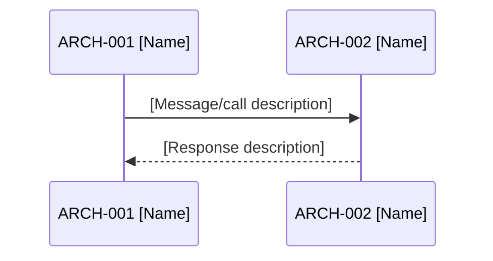

# Architecture Design: [FEATURE NAME]

**Feature Branch**: `[###-feature-name]`
**Created**: [DATE]
**Status**: Draft
**Source**: `specs/[###-feature-name]/v-model/system-design.md`

## Overview

[Brief description of the architecture decomposition rationale — how system components are broken into software modules]

## ID Schema

- **Architecture Module**: `ARCH-NNN` — sequential identifier for each module
- **Parent System Components**: Comma-separated `SYS-NNN` list per module (many-to-many)
- **Cross-Cutting Tag**: `[CROSS-CUTTING]` for infrastructure/utility modules not traceable to a specific SYS
- Example: `ARCH-003` with Parent System Components `SYS-001, SYS-004` — module serves both components
- Example: `ARCH-010 [CROSS-CUTTING]` — infrastructure module (e.g., Logger, Thread Pool) with rationale

## Logical View — Component Breakdown (IEEE 42010 / Kruchten 4+1)

<!--
  Each architecture module MUST have:
  - Unique ID: ARCH-NNN (sequential, never renumbered)
  - Name: Short descriptive module name
  - Description: What this module does
  - Parent System Components: Comma-separated SYS-NNN list OR [CROSS-CUTTING] tag with rationale
  - Type: Component | Service | Library | Utility | Adapter

  RULES:
  - Every SYS-NNN from system-design.md must appear as a parent in at least one ARCH-NNN
  - A SYS-NNN may be a parent of multiple ARCH-NNNs (many-to-many)
  - An ARCH-NNN may have multiple parent SYS (many-to-many)
  - Infrastructure/utility modules use [CROSS-CUTTING] tag with rationale instead of SYS parent
  - Do NOT create ARCH-NNN for capabilities not in system-design.md (flag as [DERIVED MODULE])
  - Every ARCH-NNN MUST have an interface contract in the Interface View (no black boxes)
-->

| ARCH ID | Name | Description | Parent System Components | Type |
|---------|------|-------------|--------------------------|------|
| ARCH-001 | [Module Name] | [What it does] | SYS-001, SYS-002 | Component |
| ARCH-002 | [Module Name] | [What it does] | SYS-003 | Service |
| ARCH-003 | [Module Name] | [What it does] | [CROSS-CUTTING] — [rationale] | Utility |

## Process View — Dynamic Behavior (Kruchten 4+1)

<!--
  Document runtime module interactions using Mermaid sequence diagrams.
  For each critical interaction path:
  - Title: Descriptive name for the interaction
  - Participants: ARCH-NNN modules involved
  - Sequence: Message flow with synchronization points
  - Concurrency: Thread/task boundaries, mutex strategies
  - Timing: Execution order constraints

  RULES:
  - Use Mermaid sequenceDiagram syntax (must be syntactically valid)
  - Reference ARCH-NNN IDs as participants
  - Show synchronization points and thread boundaries
  - Document concurrency model (thread pool, event loop, etc.)
-->

### Interaction: [Critical Path Name]

**Concurrency Model**: [Thread pool / Event loop / Actor model / etc.]
**Synchronization Points**: [Mutex, semaphore, barrier descriptions]

## Interface View — API Contracts (Kruchten 4+1)

<!--
  Every ARCH-NNN MUST have a contract defined here.
  For each module:
  - Inputs Accepted: Types, formats, ranges, required/optional
  - Outputs Produced: Types, guarantees, formats
  - Exceptions Thrown: Error codes, failure modes, recovery hints

  RULES:
  - No "black box" modules — every ARCH must have explicit contracts
  - Distinguish between synchronous and asynchronous interfaces
  - Error contracts directly drive Interface Fault Injection testing
  - Input/output contracts directly drive Interface Contract Testing
-->

### ARCH-001: [Module Name]

| Direction | Name | Type | Format | Constraints |
|-----------|------|------|--------|-------------|
| Input | [param] | [type] | [format] | [range/required] |
| Output | [return] | [type] | [format] | [guarantees] |
| Exception | [error] | [code] | [format] | [when thrown] |

### ARCH-002: [Module Name]

| Direction | Name | Type | Format | Constraints |
|-----------|------|------|--------|-------------|
| Input | [param] | [type] | [format] | [range/required] |
| Output | [return] | [type] | [format] | [guarantees] |
| Exception | [error] | [code] | [format] | [when thrown] |

## Data Flow View — Data Transformation Chains (Kruchten 4+1)

<!--
  Trace how data moves through architecture modules.
  For each data flow:
  - Source: Entry point (external input or upstream module)
  - Transformation chain: ARCH-NNN → ARCH-NNN with intermediate formats
  - Sink: Final destination (external output or downstream module)

  RULES:
  - Show intermediate data formats at each stage
  - Reference ARCH-NNN IDs in the chain
  - Data flows directly drive Data Flow Testing
-->

### Data Flow: [Flow Name]

| Stage | Module | Input Format | Transformation | Output Format |
|-------|--------|-------------|----------------|---------------|
| 1 | ARCH-001 | [format] | [what happens] | [format] |
| 2 | ARCH-002 | [format] | [what happens] | [format] |
| 3 | ARCH-003 | [format] | [what happens] | [format] |

<!-- SAFETY-CRITICAL SECTION: Only include when v-model-config.yml domain is set -->

<!--
## ASIL Decomposition (ISO 26262-9 §5)

| Parent Component | Parent ASIL | Child Module | Child ASIL | Independence Argument |
|-----------------|-------------|-------------|------------|----------------------|
| SYS-NNN | ASIL [A-D] | ARCH-NNN | ASIL [A-D/QM] | [How independence is guaranteed] |

## Defensive Programming (ISO 26262-6 §7.4.2 / DO-178C §6.3.3)

| Module | Invalid Input | Detection Method | Recovery Action |
|--------|--------------|-----------------|-----------------|
| ARCH-NNN | [What could go wrong] | [How detected] | [What happens] |

## Temporal & Execution Constraints (DO-178C §6.3.4)

| Module | Constraint Type | Value | Enforcement Mechanism |
|--------|----------------|-------|----------------------|
| ARCH-NNN | WCET | [max time] | [Watchdog / timer] |
| ARCH-NNN | Execution Order | [before/after ARCH-NNN] | [Scheduler / barrier] |
-->

---

## Coverage Summary

| Metric | Count |
|--------|-------|
| Total Architecture Modules (ARCH) | [N] |
| Cross-Cutting Modules | [N] |
| Total Parent System Components Covered | [N] / [N] ([%]) |
| Modules per Type | Component: [N] \| Service: [N] \| Library: [N] \| Utility: [N] |
| **Forward Coverage (SYS→ARCH)** | **[%]** |

## Derived Modules

<!--
  List any [DERIVED MODULE: ...] flags here.
  Human must resolve before proceeding to integration test generation.
  Options: (1) Add capability to system-design.md, (2) Reject, (3) Tag as [CROSS-CUTTING]
-->

[List of derived modules, or "None — all modules trace to existing system components."]
