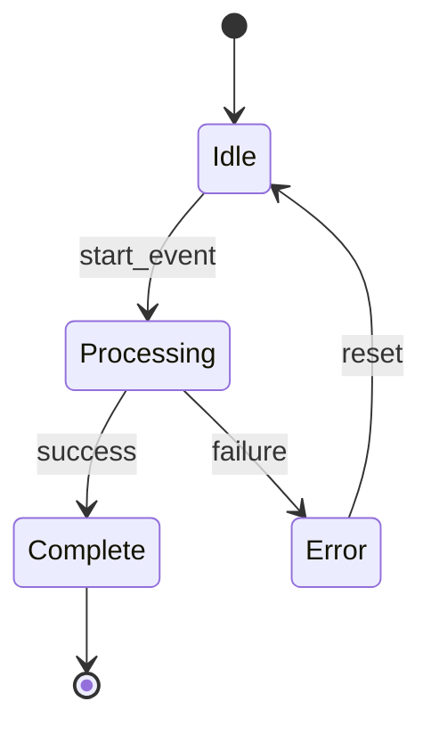

# Module Design: [FEATURE NAME]

**Feature Branch**: `[###-feature-name]`
**Created**: [DATE]
**Status**: Draft
**Source**: `specs/[###-feature-name]/v-model/architecture-design.md`

## Overview

[Brief description of the module decomposition rationale — how architecture modules are broken into implementable low-level designs. At this level, requirements must be detailed enough that coding is merely a translation exercise requiring no further design decisions.]

## ID Schema

- **Module Design**: `MOD-NNN` — sequential identifier for each module (3-digit zero-padded)
- **Parent Architecture Modules**: Comma-separated `ARCH-NNN` list per module (many-to-many, authoritative for traceability)
- **Target Source File(s)**: Comma-separated file paths mapping to the repository codebase
- Example: `MOD-003` with Parent Architecture Modules `ARCH-001, ARCH-004` — module serves both architecture components
- Example: `MOD-007 [EXTERNAL]` — third-party library wrapper, documents interface only

## Module Designs

<!--
  For EACH architecture module in architecture-design.md, generate:
  1. One or more Module Designs (MOD-NNN) — the low-level specification
  2. Four mandatory views per MOD: Algorithmic/Logic, State Machine, Internal Data Structures, Error Handling

  RULES:
  - Every ARCH-NNN must have at least one MOD-NNN
  - MOD numbering is sequential (MOD-001, MOD-002, ...) and independent of ARCH numbering
  - Each MOD MUST include "Parent Architecture Modules" field for traceability
  - Each MOD MUST include "Target Source File(s)" for code mapping
  - Non-[EXTERNAL] MODs MUST have fenced ```pseudocode``` blocks in Algorithmic/Logic View
  - Stateful MODs MUST have Mermaid stateDiagram-v2 in State Machine View
  - Stateless MODs MUST have bypass string matchable by (?i)N/?A.*Stateless
  - [CROSS-CUTTING] modules get full decomposition (inherits tag)
  - [EXTERNAL] modules document wrapper/config interface only, no library internals
  - [DERIVED MODULE: description] for functions not traceable to any ARCH-NNN
  - Do NOT renumber existing IDs when updating
  - Append new items; update modified items in-place by ID
-->

### Module: MOD-001 ([Module Name])

**Parent Architecture Modules**: ARCH-001
**Target Source File(s)**: `src/[path/to/file.ext]`

#### Algorithmic / Logic View

<!--
  Step-by-step pseudocode defining exactly how this module transforms inputs into outputs.
  MUST be enclosed in a fenced Markdown code block tagged 'pseudocode'.
  Every branch (if/else), loop (for/while), and decision point must be explicit.
  No vague prose — every transformation must be concrete.
  For [EXTERNAL] modules: document wrapper configuration logic only.
-->

```pseudocode
FUNCTION module_name(input_param: Type) -> ReturnType:
    // Step 1: Validate input
    IF input_param IS NULL:
        RETURN Error("Input required")

    // Step 2: Process
    result = transform(input_param)

    // Step 3: Return
    RETURN result
```

#### State Machine View

<!--
  For stateful modules: Mermaid stateDiagram-v2 with every state, transition, event, guard.
  For stateless modules: Write a bypass string matchable by regex (?i)N/?A.*Stateless
  Example bypass: "N/A — Stateless" or "N/A: Stateless pure function"
-->

N/A — Stateless

#### Internal Data Structures

<!--
  Document every local variable, constant, buffer, and object class.
  Include: Type, Size/Constraints, Initialization, Lifecycle.
  These feed Boundary Value Analysis in unit testing.
-->

| Name | Type | Size/Constraints | Initialization | Description |
|------|------|-----------------|----------------|-------------|
| [var_name] | [type] | [constraints] | [default] | [purpose] |

#### Error Handling & Return Codes

<!--
  Map internal errors to Architecture Interface View contracts.
  Specify exact error codes, exception types, or return values.
  Document error propagation: caught vs. re-thrown.
-->

| Error Condition | Error Code / Exception | Architecture Contract | Recovery |
|----------------|----------------------|----------------------|----------|
| [condition] | [code/exception] | [ARCH-NNN Interface View contract] | [action] |

---

### Module: MOD-002 ([Module Name])

**Parent Architecture Modules**: ARCH-001, ARCH-003
**Target Source File(s)**: `src/[path/to/file.ext]`

#### Algorithmic / Logic View

```pseudocode
FUNCTION another_module(param: Type) -> ReturnType:
    // Implementation pseudocode
    RETURN result
```

#### State Machine View

<!--
  Example of a stateful module with Mermaid diagram:
-->



#### Internal Data Structures

| Name | Type | Size/Constraints | Initialization | Description |
|------|------|-----------------|----------------|-------------|
| [var_name] | [type] | [constraints] | [default] | [purpose] |

#### Error Handling & Return Codes

| Error Condition | Error Code / Exception | Architecture Contract | Recovery |
|----------------|----------------------|----------------------|----------|
| [condition] | [code/exception] | [ARCH-NNN contract] | [action] |

---

[Continue for all modules...]

<!-- SAFETY-CRITICAL SECTION: Only include when v-model-config.yml domain is set -->

<!--
## Complexity Constraints (MISRA C/C++ / CERT-C)

| MOD ID | Cyclomatic Complexity Limit | MISRA/CERT-C Rules | Deviations |
|--------|----------------------------|-------------------|------------|
| MOD-001 | ≤ 10 | [Applicable rules] | [None / Justified deviation] |

## Memory Management (DO-178C / ISO 26262)

| MOD ID | Dynamic Allocation | Unbounded Loops | Max Stack Depth |
|--------|-------------------|----------------|-----------------|
| MOD-001 | None after init | None | [estimate] |

## Single Entry/Exit (DO-178C Level A)

| MOD ID | Entry Points | Exit Points | Guard Clause Strategy |
|--------|-------------|------------|----------------------|
| MOD-001 | 1 | 1 | [How early-returns are restructured] |
-->

---

## Coverage Summary

| Metric | Count |
|--------|-------|
| Total Module Designs (MOD) | [N] |
| External Modules (`[EXTERNAL]`) | [N] |
| Cross-Cutting Modules (`[CROSS-CUTTING]`) | [N] |
| Stateful Modules | [N] |
| Stateless Modules | [N] |
| Total Parent Architecture Modules Covered | [N] / [N] ([%]) |
| Modules with Pseudocode | [N] / [N] ([%]) |
| **Forward Coverage (ARCH→MOD)** | **[%]** |

## Derived Modules

<!--
  List any [DERIVED MODULE: ...] flags here.
  Human must resolve before proceeding to unit test generation.
  Options: (1) Add module to architecture-design.md, (2) Reject, (3) Merge into existing MOD
-->

[List of derived modules, or "None — all modules trace to existing architecture modules."]
