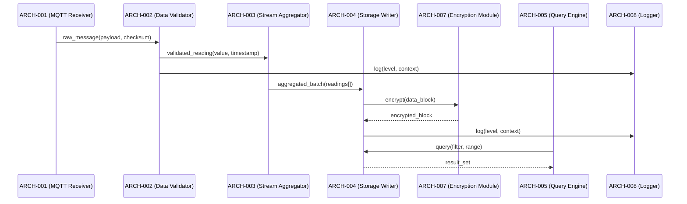

# Architecture Design — Complex Fixture (Many-to-Many)

## Logical View (Component Breakdown)

| ARCH ID | Name | Description | Parent System Components |
|---------|------|-------------|--------------------------|
| ARCH-001 | MQTT Receiver | Receives data via MQTT broker | SYS-001 |
| ARCH-002 | Data Validator | Validates data integrity and checksums | SYS-001, SYS-002 |
| ARCH-003 | Stream Aggregator | Computes real-time min/max/avg | SYS-003 |
| ARCH-004 | Storage Writer | Writes validated data to persistent store | SYS-004 |
| ARCH-005 | Query Engine | Handles REST API queries | SYS-005 |
| ARCH-006 | Metrics Exporter | Exposes Prometheus metrics | SYS-006 |
| ARCH-007 | Encryption Module | Encrypts data at rest with AES-256 | SYS-004 |
| ARCH-008 | Logger | [CROSS-CUTTING] Structured logging for all modules | [CROSS-CUTTING] |

## Process View (Dynamic Behavior)



## Interface View (API Contracts)

### ARCH-001: MQTT Receiver
- **Inputs:** MQTT topic subscription, broker connection config
- **Outputs:** `RawMessage { payload: bytes, checksum: string, source_id: string }`
- **Exceptions:** `BrokerConnectionError`, `SubscriptionError`

### ARCH-002: Data Validator
- **Inputs:** `RawMessage`
- **Outputs:** `ValidatedReading { value: float, timestamp: ISO8601, source_id: string }`
- **Exceptions:** `ChecksumMismatchError`, `MalformedPayloadError`

### ARCH-003: Stream Aggregator
- **Inputs:** `ValidatedReading`, window configuration
- **Outputs:** `AggregatedBatch { min: float, max: float, avg: float, count: int, window_end: ISO8601 }`
- **Exceptions:** `WindowOverflowError`

### ARCH-004: Storage Writer
- **Inputs:** `AggregatedBatch`, storage configuration
- **Outputs:** `WriteReceipt { record_id: string, timestamp: ISO8601 }`
- **Exceptions:** `StorageUnavailableError`, `WriteConflictError`

### ARCH-005: Query Engine
- **Inputs:** `QueryRequest { filter: object, time_range: object, limit: int }`
- **Outputs:** `ResultSet { records: array, total_count: int }`
- **Exceptions:** `InvalidFilterError`, `QueryTimeoutError`

### ARCH-006: Metrics Exporter
- **Inputs:** Internal metric counters
- **Outputs:** Prometheus text format metrics
- **Exceptions:** `MetricCollectionError`

### ARCH-007: Encryption Module
- **Inputs:** `DataBlock { data: bytes, key_id: string }`
- **Outputs:** `EncryptedBlock { ciphertext: bytes, iv: bytes, key_id: string }`
- **Exceptions:** `KeyNotFoundError`, `EncryptionError`

### ARCH-008: Logger [CROSS-CUTTING]
- **Inputs:** `LogEntry { level: enum(DEBUG|INFO|WARN|ERROR), message: string, context: object }`
- **Outputs:** Structured log line (JSON)
- **Exceptions:** None (fire-and-forget)

## Data Flow View

```
MQTT Broker → ARCH-001 (MQTT Receiver) → RawMessage → ARCH-002 (Data Validator) → ValidatedReading → ARCH-003 (Stream Aggregator) → AggregatedBatch → ARCH-004 (Storage Writer) → ARCH-007 (Encryption Module) → Encrypted Storage
                                                                                                                                                        ↓
                                                                                                                                    ARCH-005 (Query Engine) ← REST API
ARCH-008 (Logger) ← All modules (cross-cutting)
ARCH-006 (Metrics Exporter) → /metrics endpoint
```
