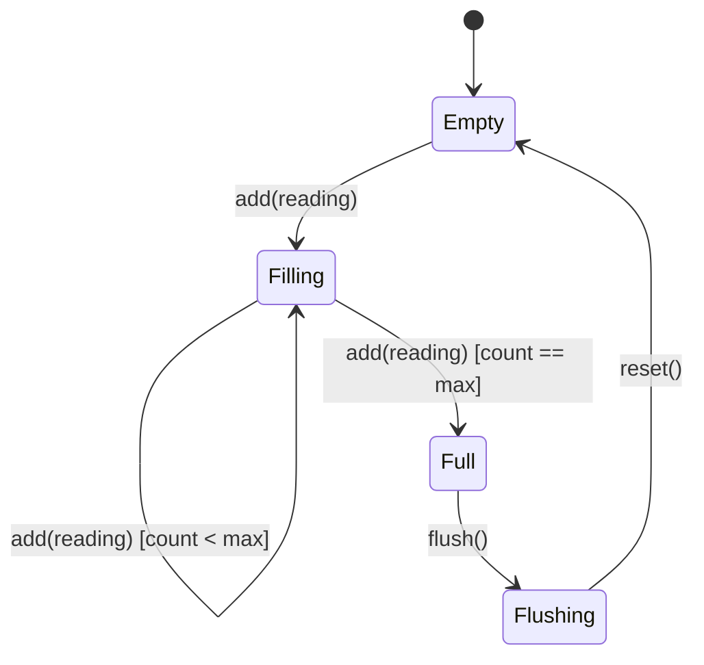
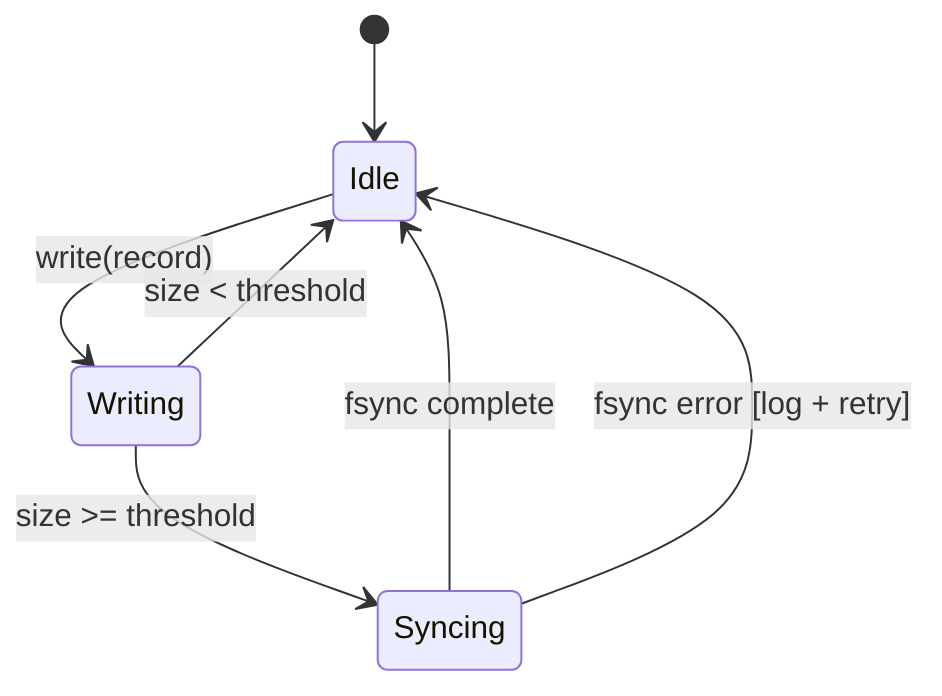

# Module Design — Complex Fixture (Many-to-Many)

### Module: MOD-001 (MQTT Parser)

**Parent Architecture Modules**: ARCH-001 (MQTT Receiver)
**Target Source File(s)**: `src/mqtt/parser.py`

#### Algorithmic/Logic View

```pseudocode
function parse(raw_bytes):
    header = extract_header(raw_bytes[0:4])
    topic  = decode_utf8(raw_bytes[4:4+header.topic_len])
    payload = raw_bytes[4+header.topic_len:]
    if len(payload) == 0:
        raise EmptyPayloadError
    return MQTTMessage(topic, payload, header.qos)
```

#### State Machine View

N/A — Stateless

#### Internal Data Structures

| Structure | Fields | Notes |
|-----------|--------|-------|
| `MQTTHeader` | `topic_len: u16, qos: u8, retain: bool` | Fixed 4-byte header |
| `MQTTMessage` | `topic: str, payload: bytes, qos: int` | Parsed output |

#### Error Handling

| Error | Trigger | Recovery |
|-------|---------|----------|
| `EmptyPayloadError` | Zero-length payload | Drop message, increment counter |
| `HeaderDecodeError` | Malformed header bytes | Drop message, log warning |

---

### Module: MOD-002 (Checksum Verifier)

**Parent Architecture Modules**: ARCH-002 (Data Validator)
**Target Source File(s)**: `src/validation/checksum.py`

#### Algorithmic/Logic View

```pseudocode
function verify(payload, expected_checksum):
    actual = sha256(payload).hex()
    if len(expected_checksum) != 64:
        raise InvalidChecksumLengthError(len(expected_checksum))
    if not constant_time_compare(actual, expected_checksum):
        raise ChecksumMismatchError(expected_checksum, actual)
    return True
```

#### State Machine View

N/A — Stateless

#### Internal Data Structures

| Structure | Fields | Notes |
|-----------|--------|-------|
| `ChecksumResult` | `valid: bool, algorithm: str` | Result envelope |

#### Error Handling

| Error | Trigger | Recovery |
|-------|---------|----------|
| `ChecksumMismatchError` | Hash mismatch | Reject payload |
| `InvalidChecksumLengthError` | Length ≠ 64 hex chars | Reject with details |

---

### Module: MOD-003 (Sliding Window)

**Parent Architecture Modules**: ARCH-003 (Stream Aggregator)
**Target Source File(s)**: `src/aggregation/window.py`

#### Algorithmic/Logic View

```pseudocode
function add(reading):
    buffer.append(reading)
    if len(buffer) >= max_size:
        batch = compute_aggregates(buffer)
        buffer.clear()
        return batch
    return None

function compute_aggregates(buf):
    return AggregatedBatch(min(buf), max(buf), avg(buf), len(buf))
```

#### State Machine View



#### Internal Data Structures

| Structure | Fields | Notes |
|-----------|--------|-------|
| `WindowBuffer` | `readings: list, max_size: int, created_at: datetime` | Ring buffer |
| `AggregatedBatch` | `min, max, avg: float, count: int, window_end: ISO8601` | Output |

#### Error Handling

| Error | Trigger | Recovery |
|-------|---------|----------|
| `WindowOverflowError` | Buffer exceeds 2× max_size | Force flush, log error |
| `EmptyWindowError` | Flush called on empty buffer | Return None |

---

### Module: MOD-004 (WAL Writer)

**Parent Architecture Modules**: ARCH-004 (Storage Writer)
**Target Source File(s)**: `src/storage/wal.py`

#### Algorithmic/Logic View

```pseudocode
function write(record):
    entry = serialize(record)
    wal_file.append(entry)
    state = Writing
    if wal_file.size >= sync_threshold:
        fsync(wal_file)
        state = Syncing
        rotate_wal()
        state = Idle
    return WriteReceipt(record.id, now())
```

#### State Machine View



#### Internal Data Structures

| Structure | Fields | Notes |
|-----------|--------|-------|
| `WALEntry` | `seq: int, data: bytes, crc: u32` | On-disk format |
| `WriteReceipt` | `record_id: str, timestamp: ISO8601` | Confirmation |

#### Error Handling

| Error | Trigger | Recovery |
|-------|---------|----------|
| `WALCorruptionError` | CRC mismatch on read | Truncate to last good entry |
| `DiskFullError` | No space for append | Raise to caller, block writes |

---

### Module: MOD-005 (SQL Parser)

**Parent Architecture Modules**: ARCH-005 (Query Engine)
**Target Source File(s)**: `src/query/parser.py`

#### Algorithmic/Logic View

```pseudocode
function parse(query_string):
    tokens = tokenize(query_string)
    ast = build_ast(tokens)
    validate_ast(ast)
    return QueryPlan(ast)
```

#### State Machine View

N/A — Stateless

#### Internal Data Structures

| Structure | Fields | Notes |
|-----------|--------|-------|
| `Token` | `type: enum, value: str, position: int` | Lexer output |
| `QueryPlan` | `ast: Node, estimated_cost: float` | Planner output |

#### Error Handling

| Error | Trigger | Recovery |
|-------|---------|----------|
| `InvalidFilterError` | Unsupported operator in WHERE | Return 400 with details |
| `QueryTimeoutError` | Parse exceeds 500 ms | Abort, return timeout |

---

### Module: MOD-006 (Prometheus Formatter)

**Parent Architecture Modules**: ARCH-006 (Metrics Exporter)
**Target Source File(s)**: `src/metrics/formatter.py`

#### Algorithmic/Logic View

```pseudocode
function format(metrics):
    lines = []
    for m in metrics:
        lines.append("# HELP " + m.name + " " + m.help)
        lines.append("# TYPE " + m.name + " " + m.type)
        for sample in m.samples:
            lines.append(m.name + label_str(sample.labels) + " " + str(sample.value))
    return "\n".join(lines)
```

#### State Machine View

N/A — Stateless

#### Internal Data Structures

| Structure | Fields | Notes |
|-----------|--------|-------|
| `MetricFamily` | `name: str, help: str, type: str, samples: list` | Prom model |
| `Sample` | `labels: dict, value: float, timestamp: int?` | Single data point |

#### Error Handling

| Error | Trigger | Recovery |
|-------|---------|----------|
| `MetricCollectionError` | Counter read failure | Omit metric, log warning |

---

### Module: MOD-007 (AES-256 Wrapper) [EXTERNAL]

**Parent Architecture Modules**: ARCH-007 (Encryption Module)
**Target Source File(s)**: `src/crypto/aes_wrapper.py`

> Wraps OpenSSL `libcrypto` AES-256-GCM. Only the wrapper interface is specified; internal cryptographic logic is external.

#### Algorithmic/Logic View

```pseudocode
function encrypt(plaintext, key_id):
    key = key_store.get(key_id)         # external lookup
    iv  = os.urandom(12)
    ciphertext, tag = openssl_aes_gcm_encrypt(key, iv, plaintext)  # external call
    return EncryptedBlock(ciphertext, iv, tag, key_id)

function decrypt(block, key_id):
    key = key_store.get(key_id)
    return openssl_aes_gcm_decrypt(key, block.iv, block.ciphertext, block.tag)
```

#### State Machine View

N/A — Stateless

#### Internal Data Structures

| Structure | Fields | Notes |
|-----------|--------|-------|
| `EncryptedBlock` | `ciphertext: bytes, iv: bytes, tag: bytes, key_id: str` | Output |

#### Error Handling

| Error | Trigger | Recovery |
|-------|---------|----------|
| `KeyNotFoundError` | key_id missing from store | Raise to caller |
| `EncryptionError` | OpenSSL failure | Raise to caller, log |

---

### Module: MOD-008 (Log Rotator) [CROSS-CUTTING]

**Parent Architecture Modules**: ARCH-008 (Logger) [CROSS-CUTTING]
**Target Source File(s)**: `src/logging/rotator.py`

#### Algorithmic/Logic View

```pseudocode
function rotate_if_needed(log_file):
    if log_file.size >= max_bytes:
        archive_name = log_file.name + "." + timestamp()
        rename(log_file, archive_name)
        compress(archive_name)
        prune_old_archives(keep=max_backups)
        return new_log_file(log_file.name)
    return log_file
```

#### State Machine View

N/A — Stateless

#### Internal Data Structures

| Structure | Fields | Notes |
|-----------|--------|-------|
| `RotationConfig` | `max_bytes: int, max_backups: int, compress: bool` | Config |
| `ArchiveEntry` | `path: str, created_at: datetime, size: int` | Metadata |

#### Error Handling

| Error | Trigger | Recovery |
|-------|---------|----------|
| `RotationIOError` | Rename/compress failure | Keep current file, log error |
| `PruneError` | Cannot delete old archive | Skip, retry next rotation |

---

## Coverage Summary

| Metric | Value |
|--------|-------|
| Total MODs | 8 |
| External modules | 1 (MOD-007) |
| Cross-cutting modules | 1 (MOD-008) |
| Stateful modules | 2 (MOD-003, MOD-004) |
| Stateless modules | 5 (MOD-001, MOD-002, MOD-005, MOD-006, MOD-008) |
| ARCH coverage | 8/8 |
