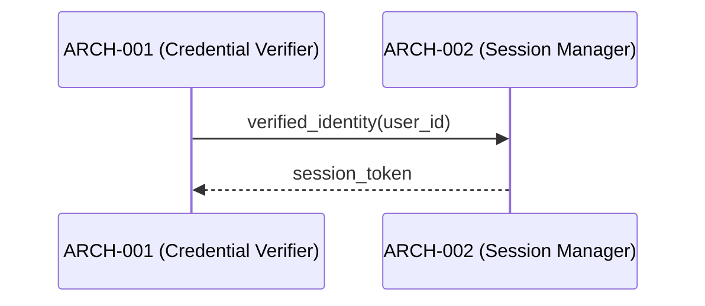

# Architecture Design — Gaps Fixture

## Logical View (Component Breakdown)

| ARCH ID | Name | Description | Parent System Components |
|---------|------|-------------|--------------------------|
| ARCH-001 | Credential Verifier | Verifies user credentials against store | SYS-001 |
| ARCH-002 | Session Manager | Creates and manages session tokens | SYS-001 |

## Process View (Dynamic Behavior)



## Interface View (API Contracts)

### ARCH-001: Credential Verifier
- **Inputs:** `Credentials { email: string, password: string }`
- **Outputs:** `VerifiedIdentity { user_id: string, roles: string[] }`
- **Exceptions:** `InvalidCredentialsError`

### ARCH-002: Session Manager
- **Inputs:** `VerifiedIdentity`
- **Outputs:** `SessionToken { token: string, expires_at: ISO8601 }`
- **Exceptions:** `SessionCreationError`

## Data Flow View

```
Credentials → ARCH-001 (Credential Verifier) → VerifiedIdentity → ARCH-002 (Session Manager) → SessionToken
```
