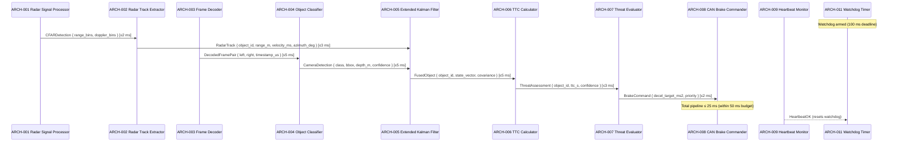

# Architecture Design — Automatic Emergency Braking System (AEB)

## ID Schema

Architecture modules use the `ARCH-NNN` identifier format (sequential, never renumbered).
Each module traces to one or more parent system components via the "Parent SYS" column.

## Logical View

| ARCH ID | Name | Description | Parent SYS | Type |
|---------|------|-------------|------------|------|
| ARCH-001 | Radar Signal Processor | Processes 77 GHz FMCW radar returns at 20 Hz; performs range-Doppler FFT and CFAR detection | SYS-001 | Module |
| ARCH-002 | Radar Track Extractor | Extracts object tracks (range, velocity, azimuth, RCS) from CFAR detections; maintains track continuity across frames | SYS-001 | Module |
| ARCH-003 | Frame Decoder | Decodes H.265 compressed stereo camera frame pairs at 15 Hz; synchronizes left/right frames using timestamp alignment | SYS-002 | Module |
| ARCH-004 | Object Classifier | Runs CNN-based object classification (Vehicle, Pedestrian, Cyclist) on decoded frames; computes bounding boxes and depth estimates up to 80 m | SYS-002 | Module |
| ARCH-005 | Extended Kalman Filter | Fuses radar tracks and camera detections into unified object list using state-vector prediction and measurement update | SYS-003 | Module |
| ARCH-006 | TTC Calculator | Computes Time-to-Collision for each fused object; applies false-positive suppression filter to maintain < 1 false activation per 10,000 km | SYS-003 | Module |
| ARCH-007 | Threat Evaluator | Evaluates TTC against warning threshold (2.5 s) and braking threshold (1.5 s); issues forward collision warning or autonomous braking command | SYS-004 | Controller |
| ARCH-008 | CAN Brake Commander | Transmits deceleration commands (max 10 m/s²) to brake-by-wire ECU via dual-channel CAN-FD; manages primary/secondary bus failover within 10 ms | SYS-004 | Module |
| ARCH-009 | Heartbeat Monitor | Monitors heartbeat signals from all subsystem modules at 100 ms intervals; detects module failure and reports to Degradation Controller | SYS-005 | Service |
| ARCH-010 | Degradation Controller | Manages system operating modes (Normal, Radar-Only, Camera-Only, Safe-State); logs DTCs to non-volatile memory on state transitions | SYS-005 | Service |
| ARCH-011 | Watchdog Timer | Cross-cutting hardware watchdog that enforces 100 ms execution deadline on the sensor-to-actuator critical path; triggers safe-state on timeout | SYS-001, SYS-002, SYS-003, SYS-004, SYS-005 | Cross-Cutting |

## Process View

## Interface View

| Producer | Consumer | Contract | Exceptions | Max Latency |
|----------|----------|----------|------------|-------------|
| ARCH-001 | ARCH-002 | `CFARDetection { range_bins: Vec<f32>, doppler_bins: Vec<f32>, noise_floor: f32 }` | `RadarHWFault` | ≤ 2 ms |
| ARCH-002 | ARCH-005 | `RadarTrack { object_id: u16, range_m: f32, velocity_ms: f32, azimuth_deg: f32, rcs_dbsm: f32 }` | `TrackLost` (object dropped for > 3 consecutive frames) | ≤ 3 ms |
| ARCH-003 | ARCH-004 | `DecodedFramePair { left: FrameBuffer, right: FrameBuffer, timestamp_us: u64, imu_quat: [f32;4] }` | `FrameSyncError`, `DecodeTimeout` | ≤ 5 ms |
| ARCH-004 | ARCH-005 | `CameraDetection { class: enum(Vehicle,Pedestrian,Cyclist), bbox: Rect, depth_m: f32, confidence: f32 }` | `ClassificationTimeout` (frame dropped) | ≤ 5 ms |
| ARCH-005 | ARCH-006 | `FusedObject { object_id: u16, state_vector: [f32;6], covariance: [[f32;6];6], class: enum }` | `FusionDivergence` (covariance exceeds threshold) | ≤ 5 ms |
| ARCH-006 | ARCH-007 | `ThreatAssessment { object_id: u16, ttc_s: f32, confidence: f32, range_m: f32, class: enum }` | None (always produces output; low-confidence objects marked accordingly) | ≤ 3 ms |
| ARCH-007 | ARCH-008 | `BrakeCommand { decel_target_ms2: f32, activation: bool, priority: enum(Warning,Emergency) }` | `ActuatorTimeout` | ≤ 2 ms |
| ARCH-009 | ARCH-010 | `HealthReport { component_id: u8, state: enum(OK,Degraded,Failed), timestamp_us: u64 }` | `HeartbeatTimeout` (component unresponsive for > 100 ms) | ≤ 1 ms |
| ARCH-011 | ALL | `WatchdogKick { timestamp_us: u64 }` / `WatchdogExpiry → SafeStateCommand` | `WatchdogReset` (triggers system-wide safe-state) | ≤ 1 ms (hardware) |

## Data Flow View

| Stage | Module | Input | Transformation | Output | Timing |
|-------|--------|-------|----------------|--------|--------|
| 1a | ARCH-001 | 77 GHz FMCW radar returns (CAN-FD) | Range-Doppler FFT + CFAR detection | CFARDetection (range/doppler bins) | Every 50 ms (20 Hz) |
| 1b | ARCH-003 | H.265 stereo frame pair (Ethernet) | Frame decompression + stereo sync | DecodedFramePair | Every 67 ms (15 Hz) |
| 2a | ARCH-002 | CFARDetection | Track initiation/continuation/deletion | RadarTrack list | ≤ 3 ms after stage 1a |
| 2b | ARCH-004 | DecodedFramePair | CNN inference + depth estimation | CameraDetection list | ≤ 5 ms after stage 1b |
| 3 | ARCH-005 | RadarTrack + CameraDetection | Extended Kalman filter predict/update | FusedObject list | ≤ 5 ms after latest input |
| 4 | ARCH-006 | FusedObject | TTC computation + false-positive filter | ThreatAssessment list | ≤ 3 ms after stage 3 |
| 5 | ARCH-007 → ARCH-008 | ThreatAssessment | Threshold evaluation → CAN-FD command | BrakeCommand to ECU | ≤ 4 ms after stage 4 |

## Safety Annotations (ISO 26262 ASIL-D)

| ARCH ID | ASIL Allocation | Defensive Programming Notes |
|---------|----------------|-----------------------------|
| ARCH-001 | ASIL-B(D) | CRC-32 validation on every CAN-FD frame; redundant ADC sampling with cross-check |
| ARCH-002 | ASIL-B(D) | Track-level plausibility checks (max acceleration, max range rate); aged tracks auto-deleted after 3 missed frames |
| ARCH-003 | ASIL-B(D) | Sequence number gap detection; stale-frame flag when timestamp delta > 80 ms |
| ARCH-004 | ASIL-B(D) | Dual-inference with voting (primary + watchdog classifier); confidence floor of 0.5 for safety-relevant classes |
| ARCH-005 | ASIL-D | Covariance bounds monitoring; divergence triggers fallback to single-sensor mode; EKF state reset on NaN detection |
| ARCH-006 | ASIL-D | Redundant TTC computation (two independent algorithms with cross-check); fail-safe defaults to threat-present |
| ARCH-007 | ASIL-D | Dual-channel command with bitwise comparison before transmission; safe-state on mismatch |
| ARCH-008 | ASIL-D | Primary/secondary CAN-FD bus failover within 10 ms; end-to-end CRC on brake command messages |
| ARCH-009 | ASIL-B(D) | Heartbeat polling at 10× the failure detection interval (every 10 ms); triple-redundant failure counter |
| ARCH-010 | ASIL-B(D) | State machine with explicit transition guards; DTC logging before and after every mode change |
| ARCH-011 | ASIL-D | Hardware watchdog (independent clock source); cannot be disabled by software; 100 ms timeout triggers safe-state with maximum braking |

### ASIL Decomposition

The end-to-end sensor-to-actuator path is ASIL-D. Decomposition applies:
- **Sensor acquisition** (ARCH-001 to ARCH-004): ASIL-B(D) + ASIL-B(D) via dual independent sensor channels (radar + camera)
- **Fusion and decision** (ARCH-005 to ARCH-008): ASIL-D (no decomposition; single critical path with internal redundancy)
- **Monitoring** (ARCH-009 to ARCH-011): ASIL-B(D) on monitoring, ASIL-D on watchdog (independent safety mechanism)

## Coverage Summary

| Metric | Value |
|--------|-------|
| Total ARCH Modules | 11 |
| SYS Components Covered | 5 / 5 (100%) |
| Cross-Cutting Modules | 1 (ARCH-011) |
