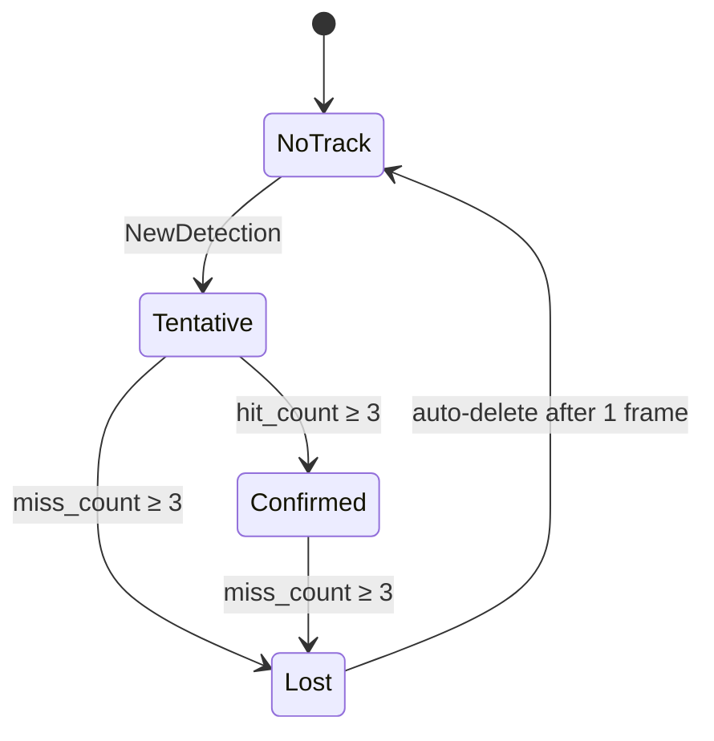
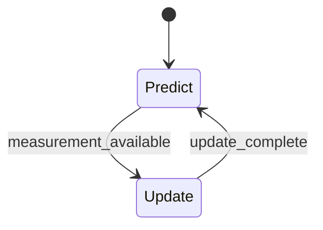
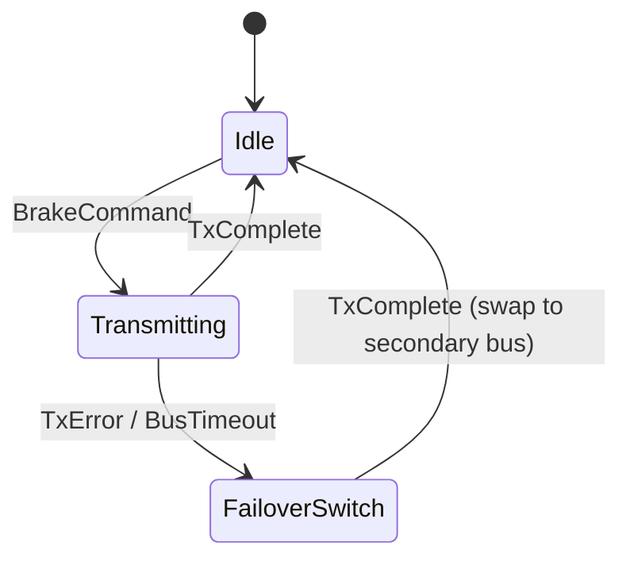
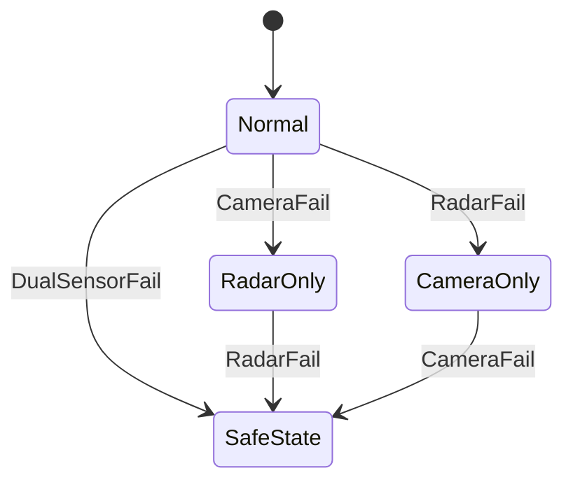

# Module Design — Automatic Emergency Braking System (AEB)

## ID Schema

Module units use the `MOD-NNN` identifier format (sequential, never renumbered).
Each module traces to exactly one parent architecture module via the "Parent ARCH" column.

## Module Catalogue

| MOD ID | Name | Parent ARCH | Target Source File(s) | Statefulness |
|--------|------|-------------|----------------------|--------------|
| MOD-001 | FFT Processor | ARCH-001 | `src/radar/fft_processor.c`, `src/radar/fft_processor.h` | Stateless |
| MOD-002 | Track Manager | ARCH-002 | `src/radar/track_mgr.c` | Stateful |
| MOD-003 | H265 Decoder | ARCH-003 | `src/camera/h265_decoder.c` | Stateless |
| MOD-004 | CNN Inference Engine | ARCH-004 | `src/camera/cnn_inference.c` | Stateless |
| MOD-005 | EKF Core | ARCH-005 | `src/fusion/ekf_core.c` | Stateful |
| MOD-006 | TTC Estimator | ARCH-006 | `src/fusion/ttc_calc.c` | Stateless |
| MOD-007 | Collision Decision Logic | ARCH-007 | `src/brake/collision_logic.c` | Stateless |
| MOD-008 | CAN-FD Transmitter | ARCH-008 | `src/brake/canfd_tx.c` | Stateful |
| MOD-009 | Module Health Checker | ARCH-009 | `src/safety/health_check.c` | Stateless |
| MOD-010 | Mode Controller | ARCH-010 | `src/safety/mode_ctrl.c` | Stateful |
| MOD-011 | Watchdog Kicker | ARCH-011 | `src/safety/wdt_kicker.c` | Stateless |

## Module Specifications

### Module: MOD-001 (FFT Processor)

**Parent Architecture Modules**: ARCH-001
**Target Source File(s)**: `src/radar/fft_processor.c`, `src/radar/fft_processor.h`

#### Algorithmic / Logic View

```pseudocode
FUNCTION fft_process(frame: radar_raw_frame_t) -> cfar_detection_t:
    complex_samples = zip(frame.i_samples, frame.q_samples)
    range_fft = radix2_fft(complex_samples, FFT_SIZE)
    range_bins = magnitude(range_fft)
    // 2D FFT: range-Doppler map
    FOR each range_bin IN range_bins:
        doppler_fft = radix2_fft(range_bin.slow_time, FFT_SIZE)
        doppler_bins[range_bin.index] = magnitude(doppler_fft)
    noise_floor = estimate_noise_floor(doppler_bins)   // median of non-peak cells
    // CFAR detection: cell-averaging
    FOR each cell IN doppler_bins:
        threshold = noise_floor * CFAR_ALPHA
        IF cell.power > threshold THEN mark_detection(cell)
    RETURN { range_bins: detected_ranges, doppler_bins: detected_dopplers, noise_floor }
```

> **Hardware Mock Note**: Unit tests must replace ADC DMA input with pre-recorded I/Q sample arrays. No radar hardware is available in the test environment.

#### State Machine View

N/A — Stateless

#### Internal Data Structures

| Name | Type | Size/Constraints | Initialization | Description |
|------|------|-----------------|----------------|-------------|
| `FFT_SIZE` | `#define` | 1024 | Compile-time | FFT window length |
| `RADAR_FREQ_GHZ` | `#define` | 77.0 | Compile-time | Radar carrier frequency (GHz) |
| `SAMPLE_RATE_HZ` | `#define` | 20 | Compile-time | ADC sample rate (Hz) |
| `cfar_detection_t.range_bins` | `float32[]` | FFT_SIZE | Zeroed | CFAR-detected range bins |
| `cfar_detection_t.doppler_bins` | `float32[]` | FFT_SIZE | Zeroed | CFAR-detected Doppler bins |
| `cfar_detection_t.noise_floor` | `float32` | — | 0.0 | Estimated noise floor |
| `radar_raw_frame_t.i_samples` | `float32[]` | FFT_SIZE | DMA fill | In-phase ADC samples |
| `radar_raw_frame_t.q_samples` | `float32[]` | FFT_SIZE | DMA fill | Quadrature ADC samples |
| `radar_raw_frame_t.timestamp_us` | `uint64_t` | — | DMA fill | Frame capture timestamp (µs) |

```c
#define FFT_SIZE          1024
#define RADAR_FREQ_GHZ    77.0f
#define SAMPLE_RATE_HZ    20

typedef struct {
    float32 range_bins[FFT_SIZE];
    float32 doppler_bins[FFT_SIZE];
    float32 noise_floor;
} cfar_detection_t;

typedef struct {
    float32 i_samples[FFT_SIZE];   // in-phase ADC samples
    float32 q_samples[FFT_SIZE];   // quadrature ADC samples
    uint64_t timestamp_us;
} radar_raw_frame_t;
```

#### Error Handling & Return Codes

| Error Condition | Error Code / Exception | Architecture Contract | Recovery |
|----------------|----------------------|----------------------|----------|
| ADC DMA timeout | HW timeout | ARCH-001 shall detect ADC failure | Report to health monitor |
| FFT input all-zero | Silent | ARCH-001 shall output empty detection list | Return empty `cfar_detection_t` |

---

### Module: MOD-002 (Track Manager)

**Parent Architecture Modules**: ARCH-002
**Target Source File(s)**: `src/radar/track_mgr.c`

#### Algorithmic / Logic View

```pseudocode
FUNCTION track_update(ctx: &mut track_mgr_ctx_t,
                       detections: &[cfar_detection_t]) -> &[radar_track_t]:
    // Association: nearest-neighbor matching
    FOR each track IN ctx.tracks WHERE track.state != TRACK_NOTRACK:
        matched = find_nearest_detection(detections, track, GATE_DISTANCE)
        IF matched THEN
            track.range_m    = matched.range
            track.velocity_ms = matched.doppler
            track.hit_count  += 1
            track.miss_count  = 0
            IF track.state == TRACK_TENTATIVE AND track.hit_count >= CONFIRM_THRESHOLD THEN
                track.state = TRACK_CONFIRMED
        ELSE
            track.miss_count += 1
            IF track.miss_count >= LOST_THRESHOLD THEN
                track.state = TRACK_LOST
    // Delete lost tracks
    FOR each track IN ctx.tracks WHERE track.state == TRACK_LOST:
        track.state = TRACK_NOTRACK
        ctx.active_count -= 1
    // Initiate new tracks for unmatched detections
    FOR each unmatched IN detections:
        IF ctx.active_count < MAX_TRACKS THEN
            new_track = { object_id: ctx.next_id++, state: TRACK_TENTATIVE, ... }
            ctx.active_count += 1
    RETURN confirmed_tracks(ctx)
```

#### State Machine View



#### Internal Data Structures

| Name | Type | Size/Constraints | Initialization | Description |
|------|------|-----------------|----------------|-------------|
| `MAX_TRACKS` | `#define` | 64 | Compile-time | Maximum simultaneous tracks |
| `CONFIRM_THRESHOLD` | `#define` | 3 | Compile-time | Consecutive detections to confirm |
| `LOST_THRESHOLD` | `#define` | 3 | Compile-time | Consecutive misses to mark lost |
| `radar_track_t.object_id` | `uint16_t` | — | Auto-increment | Unique track identifier |
| `radar_track_t.state` | `track_state_t` | Enum | `TRACK_NOTRACK` | Current track state |
| `radar_track_t.range_m` | `float32` | — | 0.0 | Measured range (m) |
| `radar_track_t.velocity_ms` | `float32` | — | 0.0 | Measured velocity (m/s) |
| `radar_track_t.azimuth_deg` | `float32` | — | 0.0 | Measured azimuth (deg) |
| `radar_track_t.rcs_dbsm` | `float32` | — | 0.0 | Radar cross-section (dBsm) |
| `radar_track_t.hit_count` | `uint8_t` | — | 0 | Consecutive detection count |
| `radar_track_t.miss_count` | `uint8_t` | — | 0 | Consecutive miss count |
| `track_mgr_ctx_t.tracks` | `radar_track_t[]` | MAX_TRACKS | Zeroed | Track array |
| `track_mgr_ctx_t.active_count` | `uint16_t` | — | 0 | Number of active tracks |
| `track_mgr_ctx_t.next_id` | `uint16_t` | — | 0 | Next available track ID |

```c
typedef enum {
    TRACK_NOTRACK,
    TRACK_TENTATIVE,
    TRACK_CONFIRMED,
    TRACK_LOST
} track_state_t;

#define MAX_TRACKS          64
#define CONFIRM_THRESHOLD   3    // consecutive detections to confirm
#define LOST_THRESHOLD      3    // consecutive misses to mark lost

typedef struct {
    uint16_t      object_id;
    track_state_t state;
    float32       range_m;
    float32       velocity_ms;
    float32       azimuth_deg;
    float32       rcs_dbsm;
    uint8_t       hit_count;
    uint8_t       miss_count;
} radar_track_t;

typedef struct {
    radar_track_t tracks[MAX_TRACKS];
    uint16_t      active_count;
    uint16_t      next_id;
} track_mgr_ctx_t;
```

#### Error Handling & Return Codes

| Error Condition | Error Code / Exception | Architecture Contract | Recovery |
|----------------|----------------------|----------------------|----------|
| Track table full (`active_count ≥ MAX_TRACKS`) | Silent (drop new detection) | ARCH-002 shall bound track count | Oldest tentative track evicted |
| No detections in frame | Silent | ARCH-002 shall increment miss counters | Normal state-machine progression |

---

### Module: MOD-003 (H265 Decoder)

**Parent Architecture Modules**: ARCH-003
**Target Source File(s)**: `src/camera/h265_decoder.c`

#### Algorithmic / Logic View

```pseudocode
FUNCTION h265_decode_pair(left_nal: &[u8], right_nal: &[u8],
                           imu: &[f32;4]) -> Result<decoded_frame_pair_t, DecodeError>:
    left_buf  = h265_decompress(left_nal)
    right_buf = h265_decompress(right_nal)
    IF left_buf IS error OR right_buf IS error THEN RETURN Err(DecodeTimeout)
    delta = ABS(left_buf.timestamp_us - right_buf.timestamp_us)
    IF delta > MAX_SYNC_DELTA_US THEN RETURN Err(FrameSyncError)
    pair.left  = left_buf
    pair.right = right_buf
    pair.timestamp_us = (left_buf.timestamp_us + right_buf.timestamp_us) / 2
    pair.imu_quat = imu
    RETURN Ok(pair)
```

> **Hardware Mock Note**: Unit tests must replace DMA camera input with pre-recorded NAL unit byte arrays.

#### State Machine View

N/A — Stateless

#### Internal Data Structures

| Name | Type | Size/Constraints | Initialization | Description |
|------|------|-----------------|----------------|-------------|
| `FRAME_WIDTH` | `#define` | 1920 | Compile-time | Frame width (pixels) |
| `FRAME_HEIGHT` | `#define` | 1080 | Compile-time | Frame height (pixels) |
| `MAX_SYNC_DELTA_US` | `#define` | 80000 | Compile-time | Max stereo timestamp delta (µs) |
| `frame_buffer_t.pixels` | `uint8_t[]` | W×H×3 | Zeroed | RGB888 pixel buffer |
| `frame_buffer_t.timestamp_us` | `uint64_t` | — | 0 | Frame capture timestamp (µs) |
| `decoded_frame_pair_t.left` | `frame_buffer_t` | — | Zeroed | Left camera frame |
| `decoded_frame_pair_t.right` | `frame_buffer_t` | — | Zeroed | Right camera frame |
| `decoded_frame_pair_t.timestamp_us` | `uint64_t` | — | 0 | Average timestamp (µs) |
| `decoded_frame_pair_t.imu_quat` | `float32[4]` | — | Identity | Orientation quaternion |

```c
#define FRAME_WIDTH     1920
#define FRAME_HEIGHT    1080
#define MAX_SYNC_DELTA_US  80000   // 80 ms max timestamp delta

typedef struct {
    uint8_t  pixels[FRAME_WIDTH * FRAME_HEIGHT * 3];  // RGB888
    uint64_t timestamp_us;
} frame_buffer_t;

typedef struct {
    frame_buffer_t left;
    frame_buffer_t right;
    uint64_t       timestamp_us;   // average of left/right
    float32        imu_quat[4];    // orientation quaternion
} decoded_frame_pair_t;
```

#### Error Handling & Return Codes

| Error Condition | Error Code / Exception | Architecture Contract | Recovery |
|----------------|----------------------|----------------------|----------|
| H.265 decompression failure | `DecodeTimeout` | ARCH-003 shall detect codec timeout | Skip frame; report to health monitor |
| Stereo timestamp delta > 80 ms | `FrameSyncError` | ARCH-003 shall enforce stereo sync | Drop pair; wait for next synchronized pair |

---

### Module: MOD-004 (CNN Inference Engine)

**Parent Architecture Modules**: ARCH-004
**Target Source File(s)**: `src/camera/cnn_inference.c`

#### Algorithmic / Logic View

```pseudocode
FUNCTION cnn_infer(pair: decoded_frame_pair_t,
                    model: &cnn_model_t) -> &[camera_detection_t]:
    tensor = preprocess_stereo(pair.left, pair.right)   // resize + normalize
    raw_outputs = model_forward(model, tensor)
    detections = nms_filter(raw_outputs, IOU_THRESHOLD)  // non-max suppression
    result_count = 0
    FOR each det IN detections WHERE det.confidence >= CONFIDENCE_FLOOR:
        det.depth_m = stereo_disparity_to_depth(det.bbox, pair)
        IF det.depth_m <= MAX_DEPTH_M THEN
            results[result_count++] = det
    RETURN results[0..result_count]
```

#### State Machine View

N/A — Stateless

#### Internal Data Structures

| Name | Type | Size/Constraints | Initialization | Description |
|------|------|-----------------|----------------|-------------|
| `CONFIDENCE_FLOOR` | `#define` | 0.50 | Compile-time | Minimum confidence for safety classes |
| `MAX_DETECTIONS` | `#define` | 32 | Compile-time | Maximum output detections |
| `MAX_DEPTH_M` | `#define` | 80.0 | Compile-time | Maximum valid depth (m) |
| `camera_detection_t.class` | `object_class_t` | Enum | — | Object class (vehicle/pedestrian/cyclist) |
| `camera_detection_t.bbox` | `bounding_box_t` | — | Zeroed | Bounding box (x, y, w, h) |
| `camera_detection_t.depth_m` | `float32` | ≤ 80.0 | 0.0 | Stereo-derived depth (m) |
| `camera_detection_t.confidence` | `float32` | [0.0, 1.0] | 0.0 | Classification confidence |

```c
typedef enum { CLASS_VEHICLE, CLASS_PEDESTRIAN, CLASS_CYCLIST } object_class_t;

#define CONFIDENCE_FLOOR  0.50f   // minimum confidence for safety-relevant classes
#define MAX_DETECTIONS    32
#define MAX_DEPTH_M       80.0f

typedef struct {
    uint16_t x, y, w, h;
} bounding_box_t;

typedef struct {
    object_class_t class;
    bounding_box_t bbox;
    float32        depth_m;
    float32        confidence;
} camera_detection_t;
```

#### Error Handling & Return Codes

| Error Condition | Error Code / Exception | Architecture Contract | Recovery |
|----------------|----------------------|----------------------|----------|
| All detections below confidence floor | Silent | ARCH-004 shall return empty list | Return zero-length result array |
| Stereo depth exceeds `MAX_DEPTH_M` | Silent (filtered) | ARCH-004 shall discard far objects | Detection excluded from results |

---

### Module: MOD-005 (EKF Core)

**Parent Architecture Modules**: ARCH-005
**Target Source File(s)**: `src/fusion/ekf_core.c`

#### Algorithmic / Logic View

```pseudocode
FUNCTION ekf_step(ctx: &mut ekf_ctx_t, dt_s: f32,
                   measurement: Option<measurement_t>) -> Result<fused_object_t, EKFError>:
    // Predict phase
    ctx.phase = EKF_PREDICT
    F = jacobian_state_transition(ctx.state_vector, dt_s)
    ctx.state_vector = F * ctx.state_vector        // state prediction
    ctx.covariance   = F * ctx.covariance * F^T + ctx.process_noise
    // NaN guard
    IF any_nan(ctx.state_vector) OR any_nan(ctx.covariance) THEN
        ekf_reset(ctx)
        RETURN Err(FusionDivergence)
    // Divergence guard
    IF max_diagonal(ctx.covariance) > COV_DIVERGENCE_THRESHOLD THEN
        ekf_reset(ctx)
        RETURN Err(FusionDivergence)
    // Update phase (if measurement available)
    IF measurement IS Some(z) THEN
        ctx.phase = EKF_UPDATE
        H = jacobian_measurement(ctx.state_vector)
        K = ctx.covariance * H^T * inverse(H * ctx.covariance * H^T + R)
        ctx.state_vector = ctx.state_vector + K * (z - H * ctx.state_vector)
        ctx.covariance   = (I - K * H) * ctx.covariance
    ctx.last_update_us = now_us()
    RETURN Ok({ state_vector: ctx.state_vector, covariance: ctx.covariance, ... })
```

#### State Machine View



#### Internal Data Structures

| Name | Type | Size/Constraints | Initialization | Description |
|------|------|-----------------|----------------|-------------|
| `STATE_DIM` | `#define` | 6 | Compile-time | State dimensions [x, y, vx, vy, ax, ay] |
| `COV_DIVERGENCE_THRESHOLD` | `#define` | 1e6 | Compile-time | Covariance divergence limit |
| `ekf_ctx_t.phase` | `ekf_phase_t` | Enum | `EKF_PREDICT` | Current EKF phase |
| `ekf_ctx_t.state_vector` | `float32[]` | STATE_DIM | Zeroed | State estimate vector |
| `ekf_ctx_t.covariance` | `float32[][]` | STATE_DIM × STATE_DIM | Identity | Error covariance matrix |
| `ekf_ctx_t.process_noise` | `float32[][]` | STATE_DIM × STATE_DIM | Tuned | Process noise matrix Q |
| `ekf_ctx_t.last_update_us` | `uint64_t` | — | 0 | Last update timestamp (µs) |
| `fused_object_t.object_id` | `uint16_t` | — | 0 | Fused object identifier |
| `fused_object_t.state_vector` | `float32[]` | STATE_DIM | Zeroed | Fused state estimate |
| `fused_object_t.covariance` | `float32[][]` | STATE_DIM × STATE_DIM | Zeroed | Fused covariance |
| `fused_object_t.class` | `object_class_t` | Enum | — | Object classification |

```c
#define STATE_DIM  6   // [x, y, vx, vy, ax, ay]
#define COV_DIVERGENCE_THRESHOLD  1e6f

typedef enum { EKF_PREDICT, EKF_UPDATE } ekf_phase_t;

typedef struct {
    ekf_phase_t phase;
    float32     state_vector[STATE_DIM];
    float32     covariance[STATE_DIM][STATE_DIM];
    float32     process_noise[STATE_DIM][STATE_DIM];
    uint64_t    last_update_us;
} ekf_ctx_t;

typedef struct {
    uint16_t      object_id;
    float32       state_vector[STATE_DIM];
    float32       covariance[STATE_DIM][STATE_DIM];
    object_class_t class;
} fused_object_t;
```

#### Error Handling & Return Codes

| Error Condition | Error Code / Exception | Architecture Contract | Recovery |
|----------------|----------------------|----------------------|----------|
| NaN in state vector or covariance | `FusionDivergence` | ARCH-005 shall detect numerical instability | `ekf_reset(ctx)` — reinitialize filter |
| Covariance diagonal > 1e6 | `FusionDivergence` | ARCH-005 shall bound covariance growth | `ekf_reset(ctx)` — reinitialize filter |

---

### Module: MOD-006 (TTC Estimator)

**Parent Architecture Modules**: ARCH-006
**Target Source File(s)**: `src/fusion/ttc_calc.c`

#### Algorithmic / Logic View

```pseudocode
FUNCTION ttc_compute(obj: fused_object_t) -> Option<threat_assessment_t>:
    // Extract range and closing velocity from state vector
    range = sqrt(obj.state_vector[0]^2 + obj.state_vector[1]^2)
    closing_vel = -(obj.state_vector[0] * obj.state_vector[2]
                  + obj.state_vector[1] * obj.state_vector[3]) / range
    IF closing_vel <= 0.0 THEN RETURN None   // object receding
    ttc = range / closing_vel
    IF ttc > TTC_MAX_S THEN RETURN None      // no imminent threat
    // False-positive suppression: require consistent track
    confidence = obj.covariance_trace_inverse * FP_FILTER_ALPHA
    RETURN Some({ object_id: obj.object_id, ttc_s: ttc,
                  confidence: confidence, range_m: range, class: obj.class })
```

#### State Machine View

N/A — Stateless

#### Internal Data Structures

| Name | Type | Size/Constraints | Initialization | Description |
|------|------|-----------------|----------------|-------------|
| `TTC_WARNING_S` | `#define` | 2.5 | Compile-time | Forward collision warning threshold (s) |
| `TTC_BRAKING_S` | `#define` | 1.5 | Compile-time | Autonomous braking threshold (s) |
| `TTC_MAX_S` | `#define` | 10.0 | Compile-time | Maximum threat horizon (s) |
| `FP_FILTER_ALPHA` | `#define` | 0.8 | Compile-time | False-positive suppression coefficient |
| `threat_assessment_t.object_id` | `uint16_t` | — | 0 | Tracked object identifier |
| `threat_assessment_t.ttc_s` | `float32` | ≤ TTC_MAX_S | 0.0 | Time-to-collision (s) |
| `threat_assessment_t.confidence` | `float32` | [0.0, 1.0] | 0.0 | Threat confidence score |
| `threat_assessment_t.range_m` | `float32` | — | 0.0 | Object range (m) |
| `threat_assessment_t.class` | `object_class_t` | Enum | — | Object classification |

```c
#define TTC_WARNING_S      2.5f    // forward collision warning threshold
#define TTC_BRAKING_S      1.5f    // autonomous braking threshold
#define TTC_MAX_S         10.0f    // discard threats beyond 10 s
#define FP_FILTER_ALPHA    0.8f    // false-positive suppression coefficient

typedef struct {
    uint16_t      object_id;
    float32       ttc_s;
    float32       confidence;
    float32       range_m;
    object_class_t class;
} threat_assessment_t;
```

#### Error Handling & Return Codes

| Error Condition | Error Code / Exception | Architecture Contract | Recovery |
|----------------|----------------------|----------------------|----------|
| Object receding (closing_vel ≤ 0) | `None` returned | ARCH-006 shall ignore non-threats | No threat assessment emitted |
| TTC exceeds `TTC_MAX_S` | `None` returned | ARCH-006 shall discard distant threats | No threat assessment emitted |

---

### Module: MOD-007 (Collision Decision Logic)

**Parent Architecture Modules**: ARCH-007
**Target Source File(s)**: `src/brake/collision_logic.c`

#### Algorithmic / Logic View

```pseudocode
FUNCTION evaluate_threat(threat: threat_assessment_t) -> Option<brake_command_t>:
    IF threat.ttc_s < TTC_BRAKING_S THEN
        // Emergency braking
        RETURN Some({
            decel_target_ms2: DECEL_MAX_MS2,
            activation: true,
            priority: PRIORITY_EMERGENCY
        })
    IF threat.ttc_s < TTC_WARNING_S THEN
        // Forward collision warning only
        RETURN Some({
            decel_target_ms2: DECEL_WARNING_MS2,
            activation: false,
            priority: PRIORITY_WARNING
        })
    RETURN None   // no action required
```

#### State Machine View

N/A — Stateless

#### Internal Data Structures

| Name | Type | Size/Constraints | Initialization | Description |
|------|------|-----------------|----------------|-------------|
| `DECEL_MAX_MS2` | `#define` | 10.0 | Compile-time | Maximum braking deceleration (m/s²) |
| `DECEL_WARNING_MS2` | `#define` | 0.0 | Compile-time | Warning-only deceleration (m/s²) |
| `brake_command_t.decel_target_ms2` | `float32` | [0.0, 10.0] | 0.0 | Commanded deceleration (m/s²) |
| `brake_command_t.activation` | `bool` | — | `false` | Brake actuator activation flag |
| `brake_command_t.priority` | `brake_priority_t` | Enum | `PRIORITY_WARNING` | Brake command priority level |

```c
#define DECEL_MAX_MS2      10.0f   // maximum braking deceleration
#define DECEL_WARNING_MS2   0.0f   // warning = no deceleration

typedef enum { PRIORITY_WARNING, PRIORITY_EMERGENCY } brake_priority_t;

typedef struct {
    float32         decel_target_ms2;
    bool            activation;
    brake_priority_t priority;
} brake_command_t;
```

#### Error Handling & Return Codes

| Error Condition | Error Code / Exception | Architecture Contract | Recovery |
|----------------|----------------------|----------------------|----------|
| TTC above warning threshold | `None` returned | ARCH-007 shall suppress non-urgent threats | No brake command issued |
| No threat assessments available | Silent | ARCH-007 shall not brake without threat data | No action taken |

---

### Module: MOD-008 (CAN-FD Transmitter)

**Parent Architecture Modules**: ARCH-008
**Target Source File(s)**: `src/brake/canfd_tx.c`

#### Algorithmic / Logic View

```pseudocode
FUNCTION canfd_send(ctx: &mut canfd_ctx_t, cmd: brake_command_t) -> Result<(), CANError>:
    ctx.state = CANFD_TRANSMITTING
    frame = serialize_brake_cmd(cmd)
    frame.crc32 = crc32_compute(frame.payload)
    bus_addr = IF ctx.active_bus == 0 THEN CAN_PRIMARY_BUS_ADDR ELSE CAN_SECONDARY_BUS_ADDR
    result = can_transmit(bus_addr, frame)
    IF result IS Ok THEN
        // Dual-channel verification: compare transmitted vs echo
        echo = can_read_echo(bus_addr)
        IF echo.payload != frame.payload THEN RETURN Err(BitwiseMismatch)
        ctx.state = CANFD_IDLE
        RETURN Ok(())
    ELSE
        ctx.state = CANFD_FAILOVER_SWITCH
        ctx.active_bus = 1 - ctx.active_bus   // swap bus
        fallback_addr = IF ctx.active_bus == 0 THEN CAN_PRIMARY_BUS_ADDR ELSE CAN_SECONDARY_BUS_ADDR
        result2 = can_transmit(fallback_addr, frame)
        IF result2 IS Ok THEN
            ctx.state = CANFD_IDLE
            RETURN Ok(())
        RETURN Err(DualBusFailure)
```

> **Hardware Mock Note**: Unit tests must replace `can_transmit()` and `can_read_echo()` with mocks. No physical CAN-FD bus is available in the test environment.

#### State Machine View



#### Internal Data Structures

| Name | Type | Size/Constraints | Initialization | Description |
|------|------|-----------------|----------------|-------------|
| `CAN_PRIMARY_BUS_ADDR` | `#define` | 0x100 | Compile-time | Primary CAN-FD bus address |
| `CAN_SECONDARY_BUS_ADDR` | `#define` | 0x200 | Compile-time | Secondary CAN-FD bus address |
| `FAILOVER_TIMEOUT_MS` | `#define` | 10 | Compile-time | Bus failover timeout (ms) |
| `canfd_ctx_t.state` | `canfd_state_t` | Enum | `CANFD_IDLE` | Current transmitter state |
| `canfd_ctx_t.active_bus` | `uint8_t` | 0 or 1 | 0 (primary) | Active bus selector |
| `canfd_ctx_t.tx_start_us` | `uint32_t` | — | 0 | Transmission start timestamp (µs) |
| `canfd_ctx_t.crc32` | `uint32_t` | — | 0 | End-to-end CRC |

```c
#define CAN_PRIMARY_BUS_ADDR    0x100
#define CAN_SECONDARY_BUS_ADDR  0x200
#define FAILOVER_TIMEOUT_MS     10

typedef enum {
    CANFD_IDLE,
    CANFD_TRANSMITTING,
    CANFD_FAILOVER_SWITCH
} canfd_state_t;

typedef struct {
    canfd_state_t state;
    uint8_t       active_bus;      // 0 = primary, 1 = secondary
    uint32_t      tx_start_us;
    uint32_t      crc32;           // end-to-end CRC
} canfd_ctx_t;
```

#### Error Handling & Return Codes

| Error Condition | Error Code / Exception | Architecture Contract | Recovery |
|----------------|----------------------|----------------------|----------|
| Echo mismatch after transmit | `BitwiseMismatch` | ARCH-008 shall verify end-to-end CRC | Report error; retry on same bus |
| Both primary and secondary bus fail | `DualBusFailure` | ARCH-008 shall detect dual-bus loss | Escalate to safe-state via health monitor |

---

### Module: MOD-009 (Module Health Checker)

**Parent Architecture Modules**: ARCH-009
**Target Source File(s)**: `src/safety/health_check.c`

#### Algorithmic / Logic View

```pseudocode
FUNCTION check_health(ctx: &health_ctx_t,
                       current_us: u64) -> &[health_report_t]:
    reports = []
    FOR comp_id = 0 TO NUM_COMPONENTS - 1:
        elapsed = current_us - ctx.last_heartbeat_us[comp_id]
        IF elapsed > HEARTBEAT_INTERVAL_MS * 1000 THEN
            ctx.failure_count[comp_id] += 1
            IF ctx.failure_count[comp_id] >= 3 THEN
                reports.push({ component_id: comp_id, state: HEALTH_FAILED, timestamp_us: current_us })
            ELSE
                reports.push({ component_id: comp_id, state: HEALTH_DEGRADED, timestamp_us: current_us })
        ELSE
            ctx.failure_count[comp_id] = 0
            reports.push({ component_id: comp_id, state: HEALTH_OK, timestamp_us: current_us })
    RETURN reports
```

#### State Machine View

N/A — Stateless

#### Internal Data Structures

| Name | Type | Size/Constraints | Initialization | Description |
|------|------|-----------------|----------------|-------------|
| `HEARTBEAT_INTERVAL_MS` | `#define` | 100 | Compile-time | Expected heartbeat interval (ms) |
| `HEARTBEAT_POLL_MS` | `#define` | 10 | Compile-time | Health poll interval (ms) |
| `NUM_COMPONENTS` | `#define` | 8 | Compile-time | Monitored components (ARCH-001–ARCH-008) |
| `health_report_t.component_id` | `uint8_t` | [0, NUM_COMPONENTS) | — | Component identifier |
| `health_report_t.state` | `health_state_t` | Enum | `HEALTH_OK` | Component health state |
| `health_report_t.timestamp_us` | `uint64_t` | — | 0 | Report timestamp (µs) |
| `health_ctx_t.last_heartbeat_us` | `uint64_t[]` | NUM_COMPONENTS | Zeroed | Last heartbeat per component |
| `health_ctx_t.failure_count` | `uint8_t[]` | NUM_COMPONENTS | Zeroed | Triple-redundant failure counter |

```c
#define HEARTBEAT_INTERVAL_MS   100
#define HEARTBEAT_POLL_MS        10   // poll at 10× failure detection rate
#define NUM_COMPONENTS            8    // ARCH-001 through ARCH-008

typedef enum { HEALTH_OK, HEALTH_DEGRADED, HEALTH_FAILED } health_state_t;

typedef struct {
    uint8_t       component_id;
    health_state_t state;
    uint64_t       timestamp_us;
} health_report_t;

typedef struct {
    uint64_t last_heartbeat_us[NUM_COMPONENTS];
    uint8_t  failure_count[NUM_COMPONENTS];   // triple-redundant counter
} health_ctx_t;
```

#### Error Handling & Return Codes

| Error Condition | Error Code / Exception | Architecture Contract | Recovery |
|----------------|----------------------|----------------------|----------|
| Heartbeat timeout (1 miss) | `HEALTH_DEGRADED` | ARCH-009 shall detect missed heartbeats | Increment failure counter; continue monitoring |
| Heartbeat timeout (≥ 3 misses) | `HEALTH_FAILED` | ARCH-009 shall escalate persistent failure | Report `HEALTH_FAILED` to mode controller |

---

### Module: MOD-010 (Mode Controller)

**Parent Architecture Modules**: ARCH-010
**Target Source File(s)**: `src/safety/mode_ctrl.c`

#### Algorithmic / Logic View

```pseudocode
FUNCTION mode_transition(ctx: &mut mode_ctrl_ctx_t,
                          report: health_report_t) -> ModeAction:
    MATCH (ctx.mode, report):
        (MODE_NORMAL, { state: HEALTH_FAILED, component_id }) IF is_camera(component_id):
            ctx.mode = MODE_RADAR_ONLY
            log_dtc(ctx, DTC_CAMERA_FAIL)
            RETURN SwitchToRadarOnly
        (MODE_NORMAL, { state: HEALTH_FAILED, component_id }) IF is_radar(component_id):
            ctx.mode = MODE_CAMERA_ONLY
            log_dtc(ctx, DTC_RADAR_FAIL)
            RETURN SwitchToCameraOnly
        (MODE_RADAR_ONLY, { state: HEALTH_FAILED, component_id }) IF is_radar(component_id):
            ctx.mode = MODE_SAFE_STATE
            log_dtc(ctx, DTC_DUAL_FAIL)
            RETURN EngageMaxBraking
        (MODE_CAMERA_ONLY, { state: HEALTH_FAILED, component_id }) IF is_camera(component_id):
            ctx.mode = MODE_SAFE_STATE
            log_dtc(ctx, DTC_DUAL_FAIL)
            RETURN EngageMaxBraking
        (MODE_NORMAL, { state: HEALTH_FAILED, _ }):
            ctx.mode = MODE_SAFE_STATE
            log_dtc(ctx, DTC_DUAL_FAIL)
            RETURN EngageMaxBraking
        _: RETURN NoAction
```

#### State Machine View



#### Internal Data Structures

| Name | Type | Size/Constraints | Initialization | Description |
|------|------|-----------------|----------------|-------------|
| `DTC_RADAR_FAIL` | `#define` | 0xC001 | Compile-time | DTC code for radar failure |
| `DTC_CAMERA_FAIL` | `#define` | 0xC002 | Compile-time | DTC code for camera failure |
| `DTC_DUAL_FAIL` | `#define` | 0xC003 | Compile-time | DTC code for dual-sensor failure |
| `mode_ctrl_ctx_t.mode` | `system_mode_t` | Enum | `MODE_NORMAL` | Current system operating mode |
| `mode_ctrl_ctx_t.dtc_log` | `uint16_t[]` | 64 entries | Zeroed | Diagnostic trouble code log |
| `mode_ctrl_ctx_t.dtc_count` | `uint8_t` | — | 0 | Number of logged DTCs |

```c
typedef enum {
    MODE_NORMAL,
    MODE_RADAR_ONLY,
    MODE_CAMERA_ONLY,
    MODE_SAFE_STATE
} system_mode_t;

#define DTC_RADAR_FAIL   0xC001
#define DTC_CAMERA_FAIL  0xC002
#define DTC_DUAL_FAIL    0xC003

typedef struct {
    system_mode_t mode;
    uint16_t      dtc_log[64];
    uint8_t       dtc_count;
} mode_ctrl_ctx_t;
```

#### Error Handling & Return Codes

| Error Condition | Error Code / Exception | Architecture Contract | Recovery |
|----------------|----------------------|----------------------|----------|
| Camera sensor failure | `DTC_CAMERA_FAIL` (0xC002) | ARCH-010 shall degrade to radar-only | Switch to `MODE_RADAR_ONLY` |
| Radar sensor failure | `DTC_RADAR_FAIL` (0xC001) | ARCH-010 shall degrade to camera-only | Switch to `MODE_CAMERA_ONLY` |
| Dual sensor failure | `DTC_DUAL_FAIL` (0xC003) | ARCH-010 shall engage safe state | `EngageMaxBraking` — enter `MODE_SAFE_STATE` |

---

### Module: MOD-011 (Watchdog Kicker) [CROSS-CUTTING]

**Parent Architecture Modules**: ARCH-011
**Target Source File(s)**: `src/safety/wdt_kicker.c`

#### Algorithmic / Logic View

```pseudocode
FUNCTION wdt_kick(timestamp_us: u64) -> void:
    // Write magic pattern to hardware watchdog register
    volatile_write(WDT_KICK_REGISTER, WDT_KICK_PATTERN)
    // If this function is not called within WDT_TIMEOUT_MS,
    // hardware triggers SafeStateCommand autonomously.
    // Software cannot disable the watchdog — independent clock source.

FUNCTION wdt_check_deadline(pipeline_start_us: u64,
                              current_us: u64) -> bool:
    elapsed_ms = (current_us - pipeline_start_us) / 1000
    IF elapsed_ms < WDT_TIMEOUT_MS THEN
        wdt_kick(current_us)
        RETURN true    // deadline met
    RETURN false       // deadline exceeded — watchdog will fire
```

> **Hardware Mock Note**: Unit tests must replace `volatile_write()` with a mock that records register writes. No physical watchdog hardware is available in the test environment.

#### State Machine View

N/A — Stateless

#### Internal Data Structures

| Name | Type | Size/Constraints | Initialization | Description |
|------|------|-----------------|----------------|-------------|
| `WDT_TIMEOUT_MS` | `#define` | 100 | Compile-time | Watchdog timeout (ms) |
| `WDT_KICK_REGISTER` | `#define` | 0x40001000 | Compile-time | Hardware watchdog kick address |
| `WDT_KICK_PATTERN` | `#define` | 0x5A5A5A5A | Compile-time | Magic word for watchdog kick |
| `watchdog_kick_t.timestamp_us` | `uint64_t` | — | 0 | Kick event timestamp (µs) |

```c
#define WDT_TIMEOUT_MS       100
#define WDT_KICK_REGISTER    0x40001000   // hardware watchdog kick address
#define WDT_KICK_PATTERN     0x5A5A5A5A   // magic word

typedef struct {
    uint64_t timestamp_us;
} watchdog_kick_t;
```

#### Error Handling & Return Codes

| Error Condition | Error Code / Exception | Architecture Contract | Recovery |
|----------------|----------------------|----------------------|----------|
| Pipeline deadline exceeded | `false` return | ARCH-011 shall detect deadline overrun | Hardware watchdog fires autonomously |
| Watchdog register write failure | HW fault | ARCH-011 independent clock prevents SW bypass | Hardware reset initiated |

---

## Coverage Summary

| Metric | Value |
|--------|-------|
| Total MOD Units | 11 |
| External Dependencies | 0 |
| Cross-Cutting Modules | 1 (MOD-011) |
| Stateful Modules | 4 (MOD-002, MOD-005, MOD-008, MOD-010) |
| Stateless Modules | 7 |
| ARCH Modules Covered | 11 / 11 (100%) |
