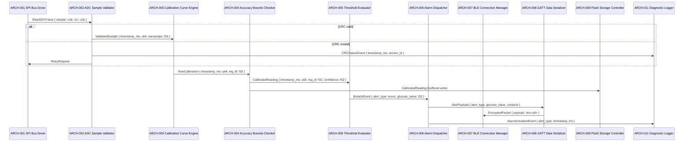

# Architecture Design — Continuous Blood Glucose Monitoring System (CBGMS)

## ID Schema

Architecture modules use the `ARCH-NNN` identifier format (sequential, never renumbered).
Each module traces to one or more parent system components via the "Parent SYS" column.

## Logical View

| ARCH ID | Name | Description | Parent SYS | Type |
|---------|------|-------------|------------|------|
| ARCH-001 | SPI Bus Driver | Manages SPI clock at 4 MHz, chip-select toggling, and 16-bit ADC sample transfer from the electrochemical sensor | SYS-001 | Hardware Abstraction |
| ARCH-002 | ADC Sample Validator | Performs CRC-16 verification on raw ADC frames; discards corrupted samples and triggers retry within 50 ms | SYS-001 | Module |
| ARCH-003 | Calibration Curve Engine | Applies factory enzyme-kinetics calibration curve to convert raw nanoamp readings to mg/dL glucose values | SYS-002 | Module |
| ARCH-004 | Accuracy Bounds Checker | Enforces ±15% tolerance above 75 mg/dL and ±15 mg/dL tolerance below 75 mg/dL; flags out-of-range readings | SYS-002 | Module |
| ARCH-005 | Threshold Evaluator | Compares calibrated glucose values against configurable hypo/hyper thresholds (55–400 mg/dL); emits breach events | SYS-003 | Module |
| ARCH-006 | Alarm Dispatcher | Activates on-device audible alarm within 1 second of breach event; schedules SMS escalation after 15-minute acknowledgement timeout | SYS-003 | Service |
| ARCH-007 | BLE Connection Manager | Handles BLE 5.0 pairing, LE Secure Connections, and 30-second exponential-backoff auto-reconnection on link loss | SYS-004 | Service |
| ARCH-008 | GATT Data Serializer | Encodes glucose records into CBOR format, manages GATT profile advertisement, and sequences encrypted data transfer | SYS-004 | Module |
| ARCH-009 | Flash Storage Controller | Manages NOR flash (8 MB) read/write operations; implements 90-day FIFO eviction with wear-leveling | SYS-005 | Module |
| ARCH-010 | Export Formatter | Generates CSV and PDF export archives from stored glucose readings on companion app request | SYS-005 | Module |
| ARCH-011 | Diagnostic Logger | Cross-cutting service that records timestamped diagnostic events (CRC failures, retry counts, alarm activations, BLE disconnects) to reserved 512 KB flash partition | SYS-001, SYS-002, SYS-003, SYS-004, SYS-005 | Cross-Cutting |

## Process View

## Interface View

| Producer | Consumer | Contract | Exceptions | Latency Budget |
|----------|----------|----------|------------|----------------|
| ARCH-001 | ARCH-002 | `RawADCFrame { sample: u16, crc: u16, sensor_id: u8 }` | `SPITimeoutError`, `BusContentionError` | ≤ 10 ms |
| ARCH-002 | ARCH-003 | `ValidatedSample { timestamp_ms: u64, nanoamps: f32, sensor_id: u8 }` | `CRCFailure` (after 3 retries) | ≤ 15 ms |
| ARCH-003 | ARCH-004 | `RawCalibration { timestamp_ms: u64, mg_dl: f32, curve_version: u8 }` | `CalibrationCurveExpired` | ≤ 25 ms |
| ARCH-004 | ARCH-005 | `CalibratedReading { timestamp_ms: u64, mg_dl: f32, confidence: f32 }` | `OutOfRangeReading` (value outside 20–500 mg/dL) | ≤ 10 ms |
| ARCH-004 | ARCH-009 | `CalibratedReading { timestamp_ms: u64, mg_dl: f32, confidence: f32 }` | `FlashWriteError` | ≤ 500 ms (buffered) |
| ARCH-005 | ARCH-006 | `BreachEvent { alert_type: Hypo\|Hyper, glucose_value: f32 }` | None (fire-and-forget with guaranteed delivery) | ≤ 5 ms |
| ARCH-006 | ARCH-008 | `AlertPayload { alert_type: enum, glucose_value: f32, contacts: Vec<String> }` | `SerializationError` | ≤ 50 ms |
| ARCH-008 | ARCH-007 | `EncryptedPacket { payload: Vec<u8>, sequence_no: u32 }` | `BLELinkUnavailable` (queued in 64-record ring buffer) | ≤ 100 ms |
| ARCH-009 | ARCH-010 | `ReadingSlice { start_ts: u64, end_ts: u64, readings: Vec<CalibratedReading> }` | `FlashReadError`, `CorruptedBlock` | ≤ 2000 ms |
| ARCH-011 | — | `DiagnosticEntry { severity: enum, source_module: u8, message: String, timestamp_ms: u64 }` (write-only sink) | `LogPartitionFull` (oldest entries evicted) | ≤ 5 ms |

## Data Flow View

| Stage | Module | Input | Transformation | Output |
|-------|--------|-------|----------------|--------|
| 1 | ARCH-001 | Electrochemical sensor analog signal | SPI transfer + ADC digitization | RawADCFrame (16-bit nanoamp sample + CRC-16) |
| 2 | ARCH-002 | RawADCFrame | CRC-16 validation, corrupt sample filtering | ValidatedSample (nanoamps as f32) |
| 3 | ARCH-003 | ValidatedSample | Enzyme-kinetics polynomial curve fitting | RawCalibration (mg/dL value) |
| 4 | ARCH-004 | RawCalibration | ISO 15197 accuracy bounds enforcement | CalibratedReading (mg/dL + confidence score) |
| 5a | ARCH-005 → ARCH-006 | CalibratedReading | Threshold comparison → alarm activation | BreachEvent → audible alarm + SMS payload |
| 5b | ARCH-009 | CalibratedReading | Flash persistence with FIFO eviction | Timestamped record in NOR flash |
| 6 | ARCH-008 → ARCH-007 | AlertPayload or glucose record | CBOR serialization → AES-CCM encryption → BLE TX | Encrypted BLE packet to companion app |

## Safety Annotations (IEC 62304 Class C)

| ARCH ID | SIL Allocation | Defensive Programming Notes |
|---------|---------------|-----------------------------|
| ARCH-001 | SIL-2 | Watchdog on SPI bus; safe-state (last-known value + alarm) on 10-minute sensor silence |
| ARCH-002 | SIL-2 | Triple-retry with exponential backoff; assert on CRC polynomial mismatch |
| ARCH-003 | SIL-2 | Range-check on calibration coefficients at startup; dual computation with cross-check |
| ARCH-004 | SIL-2 | Saturation clamp to [20, 500] mg/dL; log and alarm on out-of-range |
| ARCH-005 | SIL-2 | Redundant threshold comparison (two independent evaluators with voting) |
| ARCH-006 | SIL-2 | Alarm activation is fail-safe (alarm ON is the default state; software must actively suppress) |
| ARCH-007 | SIL-1 | Connection loss does not compromise on-device alerting; 64-record ring buffer for data continuity |
| ARCH-008 | SIL-1 | CBOR schema validation before transmission; sequence numbering for gap detection |
| ARCH-009 | SIL-1 | Wear-leveling with block-level CRC; read-after-write verification |
| ARCH-010 | SIL-0 | Export is non-safety-critical; input validation on date range parameters |
| ARCH-011 | SIL-1 | Circular buffer with FIFO eviction; never blocks calling module (async write) |

## Coverage Summary

| Metric | Value |
|--------|-------|
| Total ARCH Modules | 11 |
| SYS Components Covered | 5 / 5 (100%) |
| Cross-Cutting Modules | 1 (ARCH-011) |
