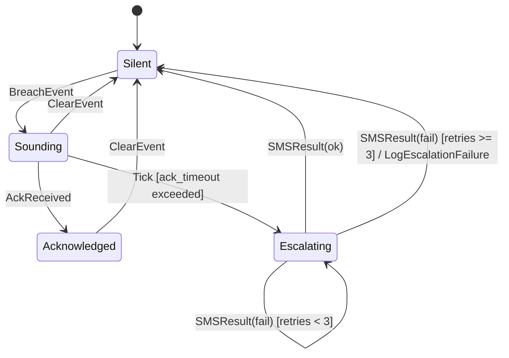
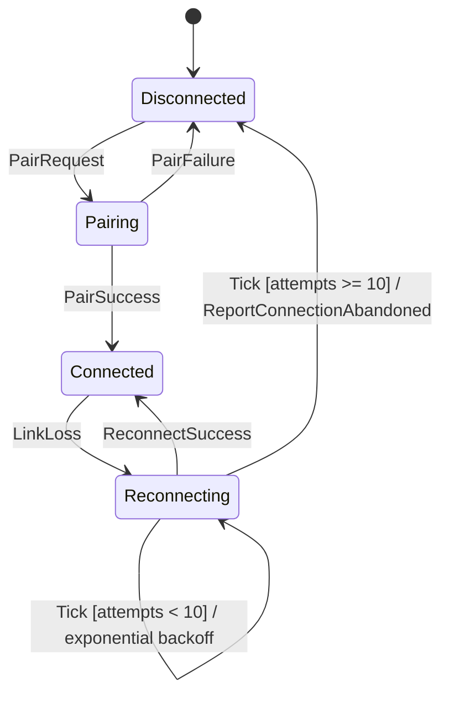
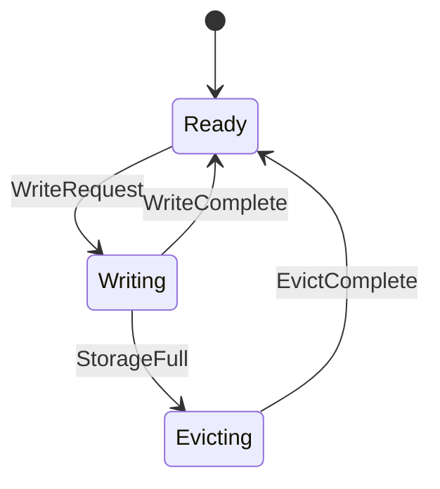

# Module Design: Continuous Blood Glucose Monitoring System (CBGMS)

## ID Schema

- **Module Design**: `MOD-NNN` — sequential identifier for each module (3-digit zero-padded)
- **Parent Architecture Modules**: Comma-separated `ARCH-NNN` list per module (many-to-many, authoritative for traceability)
- **Target Source File(s)**: Comma-separated file paths mapping to the repository codebase

## Module Catalogue

| MOD ID | Name | Parent ARCH | Target Source File(s) | Statefulness |
|--------|------|-------------|----------------------|--------------|
| MOD-001 | SPI Transfer Handler | ARCH-001 | `src/hal/spi_driver.c`, `src/hal/spi_driver.h` | Stateless |
| MOD-002 | CRC-16 Verifier | ARCH-002 | `src/sensor/crc_verifier.c` | Stateless |
| MOD-003 | Enzyme Kinetics Calculator | ARCH-003 | `src/calibration/enzyme_kinetics.c` | Stateless |
| MOD-004 | Tolerance Checker | ARCH-004 | `src/calibration/tolerance.c` | Stateless |
| MOD-005 | Hypo/Hyper Detector | ARCH-005 | `src/alert/threshold_eval.c` | Stateless |
| MOD-006 | Alarm State Machine | ARCH-006 | `src/alert/alarm_fsm.c` | Stateful |
| MOD-007 | BLE Link Controller | ARCH-007 | `src/ble/link_ctrl.c` | Stateful |
| MOD-008 | CBOR Encoder | ARCH-008 | `src/ble/cbor_encoder.c` | Stateless |
| MOD-009 | Flash FIFO Manager | ARCH-009 | `src/storage/flash_fifo.c` | Stateful |
| MOD-010 | Report Generator | ARCH-010 | `src/export/report_gen.c` | Stateless |
| MOD-011 | Event Logger | ARCH-011 | `src/diag/event_logger.c` | Stateless |

## Module Designs

### Module: MOD-001 (SPI Transfer Handler)

**Parent Architecture Modules**: ARCH-001
**Target Source File(s)**: `src/hal/spi_driver.c`, `src/hal/spi_driver.h`

#### Algorithmic / Logic View

> **Hardware Mock Note**: Unit tests must replace `spi_exchange()` with a mock that returns pre-configured byte sequences. No physical SPI bus is available in the test environment.

```pseudocode
FUNCTION spi_transfer(config: spi_config_t, sensor_id: u8) -> Result<spi_raw_frame_t, SPI_Error>:
    gpio_set_low(config.cs_pin)                // assert chip-select
    clock_configure(config.clock_hz, config.cpol, config.cpha)
    tx_buf = [READ_CMD | sensor_id]
    rx_buf = spi_exchange(tx_buf, length=4)    // 2 bytes sample + 2 bytes CRC
    gpio_set_high(config.cs_pin)               // de-assert chip-select
    IF rx_buf IS timeout THEN RETURN Err(SPI_Timeout)
    frame.sample = (rx_buf[0] << 8) | rx_buf[1]
    frame.crc    = (rx_buf[2] << 8) | rx_buf[3]
    frame.sensor_id = sensor_id
    RETURN Ok(frame)
```

#### State Machine View

N/A — Stateless

#### Internal Data Structures

| Name | Type | Size/Constraints | Initialization | Description |
|------|------|-----------------|----------------|-------------|
| sensor_id | `uint8_t` | 0–255 | Caller-supplied | Sensor index on SPI bus |
| sample | `uint16_t` | 0–65535 | From SPI RX | Raw 16-bit ADC count |
| crc | `uint16_t` | 0–65535 | From SPI RX | CRC-16/CCITT over sample bytes |
| clock_hz | `uint32_t` | 4 000 000 Hz | Factory config | SPI clock frequency |
| cs_pin | `uint8_t` | GPIO pin number | Factory config | Chip-select GPIO pin |
| cpol | `uint8_t` | 0 or 1 | Factory config | Clock polarity |
| cpha | `uint8_t` | 0 or 1 | Factory config | Clock phase |

```c
typedef struct {
    uint8_t  sensor_id;
    uint16_t sample;       // raw 16-bit ADC count
    uint16_t crc;          // CRC-16/CCITT
} spi_raw_frame_t;

typedef struct {
    uint32_t clock_hz;     // SPI clock frequency (4 000 000 Hz)
    uint8_t  cs_pin;       // chip-select GPIO pin
    uint8_t  cpol;         // clock polarity
    uint8_t  cpha;         // clock phase
} spi_config_t;
```

#### Error Handling & Return Codes

| Error Condition | Error Code / Exception | Architecture Contract | Recovery |
|----------------|----------------------|----------------------|----------|
| SPI bus timeout (no response within clock window) | `SPI_Timeout` | ARCH-001 returns error to caller | Retry transfer up to configured limit |

---

### Module: MOD-002 (CRC-16 Verifier)

**Parent Architecture Modules**: ARCH-002
**Target Source File(s)**: `src/sensor/crc_verifier.c`

#### Algorithmic / Logic View

```pseudocode
FUNCTION crc16_verify(sample: u16, received_crc: u16) -> crc_result_t:
    data_bytes = [MSB(sample), LSB(sample)]
    computed = CRC16_INIT
    FOR each byte IN data_bytes:
        computed = computed XOR (byte << 8)
        FOR bit = 0 TO 7:
            IF computed & 0x8000 THEN computed = (computed << 1) XOR CRC16_POLY
            ELSE computed = computed << 1
        computed = computed AND 0xFFFF
    IF computed == received_crc THEN RETURN CRC_OK
    RETURN CRC_MISMATCH
```

#### State Machine View

N/A — Stateless

#### Internal Data Structures

| Name | Type | Size/Constraints | Initialization | Description |
|------|------|-----------------|----------------|-------------|
| CRC16_POLY | `uint16_t` | 0x1021 (constant) | Compile-time | CRC-16/CCITT polynomial |
| CRC16_INIT | `uint16_t` | 0xFFFF (constant) | Compile-time | CRC initial seed value |
| computed | `uint16_t` | 0–65535 | CRC16_INIT | Running CRC accumulator |

```c
#define CRC16_POLY  0x1021   // CRC-16/CCITT polynomial
#define CRC16_INIT  0xFFFF

typedef enum {
    CRC_OK,
    CRC_MISMATCH
} crc_result_t;
```

#### Error Handling & Return Codes

| Error Condition | Error Code / Exception | Architecture Contract | Recovery |
|----------------|----------------------|----------------------|----------|
| CRC mismatch between computed and received values | `CRC_MISMATCH` | ARCH-002 discards corrupted sample | Caller requests re-read from sensor |

---

### Module: MOD-003 (Enzyme Kinetics Calculator)

**Parent Architecture Modules**: ARCH-003
**Target Source File(s)**: `src/calibration/enzyme_kinetics.c`

#### Algorithmic / Logic View

```pseudocode
FUNCTION enzyme_kinetics_convert(sample: validated_sample_t,
                                  curve: calibration_curve_t) -> Result<raw_calibration_t, CalError>:
    IF current_epoch_s() > curve.expiry_epoch_s THEN
        RETURN Err(CalibrationCurveExpired)
    i = sample.nanoamps
    // Third-order polynomial: glucose = a3·i³ + a2·i² + a1·i + a0
    glucose = curve.a3 * i * i * i
            + curve.a2 * i * i
            + curve.a1 * i
            + curve.a0
    IF glucose < 20.0 OR glucose > 500.0 THEN
        RETURN Err(OutOfPhysiologicalRange)
    result.timestamp_ms  = sample.timestamp_ms
    result.glucose_mg_dl = glucose
    result.curve_version = curve.curve_version
    RETURN Ok(result)
```

#### State Machine View

N/A — Stateless

#### Internal Data Structures

| Name | Type | Size/Constraints | Initialization | Description |
|------|------|-----------------|----------------|-------------|
| a0, a1, a2, a3 | `float32` | Factory-calibrated range | Factory-programmed | Polynomial coefficients for enzyme kinetics curve |
| curve_version | `uint8_t` | 0–255 | Factory-programmed | Calibration curve revision identifier |
| expiry_epoch_s | `uint32_t` | Unix epoch seconds | Factory-programmed | Calibration curve expiration timestamp |
| timestamp_ms | `uint64_t` | Monotonic ms | From sample | Measurement timestamp |
| nanoamps | `float32` | Validated sensor range | From validated sample | Sensor current input |
| glucose_mg_dl | `float32` | 20.0–500.0 mg/dL | Computed | Converted glucose concentration |

```c
typedef struct {
    float32 a0, a1, a2, a3;  // polynomial coefficients (factory-programmed)
    uint8_t curve_version;
    uint32_t expiry_epoch_s;  // calibration curve expiration timestamp
} calibration_curve_t;

typedef struct {
    uint64_t timestamp_ms;
    float32  nanoamps;        // validated sensor current
    uint8_t  sensor_id;
} validated_sample_t;

typedef struct {
    uint64_t timestamp_ms;
    float32  glucose_mg_dl;   // converted glucose concentration
    uint8_t  curve_version;
} raw_calibration_t;
```

#### Error Handling & Return Codes

| Error Condition | Error Code / Exception | Architecture Contract | Recovery |
|----------------|----------------------|----------------------|----------|
| Calibration curve past expiration timestamp | `CalibrationCurveExpired` | ARCH-003 rejects conversion | Alert user to replace sensor |
| Computed glucose outside 20–500 mg/dL physiological range | `OutOfPhysiologicalRange` | ARCH-003 flags invalid reading | Discard reading; log diagnostic event |

---

### Module: MOD-004 (Tolerance Checker)

**Parent Architecture Modules**: ARCH-004
**Target Source File(s)**: `src/calibration/tolerance.c`

#### Algorithmic / Logic View

```pseudocode
FUNCTION tolerance_check(raw: raw_calibration_t,
                          reference_mg_dl: float32) -> calibrated_reading_t:
    value = CLAMP(raw.glucose_mg_dl, CLAMP_LOW, CLAMP_HIGH)
    IF reference_mg_dl >= TOLERANCE_SPLIT_MG_DL THEN
        // ±15% rule for values ≥ 75 mg/dL
        lower = reference_mg_dl * (1.0 - TOLERANCE_PERCENT)
        upper = reference_mg_dl * (1.0 + TOLERANCE_PERCENT)
    ELSE
        // ±15 mg/dL rule for values < 75 mg/dL
        lower = reference_mg_dl - TOLERANCE_ABSOLUTE
        upper = reference_mg_dl + TOLERANCE_ABSOLUTE
    IF value < lower OR value > upper THEN
        confidence = 0.0   // out of tolerance
    ELSE
        deviation = ABS(value - reference_mg_dl)
        max_dev = upper - reference_mg_dl
        confidence = 1.0 - (deviation / max_dev)
    RETURN { timestamp_ms: raw.timestamp_ms, glucose_mg_dl: value, confidence: confidence }
```

#### State Machine View

N/A — Stateless

#### Internal Data Structures

| Name | Type | Size/Constraints | Initialization | Description |
|------|------|-----------------|----------------|-------------|
| TOLERANCE_SPLIT_MG_DL | `float32` | 75.0 (constant) | Compile-time | ISO 15197 split point between percent and absolute tolerance |
| TOLERANCE_PERCENT | `float32` | 0.15 (constant) | Compile-time | ±15% tolerance above split point |
| TOLERANCE_ABSOLUTE | `float32` | 15.0 (constant) | Compile-time | ±15 mg/dL tolerance below split point |
| CLAMP_LOW | `float32` | 20.0 (constant) | Compile-time | Minimum clamped glucose value |
| CLAMP_HIGH | `float32` | 500.0 (constant) | Compile-time | Maximum clamped glucose value |
| confidence | `float32` | 0.0–1.0 | Computed | Tolerance confidence score |

```c
#define TOLERANCE_SPLIT_MG_DL  75.0f   // ISO 15197 split point
#define TOLERANCE_PERCENT      0.15f   // ±15% above split
#define TOLERANCE_ABSOLUTE     15.0f   // ±15 mg/dL below split
#define CLAMP_LOW              20.0f
#define CLAMP_HIGH            500.0f

typedef struct {
    uint64_t timestamp_ms;
    float32  glucose_mg_dl;
    float32  confidence;       // 0.0–1.0
} calibrated_reading_t;
```

#### Error Handling & Return Codes

| Error Condition | Error Code / Exception | Architecture Contract | Recovery |
|----------------|----------------------|----------------------|----------|
| Reading outside tolerance band (confidence = 0.0) | `confidence == 0.0` | ARCH-004 flags low-confidence reading | Downstream consumers check confidence before use |

---

### Module: MOD-005 (Hypo/Hyper Detector)

**Parent Architecture Modules**: ARCH-005
**Target Source File(s)**: `src/alert/threshold_eval.c`

#### Algorithmic / Logic View

```pseudocode
FUNCTION evaluate_threshold(reading: calibrated_reading_t,
                             config: threshold_config_t) -> Option<breach_event_t>:
    IF reading.glucose_mg_dl < config.hypo_threshold_mg_dl THEN
        RETURN Some({ alert_type: ALERT_HYPO, glucose_value: reading.glucose_mg_dl })
    IF reading.glucose_mg_dl > config.hyper_threshold_mg_dl THEN
        RETURN Some({ alert_type: ALERT_HYPER, glucose_value: reading.glucose_mg_dl })
    RETURN None
```

#### State Machine View

N/A — Stateless

#### Internal Data Structures

| Name | Type | Size/Constraints | Initialization | Description |
|------|------|-----------------|----------------|-------------|
| hypo_threshold_mg_dl | `float32` | Default 55.0 mg/dL | User-configurable | Hypoglycemia threshold |
| hyper_threshold_mg_dl | `float32` | Default 400.0 mg/dL | User-configurable | Hyperglycemia threshold |
| alert_type | `alert_type_t` | ALERT_NONE / ALERT_HYPO / ALERT_HYPER | N/A | Enumerated alert classification |
| glucose_value | `float32` | 20.0–500.0 mg/dL | From reading | Glucose value that triggered the breach |

```c
typedef struct {
    float32 hypo_threshold_mg_dl;   // default 55.0
    float32 hyper_threshold_mg_dl;  // default 400.0
} threshold_config_t;

typedef enum { ALERT_NONE, ALERT_HYPO, ALERT_HYPER } alert_type_t;

typedef struct {
    alert_type_t alert_type;
    float32      glucose_value;
} breach_event_t;
```

#### Error Handling & Return Codes

| Error Condition | Error Code / Exception | Architecture Contract | Recovery |
|----------------|----------------------|----------------------|----------|
| No threshold breach detected | `None` (Option type) | ARCH-005 returns no event | Normal flow; no action required |

---

### Module: MOD-006 (Alarm State Machine)

**Parent Architecture Modules**: ARCH-006
**Target Source File(s)**: `src/alert/alarm_fsm.c`

#### Algorithmic / Logic View

```pseudocode
FUNCTION alarm_fsm_step(ctx: &mut alarm_ctx_t, event: AlarmEvent) -> AlarmAction:
    MATCH (ctx.state, event):
        (SILENT, BreachEvent(e)):
            ctx.state = SOUNDING
            ctx.sounding_since_ms = now_ms()
            RETURN ActivateAudibleAlarm(e.glucose_value)
        (SOUNDING, AckReceived):
            ctx.state = ACKNOWLEDGED
            RETURN SilenceAlarm
        (SOUNDING, Tick) IF elapsed(ctx.sounding_since_ms) > ctx.ack_timeout_ms:
            ctx.state = ESCALATING
            ctx.escalation_retries = 0
            RETURN DispatchSMS
        (ACKNOWLEDGED, ClearEvent):
            ctx.state = SILENT
            RETURN NoAction
        (ESCALATING, SMSResult(ok)):
            ctx.state = SILENT
            RETURN NoAction
        (ESCALATING, SMSResult(fail)) IF ctx.escalation_retries < 3:
            ctx.escalation_retries += 1
            RETURN DispatchSMS   // retry
        (ESCALATING, SMSResult(fail)):
            ctx.state = SILENT
            RETURN LogEscalationFailure
        (_, ClearEvent):
            ctx.state = SILENT
            RETURN SilenceAlarm
        _: RETURN NoAction
```

#### State Machine View



#### Internal Data Structures

| Name | Type | Size/Constraints | Initialization | Description |
|------|------|-----------------|----------------|-------------|
| state | `alarm_state_t` | SILENT / SOUNDING / ACKNOWLEDGED / ESCALATING | ALARM_SILENT | Current FSM state |
| sounding_since_ms | `uint64_t` | Monotonic ms | 0 | Timestamp when alarm began sounding |
| escalation_retries | `uint8_t` | 0–3 | 0 | SMS dispatch retry counter |
| ack_timeout_ms | `uint32_t` | 900 000 (15 min) | Factory config | Time before unacknowledged alarm escalates |

```c
typedef enum {
    ALARM_SILENT,
    ALARM_SOUNDING,
    ALARM_ACKNOWLEDGED,
    ALARM_ESCALATING
} alarm_state_t;

typedef struct {
    alarm_state_t state;
    uint64_t      sounding_since_ms;
    uint8_t       escalation_retries;   // max 3 SMS retries
    uint32_t      ack_timeout_ms;       // 15 min = 900 000 ms
} alarm_ctx_t;
```

#### Error Handling & Return Codes

| Error Condition | Error Code / Exception | Architecture Contract | Recovery |
|----------------|----------------------|----------------------|----------|
| Acknowledgment timeout (15 min without user response) | FSM transitions to `ESCALATING` | ARCH-006 dispatches SMS escalation | Up to 3 SMS retries before logging failure |
| All SMS retries exhausted | `LogEscalationFailure` | ARCH-006 returns to SILENT | Log critical event; manual intervention required |

---

### Module: MOD-007 (BLE Link Controller)

**Parent Architecture Modules**: ARCH-007
**Target Source File(s)**: `src/ble/link_ctrl.c`

#### Algorithmic / Logic View

```pseudocode
FUNCTION ble_link_step(ctx: &mut ble_ctx_t, event: BLEEvent) -> BLEAction:
    MATCH (ctx.state, event):
        (DISCONNECTED, PairRequest(addr)):
            ctx.peer_addr = addr
            ctx.state = PAIRING
            RETURN InitiateSecurePairing(addr)
        (PAIRING, PairSuccess):
            ctx.state = CONNECTED
            ctx.reconnect_attempts = 0
            RETURN EnableGATTNotifications
        (PAIRING, PairFailure):
            ctx.state = DISCONNECTED
            RETURN ReportPairError
        (CONNECTED, LinkLoss):
            ctx.state = RECONNECTING
            ctx.backoff_ms = 1000
            ctx.reconnect_attempts = 0
            RETURN ScheduleReconnect(ctx.backoff_ms)
        (RECONNECTING, Tick) IF ctx.reconnect_attempts < 10:
            ctx.reconnect_attempts += 1
            ctx.backoff_ms = MIN(ctx.backoff_ms * 2, 30000)
            RETURN AttemptReconnect(ctx.peer_addr)
        (RECONNECTING, ReconnectSuccess):
            ctx.state = CONNECTED
            RETURN ReplayBufferedPackets
        (RECONNECTING, _) IF ctx.reconnect_attempts >= 10:
            ctx.state = DISCONNECTED
            RETURN ReportConnectionAbandoned
        _: RETURN NoAction
```

#### State Machine View



#### Internal Data Structures

| Name | Type | Size/Constraints | Initialization | Description |
|------|------|-----------------|----------------|-------------|
| state | `ble_state_t` | DISCONNECTED / PAIRING / CONNECTED / RECONNECTING | BLE_DISCONNECTED | Current BLE link FSM state |
| reconnect_attempts | `uint8_t` | 0–10 | 0 | Reconnection attempt counter |
| backoff_ms | `uint32_t` | 1 000–30 000 ms | 1000 | Exponential backoff interval (doubles per retry, capped at 30 s) |
| peer_addr | `uint8_t[6]` | 6-byte BLE address | From pairing | Bonded peer BLE MAC address |

```c
typedef enum {
    BLE_DISCONNECTED,
    BLE_PAIRING,
    BLE_CONNECTED,
    BLE_RECONNECTING
} ble_state_t;

typedef struct {
    ble_state_t state;
    uint8_t     reconnect_attempts;
    uint32_t    backoff_ms;          // exponential backoff (initial 1 s, max 30 s)
    uint8_t     peer_addr[6];        // bonded peer BLE address
} ble_ctx_t;
```

#### Error Handling & Return Codes

| Error Condition | Error Code / Exception | Architecture Contract | Recovery |
|----------------|----------------------|----------------------|----------|
| Secure pairing failure | `ReportPairError` | ARCH-007 returns to DISCONNECTED | User retries pairing |
| Reconnection exhausted (10 attempts) | `ReportConnectionAbandoned` | ARCH-007 returns to DISCONNECTED | Data buffered locally until next connection |

---

### Module: MOD-008 (CBOR Encoder)

**Parent Architecture Modules**: ARCH-008
**Target Source File(s)**: `src/ble/cbor_encoder.c`

#### Algorithmic / Logic View

```pseudocode
FUNCTION cbor_encode_record(record: glucose_record_t,
                             seq: u32) -> Result<cbor_packet_t, EncodeError>:
    buf = cbor_map_begin(4)
    cbor_encode_uint(buf, KEY_TIMESTAMP, record.timestamp_ms)
    cbor_encode_float(buf, KEY_GLUCOSE, record.glucose_mg_dl)
    cbor_encode_float(buf, KEY_CONFIDENCE, record.confidence)
    cbor_encode_uint(buf, KEY_ALERT, record.alert_type)
    cbor_map_end(buf)
    IF buf.length > 256 THEN RETURN Err(PayloadTooLarge)
    packet.payload = buf.bytes
    packet.length  = buf.length
    packet.sequence_no = seq
    RETURN Ok(packet)
```

#### State Machine View

N/A — Stateless

#### Internal Data Structures

| Name | Type | Size/Constraints | Initialization | Description |
|------|------|-----------------|----------------|-------------|
| payload | `uint8_t[256]` | Max 256 bytes | Zeroed | CBOR-encoded packet payload buffer |
| length | `uint16_t` | 0–256 | 0 | Actual encoded payload length |
| sequence_no | `uint32_t` | Monotonic counter | From caller | Packet sequence number for ordering |
| timestamp_ms | `uint64_t` | Monotonic ms | From record | Measurement timestamp |
| glucose_mg_dl | `float32` | 20.0–500.0 | From record | Glucose concentration |
| confidence | `float32` | 0.0–1.0 | From record | Tolerance confidence score |
| alert_type | `uint8_t` | 0=none, 1=hypo, 2=hyper | From record | Alert classification code |

```c
typedef struct {
    uint8_t  payload[256];
    uint16_t length;
    uint32_t sequence_no;
} cbor_packet_t;

typedef struct {
    uint64_t timestamp_ms;
    float32  glucose_mg_dl;
    float32  confidence;
    uint8_t  alert_type;      // 0=none, 1=hypo, 2=hyper
} glucose_record_t;
```

#### Error Handling & Return Codes

| Error Condition | Error Code / Exception | Architecture Contract | Recovery |
|----------------|----------------------|----------------------|----------|
| Encoded CBOR payload exceeds 256-byte MTU | `PayloadTooLarge` | ARCH-008 rejects oversized packet | Caller splits or truncates record fields |

---

### Module: MOD-009 (Flash FIFO Manager)

**Parent Architecture Modules**: ARCH-009
**Target Source File(s)**: `src/storage/flash_fifo.c`

#### Algorithmic / Logic View

```pseudocode
FUNCTION fifo_write(ctx: &mut fifo_ctx_t, record: calibrated_reading_t) -> Result<(), FlashError>:
    ctx.state = FIFO_WRITING
    IF ctx.count >= MAX_RECORDS THEN
        ctx.state = FIFO_EVICTING
        flash_erase_sector(ctx.head)
        ctx.head = (ctx.head + 1) MOD MAX_RECORDS
        ctx.count -= 1
    addr = ctx.tail * RECORD_SIZE_BYTES
    flash_program(addr, serialize(record))
    verify = flash_read(addr, RECORD_SIZE_BYTES)
    IF verify != serialize(record) THEN RETURN Err(FlashWriteVerifyFail)
    ctx.tail = (ctx.tail + 1) MOD MAX_RECORDS
    ctx.count += 1
    ctx.state = FIFO_READY
    RETURN Ok(())
```

#### State Machine View



#### Internal Data Structures

| Name | Type | Size/Constraints | Initialization | Description |
|------|------|-----------------|----------------|-------------|
| FLASH_SIZE_BYTES | `uint32_t` | 8 388 608 (8 MB, constant) | Compile-time | Total NOR flash capacity |
| RECORD_SIZE_BYTES | `uint32_t` | 32 (constant) | Compile-time | Size of one serialized record |
| MAX_RECORDS | `uint32_t` | 262 144 (constant) | Compile-time | Maximum records in FIFO |
| RETENTION_DAYS | `uint32_t` | 90 (constant) | Compile-time | Data retention period |
| state | `fifo_state_t` | READY / WRITING / EVICTING | FIFO_READY | Current FIFO FSM state |
| head | `uint32_t` | 0–(MAX_RECORDS−1) | 0 | Index of oldest record |
| tail | `uint32_t` | 0–(MAX_RECORDS−1) | 0 | Index of next write slot |
| count | `uint32_t` | 0–MAX_RECORDS | 0 | Current number of stored records |

```c
#define FLASH_SIZE_BYTES      (8 * 1024 * 1024)  // 8 MB NOR flash
#define RECORD_SIZE_BYTES     32
#define MAX_RECORDS           (FLASH_SIZE_BYTES / RECORD_SIZE_BYTES)
#define RETENTION_DAYS        90

typedef enum {
    FIFO_READY,
    FIFO_WRITING,
    FIFO_EVICTING
} fifo_state_t;

typedef struct {
    fifo_state_t state;
    uint32_t     head;          // oldest record index
    uint32_t     tail;          // next write index
    uint32_t     count;
} fifo_ctx_t;
```

#### Error Handling & Return Codes

| Error Condition | Error Code / Exception | Architecture Contract | Recovery |
|----------------|----------------------|----------------------|----------|
| Flash write-back verification mismatch | `FlashWriteVerifyFail` | ARCH-009 aborts write | Retry write; if persistent, mark sector bad |

---

### Module: MOD-010 (Report Generator)

**Parent Architecture Modules**: ARCH-010
**Target Source File(s)**: `src/export/report_gen.c`

#### Algorithmic / Logic View

```pseudocode
FUNCTION generate_report(req: export_request_t,
                          store: &fifo_ctx_t) -> Result<export_result_t, ExportError>:
    readings = fifo_read_range(store, req.start_ts, req.end_ts)
    IF readings.count == 0 THEN RETURN Err(NoDataInRange)
    MATCH req.format:
        FORMAT_CSV:
            buf = "timestamp,glucose_mg_dl,confidence\n"
            FOR each r IN readings:
                buf += format_iso8601(r.timestamp_ms) + ","
                     + to_string(r.glucose_mg_dl) + ","
                     + to_string(r.confidence) + "\n"
        FORMAT_PDF:
            buf = pdf_create_header("Glucose Report", req.start_ts, req.end_ts)
            pdf_add_table(buf, readings)
            pdf_finalize(buf)
    RETURN Ok({ data: buf.bytes, size_bytes: buf.length, format: req.format })
```

#### State Machine View

N/A — Stateless

#### Internal Data Structures

| Name | Type | Size/Constraints | Initialization | Description |
|------|------|-----------------|----------------|-------------|
| start_ts | `uint64_t` | Unix epoch ms | From request | Report time range start |
| end_ts | `uint64_t` | Unix epoch ms | From request | Report time range end |
| format | `export_format_t` | FORMAT_CSV / FORMAT_PDF | From request | Requested export format |
| data | `uint8_t*` | Variable length | NULL | Serialized report output buffer |
| size_bytes | `uint32_t` | 0–max export size | 0 | Actual report data size |

```c
typedef enum { FORMAT_CSV, FORMAT_PDF } export_format_t;

typedef struct {
    uint64_t       start_ts;
    uint64_t       end_ts;
    export_format_t format;
} export_request_t;

typedef struct {
    uint8_t *data;
    uint32_t size_bytes;
    export_format_t format;
} export_result_t;
```

#### Error Handling & Return Codes

| Error Condition | Error Code / Exception | Architecture Contract | Recovery |
|----------------|----------------------|----------------------|----------|
| No readings found in requested time range | `NoDataInRange` | ARCH-010 returns error to caller | User adjusts date range |

---

### Module: MOD-011 (Event Logger) [CROSS-CUTTING]

**Parent Architecture Modules**: ARCH-011
**Target Source File(s)**: `src/diag/event_logger.c`

#### Algorithmic / Logic View

```pseudocode
FUNCTION log_event(entry: diagnostic_entry_t) -> void:
    IF entry.severity < configured_min_level THEN RETURN
    serialized = serialize_entry(entry)
    write_ptr = atomic_load(log_write_offset)
    IF write_ptr + serialized.length > LOG_PARTITION_SIZE THEN
        write_ptr = 0   // FIFO wrap — evict oldest entries
    atomic_store(log_write_offset, write_ptr + serialized.length)
    flash_write_async(LOG_PARTITION_BASE + write_ptr, serialized)
    // Non-blocking: never stalls calling module
```

#### State Machine View

N/A — Stateless

#### Internal Data Structures

| Name | Type | Size/Constraints | Initialization | Description |
|------|------|-----------------|----------------|-------------|
| LOG_PARTITION_SIZE | `uint32_t` | 524 288 (512 KB, constant) | Compile-time | Reserved flash partition for diagnostics |
| severity | `log_level_t` | DEBUG / INFO / WARNING / ERROR / CRITICAL | From entry | Log message severity level |
| source_module | `uint8_t` | ARCH-0xx numeric ID | From caller | Originating architecture module identifier |
| message | `char[128]` | Max 128 characters | From entry | Human-readable diagnostic message |
| timestamp_ms | `uint64_t` | Monotonic ms | From entry | Event timestamp |
| log_write_offset | `uint32_t` | 0–LOG_PARTITION_SIZE | 0 | Atomic write pointer into log partition |

```c
typedef enum {
    LOG_DEBUG,
    LOG_INFO,
    LOG_WARNING,
    LOG_ERROR,
    LOG_CRITICAL
} log_level_t;

typedef struct {
    log_level_t severity;
    uint8_t     source_module;   // ARCH-0xx numeric ID
    char        message[128];
    uint64_t    timestamp_ms;
} diagnostic_entry_t;

#define LOG_PARTITION_SIZE  (512 * 1024)  // 512 KB reserved partition
```

#### Error Handling & Return Codes

| Error Condition | Error Code / Exception | Architecture Contract | Recovery |
|----------------|----------------------|----------------------|----------|
| Log partition full (wrap-around) | N/A (silent FIFO eviction) | ARCH-011 overwrites oldest entries | Oldest log entries evicted; no error propagated |
| Entry below configured minimum severity | N/A (filtered) | ARCH-011 drops low-severity entries | No action; entry silently discarded |

---

## Coverage Summary

| Metric | Count |
|--------|-------|
| Total Module Designs (MOD) | 11 |
| External Modules (`[EXTERNAL]`) | 0 |
| Cross-Cutting Modules (`[CROSS-CUTTING]`) | 1 (MOD-011) |
| Stateful Modules | 3 (MOD-006, MOD-007, MOD-009) |
| Stateless Modules | 8 |
| Total Parent Architecture Modules Covered | 11 / 11 (100%) |
| Modules with Pseudocode | 11 / 11 (100%) |
| **Forward Coverage (ARCH→MOD)** | **100%** |
