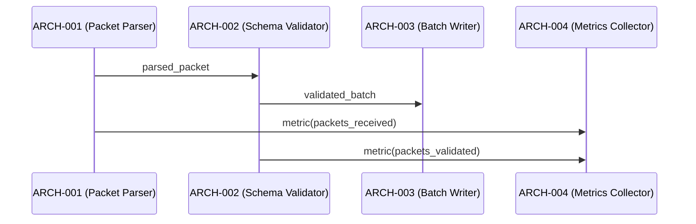

# Architecture Design — Diamond Fixture

## Logical View (Component Breakdown)

Multiple components converge downstream from the telemetry receiver path,
creating a diamond pattern where changes propagate through parallel branches.

| ARCH ID | Name | Description | Parent System Components |
|---------|------|-------------|--------------------------|
| ARCH-001 | Packet Parser | Parses raw telemetry packets | SYS-001 |
| ARCH-002 | Schema Validator | Validates packet schema | SYS-002 |
| ARCH-003 | Batch Writer | Writes validated batches to disk | SYS-003 |
| ARCH-004 | Metrics Collector [CROSS-CUTTING] | Collects throughput metrics | SYS-001, SYS-002, SYS-003 |

## Process View (Dynamic Behavior)

## Interface View (API Contracts)

### ARCH-001: Packet Parser
- **Inputs:** Raw byte stream
- **Outputs:** `ParsedPacket { fields: dict, timestamp: ISO8601 }`
- **Exceptions:** `ParseError`

### ARCH-002: Schema Validator
- **Inputs:** `ParsedPacket`
- **Outputs:** `ValidatedPacket { fields: dict, valid: bool }`
- **Exceptions:** `SchemaError`

### ARCH-003: Batch Writer
- **Inputs:** `ValidatedPacket[]`
- **Outputs:** Write acknowledgment
- **Exceptions:** `DiskFullError`

### ARCH-004: Metrics Collector [CROSS-CUTTING]
- **Inputs:** Metric events from all components
- **Outputs:** Aggregated metric snapshots
- **Exceptions:** `MetricOverflowError`
