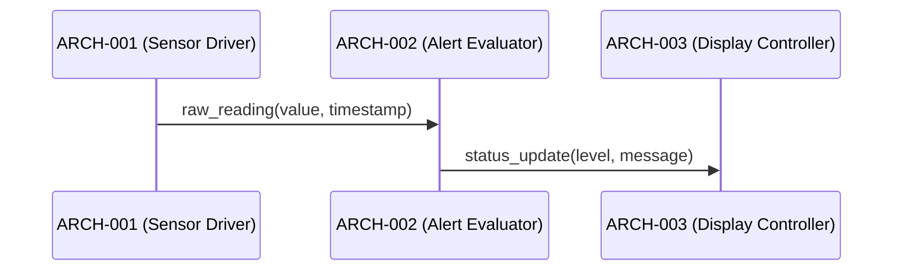

# Architecture Design — Minimal Fixture

## Logical View (Component Breakdown)

| ARCH ID | Name | Description | Parent System Components |
|---------|------|-------------|--------------------------|
| ARCH-001 | Sensor Driver | Reads raw sensor data via I2C | SYS-001 |
| ARCH-002 | Alert Evaluator | Evaluates thresholds and triggers alerts | SYS-002 |
| ARCH-003 | Display Controller | Renders status to LCD panel | SYS-003 |
| ARCH-004 | Logger [CROSS-CUTTING] | Structured logging for all modules | SYS-001, SYS-002, SYS-003 |

## Process View (Dynamic Behavior)



## Interface View (API Contracts)

### ARCH-001: Sensor Driver
- **Inputs:** I2C bus address, polling interval
- **Outputs:** `SensorReading { value: float, timestamp: ISO8601, unit: string }`
- **Exceptions:** `I2CTimeoutError`, `InvalidReadingError`

### ARCH-002: Alert Evaluator
- **Inputs:** `SensorReading`, threshold configuration
- **Outputs:** `AlertEvent { level: enum(INFO|WARN|CRITICAL), message: string }`
- **Exceptions:** `ThresholdConfigError`

### ARCH-003: Display Controller
- **Inputs:** `AlertEvent`, status data
- **Outputs:** Rendered display frame
- **Exceptions:** `DisplayHardwareError`

### ARCH-004: Logger [CROSS-CUTTING]
- **Inputs:** Log level, message, source module identifier
- **Outputs:** `LogEntry { timestamp: ISO8601, level: enum(DEBUG|INFO|WARN|ERROR), source: string, message: string }`
- **Exceptions:** `LogWriteError`

## Data Flow View

```
I2C Bus → ARCH-001 (Sensor Driver) → SensorReading → ARCH-002 (Alert Evaluator) → AlertEvent → ARCH-003 (Display Controller) → LCD Panel
```
