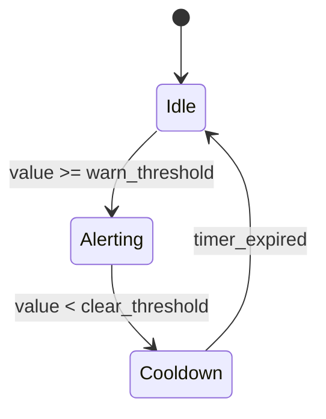

# Module Design — Minimal Fixture

### Module: MOD-001 (I2C Read Handler)

**Parent Architecture Modules**: ARCH-001
**Target Source File(s)**: `src/sensor/i2c_reader.py`

#### Algorithmic / Logic View

```pseudocode
FUNCTION read_sensor(bus_addr, register):
    raw ← i2c_read(bus_addr, register, 2)
    IF raw IS timeout THEN RETURN Error(I2CTimeoutError)
    value ← (raw[0] << 8 | raw[1]) * 0.01
    RETURN SensorReading(value, now(), "°C")
```

#### State Machine View

N/A — Stateless

#### Internal Data Structures

| Name | Type | Description |
|------|------|-------------|
| bus_addr | uint8 | I2C peripheral address (0x00–0x7F) |
| register | uint8 | Target register offset |
| raw | bytes[2] | Two-byte big-endian I2C register payload |
| value | float | Converted sensor value in engineering units |
| SensorReading | struct{value: float, timestamp: datetime, unit: string} | Typed sensor measurement returned to caller |

#### Error Handling & Return Codes

| Code | Condition | Recovery |
|------|-----------|----------|
| I2CTimeoutError | Bus read exceeds 100 ms | Retry up to 3 times, then propagate |
| InvalidReadingError | Converted value outside [−40, 125] | Discard and log warning |

---

### Module: MOD-002 (Threshold Checker)

**Parent Architecture Modules**: ARCH-002
**Target Source File(s)**: `src/alert/threshold.py`

#### Algorithmic / Logic View

```pseudocode
FUNCTION evaluate(reading: SensorReading, config: ThresholdConfig) → AlertEvent | None:
    IF state = Idle AND reading.value >= config.warn THEN
        state ← Alerting
        RETURN AlertEvent(WARN, "Threshold exceeded")
    ELSE IF state = Alerting AND reading.value < config.clear THEN
        state ← Cooldown; start_timer(config.cooldown_s)
    ELSE IF state = Cooldown AND timer_expired() THEN
        state ← Idle
    RETURN None
```

#### State Machine View



#### Internal Data Structures

| Name | Type | Description |
|------|------|-------------|
| state | enum{Idle,Alerting,Cooldown} | Current evaluator state |
| timer | float | Remaining cooldown seconds |
| ThresholdConfig | struct{warn: float, clear: float, cooldown_s: float} | Alert threshold parameters; constraint: warn > clear |
| AlertEvent | struct{level: enum{WARN,CRITICAL}, message: string} | Emitted when threshold is crossed |

#### Error Handling & Return Codes

| Code | Condition | Recovery |
|------|-----------|----------|
| ThresholdConfigError | warn ≤ clear | Reject config at load time |

---

### Module: MOD-003 (Frame Renderer)

**Parent Architecture Modules**: ARCH-003
**Target Source File(s)**: `src/display/renderer.py`

#### Algorithmic / Logic View

```pseudocode
FUNCTION render_frame(alert_event: AlertEvent | None, status: DisplayStatus) → byte_matrix:
    frame ← blank_frame(WIDTH, HEIGHT)
    draw_header(frame, status.timestamp)
    IF alert_event IS NOT None THEN
        draw_alert_banner(frame, alert_event.level, alert_event.message)
    RETURN frame
```

#### State Machine View

N/A — Stateless

#### Internal Data Structures

| Name | Type | Description |
|------|------|-------------|
| frame | byte_matrix | Pixel buffer (WIDTH × HEIGHT) |
| DisplayStatus | struct{timestamp: datetime, connected: bool} | Current display state passed from caller |
| WIDTH | const uint16 = 128 | Display width in pixels |
| HEIGHT | const uint16 = 64 | Display height in pixels |

#### Error Handling & Return Codes

| Code | Condition | Recovery |
|------|-----------|----------|
| DisplayHardwareError | Frame write to LCD fails | Return last-known-good frame |

---

### Module: MOD-004 (Log Writer) [CROSS-CUTTING]

**Parent Architecture Modules**: ARCH-004
**Target Source File(s)**: `src/logging/writer.py`

#### Algorithmic / Logic View

```pseudocode
FUNCTION write_log(level: LogLevel, message: string, source: string) → Result:
    IF level NOT IN {DEBUG, INFO, WARN, ERROR} THEN
        RETURN Error(InvalidLogLevel)
    entry ← LogEntry(now(), level, source, message)
    append_to_sink(entry)
    RETURN OK
```

#### State Machine View

N/A — Stateless

#### Internal Data Structures

| Name | Type | Description |
|------|------|-------------|
| LogLevel | enum{DEBUG,INFO,WARN,ERROR} | Severity classification |
| LogEntry | struct{timestamp: datetime, level: LogLevel, source: string, message: string} | Structured log record |
| MAX_BUFFER | const uint16 = 64 | Maximum buffered entries when sink unavailable |

#### Error Handling & Return Codes

| Code | Condition | Recovery |
|------|-----------|----------|
| LogWriteError | Sink unavailable | Buffer up to 64 entries, then drop oldest |
| InvalidLogLevel | Unknown level string | Reject call, return error |

---

## Coverage Summary

| Metric | Value |
|--------|-------|
| Total MODs | 4 |
| External MODs | 0 |
| Cross-Cutting MODs | 1 |
| Stateful MODs | 1 |
| Stateless MODs | 3 |
| ARCH coverage | 4 / 4 |
